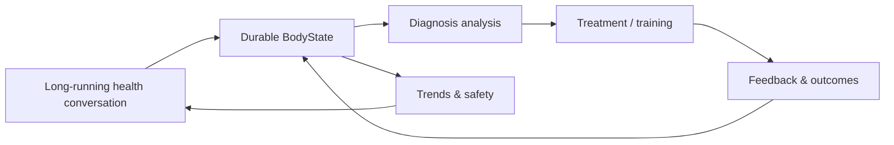

# BodySense

> **AI-native longitudinal body-health workspace** — connecting long-running conversations, durable body state, evidence-aware diagnosis, treatment plans, and training feedback into one traceable loop.

<p align="left">
  <strong>Language:</strong> English · <a href="./docs/zh-CN/README.md">Simplified Chinese</a>
</p>

<p align="left">
  <a href="https://body.bakersean.top"><strong>Live App</strong></a> ·
  <a href="https://bakersean168.github.io/BodySense/"><strong>Project Page</strong></a> ·
  <a href="./docs/feature_spec_longitudinal_body_health.md"><strong>Product Spec</strong></a> ·
  <a href="./docs/architecture/deployment-architecture.md"><strong>Architecture</strong></a>
</p>

BodySense is not a one-shot AI consultation demo. It is designed around a long-lived health workspace where people can continuously describe changes, add observations, correct facts, review how analysis evolves, and feed treatment or training outcomes back into future reasoning.

> [!IMPORTANT]
> BodySense is a personal health-information and posture-analysis assistant project. It is not a medical device and does not replace diagnosis or treatment from physicians, physical therapists, or other qualified professionals.

## Product loop



The core experience has five parts:

- **Long-lived conversation** — users do not need to create a new consultation for every body issue.
- **Live BodyState** — structured facts, observations, changes, AI hypotheses, and safety state evolve over time and remain user-correctable.
- **Evidence-aware diagnosis** — diagnosis is bound to an exact BodyState revision, temporal context, observations, and retrieved evidence instead of relying only on chat history.
- **Revisioned treatment** — the current intervention plan has an explicit version and review lifecycle rather than being silently overwritten by a new message.
- **Closed feedback loop** — adherence, training execution, symptom changes, and self-assessment results feed back into durable state and later review.

## Why it is interesting

BodySense focuses less on “how to call a model” and more on **how AI output becomes durable, traceable, reviewable product state**.

| Engineering concern | BodySense approach |
| --- | --- |
| Long-running AI interaction | Run / Turn / checkpoint + durable event log |
| Human-in-the-loop | structured `ask_user` interrupt / resume |
| AI ↔ business state | Go owns durable business state; AI runtime produces validated proposals/events |
| Retrieval | pgvector-backed evidence retrieval with provenance |
| Model boundary | standalone LiteLLM gateway; application code does not own physical provider routing |
| Diagnosis governance | immutable configuration identity, replay/eval, hard safety gates |
| Production delivery | coherent immutable release artifacts + revision-checked rollout |

## Architecture

```text
React Web
   │  HTTP + SSE
   ▼
Go API / domain authority
   │
   ├── PostgreSQL + pgvector
   ├── Redis
   └── Python AI Service
          │
          ├── FastAPI
          ├── LangGraph durable runtime
          ├── PydanticAI typed agents
          └── LiteLLM model gateway
```

The repository is an Nx + pnpm monorepo:

```text
apps/
├── web/          React 19 + TypeScript + Vite
├── api/          Go + Gin + GORM
└── ai-service/   Python + FastAPI + LangGraph + PydanticAI

docker/           Local / production orchestration
scripts/          Validation and release utilities
docs/             Product specs, ADRs, architecture and plans
tools/            Project-specific engineering tools
```

For the current runtime and deployment boundaries, see [`docs/architecture/deployment-architecture.md`](./docs/architecture/deployment-architecture.md).

## Tech stack

- **Frontend:** React 19, TypeScript 6, Vite 8, Tailwind CSS 4, shadcn/ui
- **Backend:** Go 1.26, Gin, GORM
- **AI:** Python 3.13, FastAPI, LangGraph, PydanticAI
- **Data:** PostgreSQL + pgvector, Redis
- **Model gateway:** LiteLLM
- **Workspace:** Nx 23, pnpm 11
- **Quality:** Vitest, Go test, Pytest, Playwright, Ruff/Pyright, ESLint
- **Delivery:** GitHub Actions, Docker/Compose, Alibaba Cloud ACR + ECS

## Quick start

### Prerequisites

- Node.js 24+
- pnpm 11+
- Go 1.26+
- Python 3.13+
- Docker with Compose

### Run locally

```bash
git clone https://github.com/BakerSean168/BodySense.git
cd BodySense
pnpm install
cp .env.example .env
pnpm docker:dev:up
pnpm dev
```

Run a single surface when you do not need the full stack:

```bash
pnpm dev:web
pnpm dev:api
pnpm dev:ai
```

## Validation

The repository keeps local and CI validation close to the same contract.

```bash
pnpm lint
pnpm typecheck
pnpm test
pnpm e2e
pnpm verify:release
```

`pnpm verify:release` is the broad repository release gate. CI also validates published database migration history and longitudinal browser journeys before a release becomes production-eligible.

## Production

The current production application is available at **[body.bakersean.top](https://body.bakersean.top)**.

The production path is intentionally separated from the GitHub Pages project page:

- **GitHub Pages** explains the project and its engineering story.
- **Alibaba Cloud ECS** runs the actual product.
- **Alibaba Cloud ACR** stores production OCI artifacts.
- **GitHub Actions** owns CI, release creation, and immutable image publication.

See [`docs/architecture/deployment-architecture.md`](./docs/architecture/deployment-architecture.md) for the current deployment contract.

## Documentation

Start here if you want to understand the product rather than only the code:

- [`Longitudinal Body Health Workspace`](./docs/feature_spec_longitudinal_body_health.md) — current product model and user experience.
- [`Deployment Architecture`](./docs/architecture/deployment-architecture.md) — current production topology and release flow.
- [`AGENT.md`](./AGENT.md) — repository conventions and AI-assisted engineering workflow.
- [`docs/`](./docs/) — architecture, ADRs, feature specs, evals, and implementation history.

## Repository status & license

BodySense is a **public source repository**, but it currently does **not** include an open-source license. Public visibility alone does not grant permission to copy, modify, or redistribute the code; copyright remains with the repository owner unless a license is added later.
