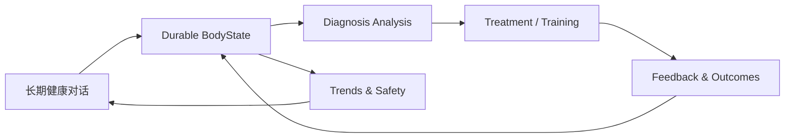

# 体悟 BodySense

> **AI-native longitudinal body-health workspace** — 把长期对话、身体状态、诊断分析、干预计划与训练反馈连接成一个可追踪的闭环。

<p align="left">
  <a href="https://body.bakersean.top"><strong>Live App</strong></a> ·
  <a href="https://bakersean168.github.io/BodySense/"><strong>Project Page</strong></a> ·
  <a href="./docs/feature_spec_longitudinal_body_health.md"><strong>Product Spec</strong></a> ·
  <a href="./docs/architecture/deployment-architecture.md"><strong>Architecture</strong></a>
</p>

BodySense 不是一次性生成报告的“AI 问诊 Demo”。它围绕一个长期存在的健康工作区设计：用户可以持续描述身体状态、补充观察、纠正信息、查看诊断变化，并把训练与干预反馈重新写回后续分析上下文。

> [!IMPORTANT]
> BodySense 是个人健康信息与体态分析辅助项目，不是医疗器械，也不能替代医生、物理治疗师或其他专业人员的诊断与治疗。

## Product loop



核心体验由五部分组成：

- **Long-lived conversation**：用户不需要为每个身体问题反复新建“问诊单”。
- **Live BodyState**：结构化事实、观察、变化、AI 假设与安全状态持续更新，并允许用户直接纠正。
- **Evidence-aware diagnosis**：诊断绑定精确的 BodyState revision、时间上下文、观察和检索证据，而不是只依赖聊天记录。
- **Revisioned treatment**：当前干预方案有明确版本与复审生命周期，不会因为一次新消息被静默覆盖。
- **Closed feedback loop**：训练执行、依从性、症状变化和自测结果会重新进入长期状态与后续复审。

## Why it is interesting

BodySense 重点解决的不是“如何调用一个模型”，而是 **AI 输出如何成为可持久、可追踪、可复审的产品状态**。

| Engineering concern | BodySense approach |
| --- | --- |
| Long-running AI interaction | Run / Turn / checkpoint + durable event log |
| Human-in-the-loop | structured `ask_user` interrupt / resume |
| AI ↔ business state | Go owns durable business state; AI runtime produces validated proposals/events |
| Retrieval | pgvector-backed evidence retrieval with provenance |
| Model boundary | standalone LiteLLM gateway; application code does not own physical provider routing |
| Diagnosis governance | immutable configuration identity, replay/eval, hard safety gates |
| Production delivery | coherent immutable release artifacts + revision-checked rollout |

## Architecture

```text
React Web
   │  HTTP + SSE
   ▼
Go API / domain authority
   │
   ├── PostgreSQL + pgvector
   ├── Redis
   └── Python AI Service
          │
          ├── FastAPI
          ├── LangGraph durable runtime
          ├── PydanticAI typed agents
          └── LiteLLM model gateway
```

The repository is an Nx + pnpm monorepo:

```text
apps/
├── web/          React 19 + TypeScript + Vite
├── api/          Go + Gin + GORM
└── ai-service/   Python + FastAPI + LangGraph + PydanticAI

docker/           Local / production orchestration
scripts/          Validation and release utilities
docs/             Product specs, ADRs, architecture and plans
tools/            Project-specific engineering tools
```

For the current runtime and deployment boundaries, see [`docs/architecture/deployment-architecture.md`](./docs/architecture/deployment-architecture.md).

## Tech stack

- **Frontend:** React 19, TypeScript 6, Vite 8, Tailwind CSS 4, shadcn/ui
- **Backend:** Go 1.26, Gin, GORM
- **AI:** Python 3.13, FastAPI, LangGraph, PydanticAI
- **Data:** PostgreSQL + pgvector, Redis
- **Model gateway:** LiteLLM
- **Workspace:** Nx 23, pnpm 11
- **Quality:** Vitest, Go test, Pytest, Playwright, Ruff/Pyright, ESLint
- **Delivery:** GitHub Actions, Docker/Compose, Alibaba Cloud ACR + ECS

## Quick start

### Prerequisites

- Node.js 24+
- pnpm 11+
- Go 1.26+
- Python 3.13+
- Docker with Compose

### Run locally

```bash
git clone https://github.com/BakerSean168/BodySense.git
cd BodySense
pnpm install
cp .env.example .env
pnpm docker:dev:up
pnpm dev
```

Run a single surface when you do not need the full stack:

```bash
pnpm dev:web
pnpm dev:api
pnpm dev:ai
```

## Validation

The repository keeps local and CI validation close to the same contract.

```bash
pnpm lint
pnpm typecheck
pnpm test
pnpm e2e
pnpm verify:release
```

`pnpm verify:release` is the broad repository release gate. CI also validates published database migration history and longitudinal browser journeys before a release becomes production-eligible.

## Production

The current production application is available at **[body.bakersean.top](https://body.bakersean.top)**.

The production path is intentionally separated from the GitHub Pages project page:

- **GitHub Pages** explains the project and its engineering story.
- **Alibaba Cloud ECS** runs the actual product.
- **Alibaba Cloud ACR** stores production OCI artifacts.
- **GitHub Actions** owns CI, release creation and immutable image publication.

See [`docs/architecture/deployment-architecture.md`](./docs/architecture/deployment-architecture.md) for the current deployment contract.

## Documentation

Start here if you want to understand the product rather than only the code:

- [`Longitudinal Body Health Workspace`](./docs/feature_spec_longitudinal_body_health.md) — current product model and user experience.
- [`Deployment Architecture`](./docs/architecture/deployment-architecture.md) — current production topology and release flow.
- [`AGENT.md`](./AGENT.md) — repository conventions and AI-assisted engineering workflow.
- [`docs/`](./docs/) — architecture, ADRs, feature specs, evals and implementation history.

## Repository status & license

BodySense is a **public source repository**, but this repository currently does **not** include an open-source license. Public visibility alone does not grant permission to copy, modify, or redistribute the code; copyright remains with the repository owner unless a license is added later.
