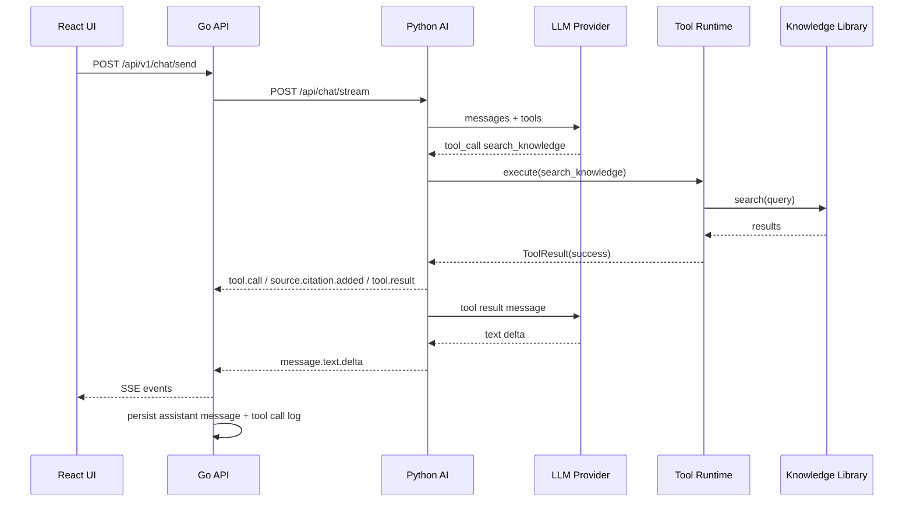
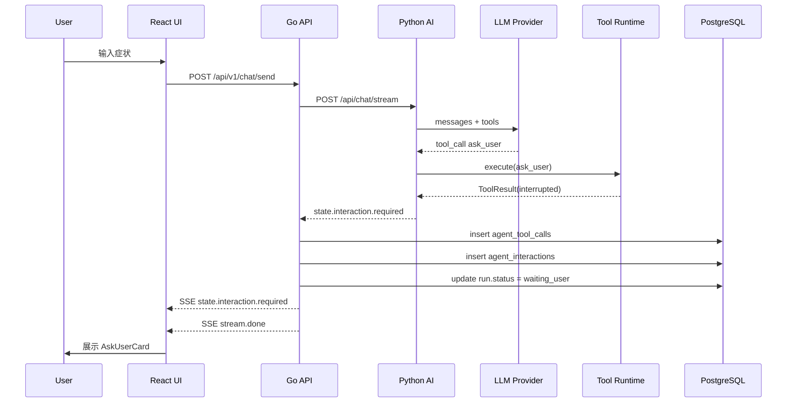
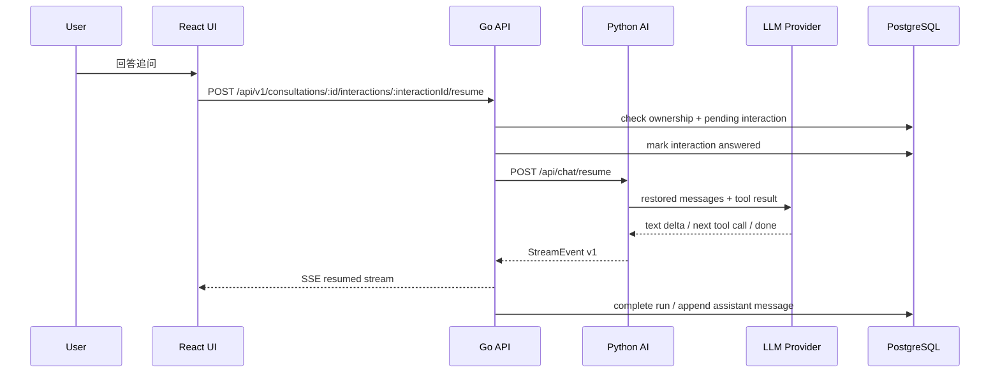

# Agent Tool Calling Runtime 架构设计

> **⚠️ HISTORICAL — 本方案的执行路径已被 ADR 0002 取代。**
>
> 本设计稿中涉及 `POST /api/v1/chat/send`、`ChatHandler`、`/api/chat/resume` 的 Go 侧执行路径已删除。工具调用运行时的核心设计概念（ToolRegistry、ToolExecutor、AgentOrchestrator、interrupt/resume 语义）仍然有效，但所有权模型已变：Python 通过 LangGraph checkpoint 拥有 Agent Thread 真值，Go 不再重建 LLM 协议历史。当前 API：
> - `POST /api/v1/consultations/:id/messages`
> - `POST /api/v1/consultations/:id/interrupts/:interactionId/answers`
>
> 详见：
> - [`docs/adr/0002-agent-runtime-ownership.md`](../adr/0002-agent-runtime-ownership.md)
> - [`docs/plan/active/final-agent-runtime-architecture.md`](../plan/active/final-agent-runtime-architecture.md)
>
> 以下正文中的 mermaid 时序图和 Go 侧流程为历史参考。

**文档版本**：v1.0
**更新日期**：2026-06-29
**状态**：部分归档（执行路径 superseded by ADR 0002，设计概念仍有效）  
**适用范围**：咨询工作台、Go API Gateway、Python AI Service、React Assistant UI

---

## Implementation Status

**当前状态**：部分实现（~40%）

| 模块 | 状态 | 说明 |
|---|---|---|
| ToolRegistry / ToolExecutor 骨架 | 部分实现 | `services/agent/` 包已创建，registry 和 executor 基础结构存在。Phase 02a 部分完成。 |
| search_knowledge 迁移到 ToolRuntime | ✅ 已完成 | 保留 RAG 行为、citation 事件、knowledge_gap 事件、query dedupe。Phase 02b 完成。 |
| extract_symptom_info 迁移到 ToolRuntime | ✅ 已完成 | 保留 dedupe-by-body-part、extracted_info 事件、阶段转换逻辑。Phase 02c 完成。 |
| agent_tool_calls 审计持久化 | 未实现 | Go 侧 migration、model、repository、service。Phase 02d 未完成。 |
| ask_user 工具契约 | ✅ 已完成 | Python ask_user 定义、feature flag、policy text。Phase 03a 完成。 |
| agent_interactions + Resume API | ✅ 已完成 | Go 侧持久化和 resume 端点。Phase 03b 完成。 |
| AskUserCard UI | 未实现 | 前端组件。Phase 03c 未完成。 |
| AgentOrchestrator 完整编排 | 骨架存在 | `services/agent/orchestrator.py` 已创建，需扩展。 |
| confirm_action / finish_consultation 工具 | 未实现 | 后续 Phase。 |

**相关 Phase**：02a, 02b, 02c, 02d, 03a, 03b, 03c → 归档于 `docs/plan/archive/implementation/`

---

## 1. 背景

BodySense 的咨询工作台已经具备以下基础：

- React 咨询工作台通过 SSE 展示流式 AI 回复。
- Go 后端负责鉴权、会话、消息、run、SSE 转发和持久化。
- Python AI Service 基于 LangGraph 编排咨询 Agent。
- AI Provider 层已抽象 OpenAI-compatible 流式输出和 tool call 事件。
- 现有工具包括 `extract_symptom_info` 和 `search_knowledge`。
- 共享包 `@bodysense/contracts` 已定义 `StreamEvent v1`。

当前主要工程摩擦是：工具定义、工具执行、结果事件、去重逻辑都集中在 Python `consultation_graph.generate_response` 的实现里。随着 `ask_user`、`confirm_action`、`save_extracted_info`、`finish_consultation` 等工具加入，Agent 主循环会继续膨胀。

本设计的目标是把工具调用从“图节点里的分支逻辑”升级为一个可校验、可审计、可暂停、可恢复的 **Agent Tool Calling Runtime**。

---

## 2. 设计目标

### 2.1 目标

1. **统一工具 Interface**  
   所有工具通过 `ToolDefinition` 注册，通过 `ToolExecutor` 执行，通过 `ToolResult` 返回。

2. **模型只提出工具调用意图**  
   LLM Provider 只负责把供应商事件转换为内部 `AiStreamEvent`。工具是否能执行、怎么执行、是否暂停、是否需要确认，由后端 Runtime 决定。

3. **支持暂停和恢复**  
   `ask_user`、`confirm_action`、`request_upload` 等人机交互工具必须能创建 interaction、保存 checkpoint、结束当前 SSE 流，并在用户响应后恢复 Agent。

4. **Go 作为持久化真值**  
   Python 负责 AI 编排和工具运行，Go 负责用户权限、conversation/run/message 状态、tool call 日志、interaction 状态和 resume API。

5. **前端可渲染工具 UI**  
   工具调用不再只是日志事件。前端需要能展示工具状态、追问卡片、确认卡片、错误和恢复中状态。

6. **可测试和可观测**  
   工具 Runtime 的 Interface 成为主要测试面。每次工具调用都能复盘：模型请求了什么、参数是什么、后端怎么处理、结果是什么。

### 2.2 非目标

1. 不在第一版引入多 Agent 协作。
2. 不把所有业务工作流改成 LangGraph DAG。
3. 不让 Python 直接写业务数据库。
4. 不让前端直接执行工具。
5. 不在第一版接入高风险外部操作，例如发邮件、删记录、下单。

---

## 3. 总体架构

```txt
React Assistant UI
  - MessagePart rendering
  - Tool UI rendering
  - AskUserCard / ConfirmActionCard
  - Resume request

Go API Gateway
  - Auth / ownership
  - Conversation / message / run persistence
  - Tool call audit persistence
  - Interaction persistence
  - SSE contract mapping
  - Resume API

Python AI Service
  - LangGraph consultation graph
  - AgentOrchestrator / tool loop
  - ToolRegistry
  - ToolExecutor
  - Tool handlers
  - Provider adapter

LLM Provider
  - Qwen / OpenRouter / OpenAI-compatible
  - Streaming text
  - Structured tool call events
```

核心分工：

| 层 | 主要职责 | 不应该负责 |
|---|---|---|
| React UI | 渲染消息、工具状态、用户交互卡片，提交 resume | 执行业务工具 |
| Go API | 鉴权、持久化、SSE 对外协议、interaction 状态机 | 解析模型供应商私有协议 |
| Python Agent | LLM 调用、工具循环、工具 Runtime、生成 tool result | 直接信任工具参数，直接维护用户权限 |
| LLM Provider | 供应商请求/响应适配 | 执行工具或写业务状态 |

---

## 4. 核心 Module 设计

### 4.1 AgentOrchestrator

**位置**：`apps/ai-service/src/services/agent/orchestrator.py`

AgentOrchestrator 是 Agent 工具调用循环的主 Module。它替代当前 `consultation_graph.generate_response` 中的内联工具分支。

Interface：

```python
class AgentOrchestrator:
    async def stream_turn(
        self,
        state: AgentState,
        tools: list[str],
    ) -> AsyncIterator[AgentEvent]:
        ...
```

职责：

- 构造 LLM messages。
- 把 `ToolRegistry` 中允许的工具传给模型。
- 处理多轮 tool call。
- 调用 `ToolExecutor`。
- 把 `ToolResult` 转换为后续 tool message。
- 遇到 `interrupted` 或 `requires_confirmation` 时停止循环并输出中断事件。
- 控制 `max_tool_iterations`。

不负责：

- 每个工具的业务逻辑。
- 数据库写入。
- 前端事件格式细节。

### 4.2 ToolRegistry

**位置**：`apps/ai-service/src/services/agent/tool_registry.py`

ToolRegistry 是工具注册中心。

Interface：

```python
@dataclass
class ToolDefinition:
    name: str
    description: str
    parameters_schema: dict[str, Any]
    args_model: type[BaseModel]
    handler: ToolHandler
    category: ToolCategory
    auto_execute: bool
    requires_confirmation: bool
    timeout_seconds: int
```

工具分类：

| category | 说明 | 示例 |
|---|---|---|
| `query` | 只读查询，可自动执行 | `search_knowledge` |
| `write` | 修改业务状态，需要强校验和幂等 | `save_extracted_info` |
| `human` | 需要用户输入，会暂停 Agent | `ask_user` |
| `dangerous` | 高风险动作，必须确认 | `delete_record`、`send_email` |

第一版注册工具：

```txt
extract_symptom_info
search_knowledge
ask_user
save_extracted_info
finish_consultation
```

### 4.3 ToolExecutor

**位置**：`apps/ai-service/src/services/agent/tool_executor.py`

ToolExecutor 是工具运行时的核心 Module。

Interface：

```python
class ToolExecutor:
    async def execute(
        self,
        call: ToolCall,
        context: ToolContext,
    ) -> ToolResult:
        ...
```

执行步骤：

1. 从 `ToolRegistry` 查找工具。
2. 校验工具名是否在白名单内。
3. 解析并校验 JSON 参数。
4. 检查工具分类和执行策略。
5. 对 `human` 工具返回 `interrupted`。
6. 对 `requires_confirmation` 工具返回 `requires_confirmation`。
7. 对自动工具执行 handler。
8. 捕获超时和异常。
9. 返回标准 `ToolResult`。

标准返回：

```python
class ToolResult(BaseModel):
    tool_call_id: str
    tool_name: str
    status: Literal[
        "success",
        "failed",
        "interrupted",
        "requires_confirmation",
    ]
    content: dict[str, Any] | None = None
    error: ToolError | None = None
    interaction: ToolInteractionRequest | None = None
```

### 4.4 Tool Handler Adapter

每个具体工具是一个 Adapter，满足统一 handler Interface。

```python
class ToolHandler(Protocol):
    async def __call__(
        self,
        args: BaseModel,
        context: ToolContext,
    ) -> ToolResult:
        ...
```

示例目录：

```txt
apps/ai-service/src/services/agent/tools/
  __init__.py
  extract_symptom_info.py
  search_knowledge.py
  ask_user.py
  save_extracted_info.py
  finish_consultation.py
```

### 4.5 Provider Adapter

现有 `apps/ai-service/src/ai/providers/openai_compatible.py` 继续保留。

Provider Adapter 的 Interface 是：

```python
async def generate_stream(req: AiRequest) -> AsyncIterator[AiStreamEvent]:
    ...
```

Provider 只产出内部模型事件：

```txt
text_delta
tool_call_done
usage
done
error
```

Provider 不知道：

- 工具是否存在。
- 工具是否允许执行。
- 工具是否会暂停。
- 工具结果如何写入数据库。

---

## 5. Python 目录结构建议

```txt
apps/ai-service/src/services/agent/
  __init__.py
  orchestrator.py          # Agent 主循环
  state.py                 # AgentState / checkpoint payload
  tool_types.py            # ToolDefinition / ToolCall / ToolResult
  tool_registry.py         # 工具注册中心
  tool_executor.py         # 工具执行器
  tool_events.py           # AgentEvent -> StreamEvent 前的内部事件
  errors.py                # ToolErrorCode
  prompts.py               # 工具策略 prompt

apps/ai-service/src/services/agent/tools/
  __init__.py
  extract_symptom_info.py
  search_knowledge.py
  ask_user.py
  save_extracted_info.py
  finish_consultation.py
```

现有 `consultation_graph.py` 的变化：

- 保留 LangGraph 节点：`safety_check`、`classify_intent`、`generate_response`、`decide_phase`。
- `generate_response` 内部改为调用 `AgentOrchestrator.stream_turn(...)`。
- 移除 `if tc_name == "extract_symptom_info"` 和 `elif tc_name == "search_knowledge"` 这种内联分支。
- RAG 搜索和 citation 事件由 `search_knowledge` handler 发出。

---

## 6. 关键工具设计

### 6.1 ask_user

`ask_user` 是暂停型工具，不是普通同步函数。

工具 schema：

```json
{
  "name": "ask_user",
  "description": "Ask the user for missing information that is necessary to continue the consultation. Use only when the answer cannot be inferred safely.",
  "parameters": {
    "type": "object",
    "properties": {
      "question": {
        "type": "string",
        "description": "The exact question to ask the user."
      },
      "reason": {
        "type": "string",
        "description": "Why this answer is needed."
      },
      "answer_type": {
        "type": "string",
        "enum": ["text", "single_choice", "multi_choice", "number", "date", "file"]
      },
      "options": {
        "type": "array",
        "items": { "type": "string" }
      },
      "required": {
        "type": "boolean"
      }
    },
    "required": ["question", "reason", "answer_type", "required"]
  }
}
```

Runtime 行为：

```txt
LLM -> tool_call ask_user(args)
ToolExecutor -> validate args
ToolExecutor -> ToolResult(status="interrupted", interaction=...)
Python -> StreamEvent state.interaction.required
Go -> persist interaction + mark run waiting_user
Frontend -> render AskUserCard
```

限制规则：

- 每一轮最多 1 次 `ask_user`。
- 连续 `ask_user` 最多 2 次。
- `question` 建议不超过 80 个中文字符。
- 必须提供 `reason`。
- 不允许询问已经在 `extracted_info` 或用户档案中存在的信息。

### 6.2 search_knowledge

`search_knowledge` 是只读查询工具。

Runtime 行为：

- 自动执行。
- 可重试一次。
- 无命中时返回 `knowledge_gap`。
- 有命中时返回 tool result，同时发出 `source.citation.added`。

### 6.3 save_extracted_info

`save_extracted_info` 是业务写入工具。

建议不要让 Python 直接写 PostgreSQL。第一版可采用以下模式：

```txt
Python ToolExecutor -> ToolResult(status="success", content={"patch": ...})
Go SSE handler -> 持久化 extracted_info patch
Go -> 转发 state.extracted_info.upsert
```

这样 Go 仍然是业务状态真值，并继续执行用户权限校验和会话 ownership 校验。

### 6.4 finish_consultation

`finish_consultation` 用于显式结束咨询阶段。

Runtime 行为：

- 需要满足 phase 前进规则。
- Go 持久化 `consultation_sessions.phase = completed`。
- 发送 `state.phase.changed`。

---

## 7. 数据库设计

### 7.1 agent_tool_calls

记录模型请求过的每一次工具调用。

```sql
CREATE TABLE agent_tool_calls (
    id                  UUID PRIMARY KEY DEFAULT uuidv7(),
    conversation_id     UUID NOT NULL REFERENCES conversations(id) ON DELETE CASCADE,
    run_id              UUID REFERENCES runs(id) ON DELETE SET NULL,
    message_id          UUID REFERENCES messages(id) ON DELETE SET NULL,

    tool_call_id        TEXT NOT NULL,
    tool_name           TEXT NOT NULL,
    category            TEXT NOT NULL,

    arguments           JSONB NOT NULL DEFAULT '{}',
    status              VARCHAR(30) NOT NULL,
    -- pending / success / failed / interrupted / requires_confirmation / cancelled

    result              JSONB,
    error               JSONB,

    started_at          TIMESTAMPTZ NOT NULL DEFAULT now(),
    finished_at         TIMESTAMPTZ,

    UNIQUE (conversation_id, tool_call_id)
);

CREATE INDEX idx_agent_tool_calls_conversation
    ON agent_tool_calls (conversation_id, started_at DESC);

CREATE INDEX idx_agent_tool_calls_run
    ON agent_tool_calls (run_id);
```

### 7.2 agent_interactions

记录暂停型工具产生的人机交互。

```sql
CREATE TABLE agent_interactions (
    id                  UUID PRIMARY KEY DEFAULT uuidv7(),
    conversation_id     UUID NOT NULL REFERENCES conversations(id) ON DELETE CASCADE,
    run_id              UUID REFERENCES runs(id) ON DELETE SET NULL,
    tool_call_id        TEXT NOT NULL,

    type                VARCHAR(40) NOT NULL,
    -- ask_user / confirm_action / request_upload

    status              VARCHAR(30) NOT NULL DEFAULT 'pending',
    -- pending / answered / expired / cancelled

    payload             JSONB NOT NULL DEFAULT '{}',
    user_response       JSONB,
    checkpoint          JSONB,

    created_at          TIMESTAMPTZ NOT NULL DEFAULT now(),
    answered_at         TIMESTAMPTZ,
    expires_at          TIMESTAMPTZ
);

CREATE INDEX idx_agent_interactions_pending
    ON agent_interactions (conversation_id, created_at DESC)
    WHERE status = 'pending';
```

### 7.3 runs 状态扩展

现有 `runs.status` 建议扩展：

```txt
running
waiting_user
completed
failed
cancelled
```

`waiting_user` 表示本次 run 没有失败，而是被人机交互暂停。

---

## 8. SSE 事件合约扩展

现有合约已包含：

```txt
tool.call
tool.result
state.extracted_info.upsert
state.phase.changed
source.citation.added
source.knowledge_gap
stream.done
stream.error
```

建议新增：

### 8.1 tool.failed

```ts
type ToolFailedEvent = StreamEventBase<
  'tool',
  'tool.failed',
  {
    tool: string;
    error: {
      code: string;
      message: string;
      retryable: boolean;
    };
  }
>;
```

### 8.2 tool.interrupted

```ts
type ToolInterruptedEvent = StreamEventBase<
  'tool',
  'tool.interrupted',
  {
    tool: string;
    interaction_id: string;
  }
>;
```

### 8.3 state.interaction.required

```ts
type InteractionRequiredEvent = StreamEventBase<
  'state',
  'state.interaction.required',
  {
    interaction_id: string;
    interaction_type: 'ask_user' | 'confirm_action' | 'request_upload';
    payload: unknown;
  }
>;
```

### 8.4 state.interaction.answered

```ts
type InteractionAnsweredEvent = StreamEventBase<
  'state',
  'state.interaction.answered',
  {
    interaction_id: string;
    answer: unknown;
  }
>;
```

---

## 9. 端到端时序

### 9.1 自动工具调用



### 9.2 ask_user 暂停



### 9.3 resume 恢复



---

## 10. Resume API 设计

### 10.1 Go endpoint

```http
POST /api/v1/consultations/:conversationId/interactions/:interactionId/resume
Authorization: Bearer <token>
Content-Type: application/json
```

Request：

```json
{
  "answer": "上下楼梯时更明显",
  "request_id": "client-generated-uuid"
}
```

Response：

```txt
text/event-stream
```

Go 处理流程：

1. 校验用户身份。
2. 校验 conversation ownership。
3. 查询 `agent_interactions`。
4. 确认 interaction 状态为 `pending`。
5. 更新 `user_response` 和 `answered_at`。
6. 创建新的 run，或恢复原 run。
7. 调 Python `/api/chat/resume`。
8. 转发 SSE。

### 10.2 Python endpoint

```http
POST /api/chat/resume
```

Request：

```json
{
  "session_id": "conversation uuid",
  "user_id": "user uuid",
  "interaction_id": "interaction uuid",
  "tool_call_id": "call_xxx",
  "tool_name": "ask_user",
  "answer": "上下楼梯时更明显",
  "checkpoint": {
    "messages": [],
    "agent_state": {}
  }
}
```

Python 行为：

1. 从 checkpoint 还原 AgentState。
2. 追加 tool message：

```json
{
  "role": "tool",
  "tool_call_id": "call_xxx",
  "content": "{\"answer\":\"上下楼梯时更明显\"}"
}
```

3. 继续执行 AgentOrchestrator。
4. 输出 StreamEvent v1。

---

## 11. 前端设计

### 11.1 MessagePart 扩展

```ts
export type MessagePart =
  | { type: 'text'; text: string }
  | { type: 'source'; title: string; snippet?: string; url?: string }
  | { type: 'tool-call'; tool: string; args: unknown }
  | { type: 'tool-result'; tool: string; result: unknown }
  | {
      type: 'ask-user';
      interactionId: string;
      payload: AskUserPayload;
      status: 'pending' | 'answered' | 'cancelled';
      answer?: unknown;
    }
  | { type: 'tool-error'; tool: string; error: ErrorInfo };
```

### 11.2 AskUserCard

位置建议：

```txt
apps/web/src/features/consultation/components/AskUserCard.tsx
```

职责：

- 根据 `answer_type` 渲染输入控件。
- 支持 text、single_choice、multi_choice、number、date、file。
- 提交后调用 resume API。
- 提交中显示 loading。
- 成功后显示已回答状态。
- 失败时允许重试。

### 11.3 SSE Processor 扩展

`useSSEProcessor.ts` 增加事件映射：

```ts
const EVENT_MAP = {
  ...
  'tool.failed': 'onToolFailed',
  'tool.interrupted': 'onToolInterrupted',
  'state.interaction.required': 'onInteractionRequired',
  'state.interaction.answered': 'onInteractionAnswered',
};
```

### 11.4 刷新恢复

进入咨询页时，前端需要从会话详情中获取 pending interactions：

```http
GET /api/v1/consultations/:id
```

响应可以扩展：

```json
{
  "conversation_id": "...",
  "phase": "collecting",
  "pending_interactions": [
    {
      "id": "...",
      "type": "ask_user",
      "payload": {}
    }
  ]
}
```

这样用户刷新页面后，追问卡片不会丢失。

---

## 12. 安全和可靠性

### 12.1 工具白名单

模型只能调用 `ToolRegistry` 注册的工具。未知工具返回：

```json
{
  "code": "UNKNOWN_TOOL",
  "message": "Tool is not registered",
  "retryable": false
}
```

### 12.2 参数强校验

每个工具必须定义 Pydantic args model：

```python
class AskUserArgs(BaseModel):
    question: str = Field(min_length=1, max_length=120)
    reason: str = Field(min_length=1, max_length=200)
    answer_type: Literal["text", "single_choice", "multi_choice", "number", "date", "file"]
    options: list[str] = Field(default_factory=list, max_length=8)
    required: bool
```

### 12.3 幂等

写入工具使用：

```txt
idempotency_key = conversation_id + run_id + tool_call_id
```

Resume API 使用客户端 `request_id` 做幂等检查，避免重复提交答案。

### 12.4 权限

Go 必须校验：

- 当前用户是否拥有 conversation。
- interaction 是否属于该 conversation。
- interaction 是否仍为 pending。
- 工具是否允许当前用户触发。

Python 不能跳过 Go 直接执行用户态写入。

### 12.5 超时

建议默认：

| 工具类型 | 超时 |
|---|---|
| query | 8 秒 |
| write | 5 秒 |
| human | 不设置执行超时，使用 interaction expires_at |
| dangerous | 不自动执行 |

### 12.6 错误处理

错误码建议：

```txt
UNKNOWN_TOOL
INVALID_TOOL_ARGUMENTS
TOOL_TIMEOUT
TOOL_EXECUTION_FAILED
TOOL_NOT_AUTO_EXECUTABLE
INTERACTION_EXPIRED
INTERACTION_ALREADY_ANSWERED
PERMISSION_DENIED
MODEL_TOOL_LOOP_LIMIT
```

处理策略：

| 错误 | 是否喂回模型 | 说明 |
|---|---|---|
| 参数校验失败 | 是 | 允许模型修正一次 |
| 工具不存在 | 否 | 后端配置问题 |
| 权限失败 | 否 | 不允许模型绕过 |
| 查询超时 | 是 | 可让模型保守回答 |
| 用户取消 | 是 | 告诉模型用户取消了操作 |
| loop 超限 | 否 | 直接结束并返回错误 |

---

## 13. 可观测性

每次 tool call 至少记录：

```txt
conversation_id
run_id
message_id
tool_call_id
tool_name
category
arguments
status
result summary
error
duration_ms
provider
model
created_at
finished_at
```

调试视图可以后续增加：

```txt
messages snapshot
tools snapshot
provider raw tool call
validated args
tool result
SSE events
```

---

## 14. 测试策略

### 14.1 Python 单元测试

目标文件：

```txt
apps/ai-service/tests/unit/test_tool_registry.py
apps/ai-service/tests/unit/test_tool_executor.py
apps/ai-service/tests/unit/test_agent_orchestrator.py
apps/ai-service/tests/unit/test_ask_user_tool.py
```

覆盖：

- 注册工具可导出 LLM tool schema。
- 未注册工具拒绝执行。
- 参数校验失败返回 `failed`。
- `query` 工具自动执行。
- `human` 工具返回 `interrupted`。
- `requires_confirmation` 工具返回 `requires_confirmation`。
- tool loop 超限时停止。

### 14.2 Go 单元测试

目标文件：

```txt
apps/api/internal/service/agent_tool_service_test.go
apps/api/internal/handler/interaction_handler_test.go
apps/api/internal/handler/chat_handler_test.go
```

覆盖：

- `tool.call` 持久化到 `agent_tool_calls`。
- `state.interaction.required` 创建 pending interaction。
- resume 校验 ownership。
- 重复 resume 不重复执行。
- pending interaction 能通过咨询详情恢复。

### 14.3 前端测试

目标文件：

```txt
apps/web/src/features/consultation/hooks/useSSEProcessor.test.ts
apps/web/src/features/consultation/components/AskUserCard.test.tsx
apps/web/src/features/consultation/hooks/useAssistantChatRuntime.test.ts
```

覆盖：

- SSE processor 能分发 interaction 事件。
- AskUserCard 根据 answer_type 渲染正确控件。
- 提交后调用 resume API。
- 已回答状态不可重复提交。
- 刷新后 pending interaction 可恢复显示。

### 14.4 端到端用例

最小 5 条：

1. 用户描述膝盖问题，模型调用 `search_knowledge` 后回答。
2. 用户描述缺少触发场景，模型调用 `ask_user`，前端出现追问卡片。
3. 用户回答追问，Agent resume 后继续输出完整建议。
4. 用户刷新页面，pending `ask_user` 仍可继续回答。
5. 模型传错工具参数，后端返回结构化错误，不崩溃。

---

## 15. 分阶段落地

### Phase 1：抽出 Tool Runtime

目标：不改变用户体验，只重构工具执行 Module。

内容：

- 新增 `ToolDefinition`、`ToolResult`、`ToolRegistry`、`ToolExecutor`。
- 将 `extract_symptom_info` 和 `search_knowledge` 迁入工具目录。
- `consultation_graph.generate_response` 调用 `AgentOrchestrator`。
- 保持现有 SSE 事件行为不变。

验收：

- 现有 Python 测试通过。
- RAG tool、citation、knowledge_gap 行为不变。

### Phase 2：工具调用审计

目标：所有 tool call 可追踪。

内容：

- 新增 `agent_tool_calls` migration、model、repository、service。
- Go ChatHandler 接收 `tool.call` / `tool.result` 时写日志。
- 工具失败写 error。

验收：

- 每次工具调用都能在 DB 查到 arguments、status、result。

### Phase 3：ask_user interrupt

目标：实现暂停型工具。

内容：

- Python 新增 `ask_user` tool。
- 新增 `state.interaction.required` / `tool.interrupted` 合约。
- Go 新增 `agent_interactions` 表。
- ChatHandler 遇到 interaction required 后标记 run `waiting_user`。
- 前端渲染 AskUserCard。

验收：

- Agent 可以暂停。
- SSE 正常结束。
- 前端显示追问卡片。
- 刷新后卡片仍存在。

### Phase 4：resume

目标：用户回答后恢复 Agent。

内容：

- Go 新增 resume endpoint。
- Python 新增 `/api/chat/resume`。
- checkpoint 从 `agent_interactions.checkpoint` 还原。
- 用户回答作为 tool result 喂回模型。

验收：

- 用户提交回答后，Agent 继续生成。
- 重复提交不会重复执行。

### Phase 5：业务写入工具

目标：工具开始驱动咨询状态。

内容：

- 新增 `save_extracted_info`。
- 新增 `finish_consultation`。
- 写入统一由 Go 持久化。
- 工具结果驱动 `state.extracted_info.upsert` 和 `state.phase.changed`。

验收：

- 模型可通过工具保存结构化问诊信息。
- phase 仍遵守 Go service 前进规则。

---

## 16. 关键设计决策

### 16.1 为什么 Go 保存 interaction，而不是 Python

Go 已经是用户鉴权、conversation ownership、message/run 持久化的真值。interaction 是用户可见业务状态，必须跟 conversation 一起被权限保护和恢复。因此 interaction 不应只存在 Python 内存或 LangGraph checkpoint 中。

### 16.2 为什么 ToolRuntime 在 Python

工具调用循环靠近 LLM messages、tool result、LangGraph state，放在 Python 可以保持 Agent 编排的 locality。Go 只处理持久化和对外协议，不理解模型供应商细节。

### 16.3 为什么 `ask_user` 不直接生成 assistant 文本追问

普通文本追问无法被系统恢复、审计、校验，也无法让前端渲染结构化输入控件。`ask_user` 作为 tool interrupt 可以把“等待用户输入”变成显式状态。

### 16.4 为什么先不引入更多高风险工具

当前阶段最需要验证的是工具 Runtime 的暂停恢复、日志和 UI 体验。高风险工具需要确认、权限、审计和撤销策略，应该等基础 Runtime 稳定后再接入。

---

## 17. 成功标准

该架构落地后，应满足：

1. 新增普通查询工具时，只需要注册工具和 handler，不需要改 Agent 主循环。
2. 新增暂停型工具时，只需要实现 payload 和前端卡片，不需要重写 SSE 流。
3. 每次工具调用都有 DB 审计记录。
4. 用户刷新页面不会丢失 pending interaction。
5. 模型乱传参数不会导致后端崩溃。
6. Provider 切换不会影响 ToolRuntime。
7. 前端可以稳定渲染文本、引用、工具状态、追问、确认和错误。

