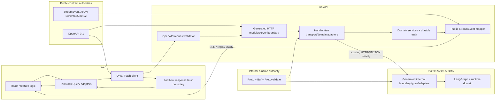

# BodySense Contract Codegen Production North-Star Architecture

> Status: **IMPLEMENTED — vNext engineering reset complete**
> Date: 2026-09-09; implementation completed 2026-09-15
> Evidence base: `docs/architecture/contract-codegen-spike-results-2026-09-09.md`
> Prior decision: `docs/adr/0014-adopt-boundary-specific-contract-codegen-strategy.md`
> Implementation record: `docs/plan/archive/2026-09-13-bodysense-vnext-engineering-reset.md` and `docs/refactor/vnext/phase-01-contract-foundation.md` through `phase-11-final-simplification.md`
> Scope: implemented production architecture, compatibility policy, migration sequencing and CI gates. The execution-ticket sections below are retained as the decision/history record for the completed migration.

---

## 0. Executive decision

The completed spike already answered the first-order question: BodySense should **not** choose one IDL/codegen technology for every protocol boundary.

After a second-order architecture simulation focused on stale browser clients, rolling deployment, domain ownership, schema evolution, Agent context cost and rollback behavior, the final direction is:

| Boundary | Canonical source | Production consumer strategy | Transport |
|---|---|---|---|
| Browser-facing REST | **OpenAPI 3.1 spec-first** | Go strict generated HTTP boundary + request validator; Web **Orval validated Fetch + Zod Mini** behind handwritten TanStack/error adapters | Existing HTTP/JSON |
| Public `StreamEvent` | **JSON Schema 2020-12** | Generated TS static contract + generated/compiled runtime validator, protected by fixture/parity/shadow gates | Existing SSE + durable JSON replay |
| Go -> Python Agent runtime control/request boundary | **Proto + Buf + Protovalidate** | Generated Go/Python boundary types behind adapters; introduce first for Start/Resume/control contracts | Keep current HTTP/NDJSON initially |
| Fine-grained internal event transport | No transport rewrite decision | Continue current fail-closed NDJSON path until a better workload-specific experiment exists | **Keep NDJSON** |
| Selective unary/coarse internal RPC | Proto contract where justified | Connect/gRPC may be evaluated per call | Optional later |

The most important production refinement relative to the spike configuration is:

> **Strictness must be asymmetric.**
>
> - Inputs written into BodySense remain strict and fail closed.
> - Known response fields remain strictly validated at the browser trust boundary.
> - Unknown additive response fields should be **stripped/ignored**, not reject the entire response, so an older immutable Web bundle can continue to consume a newer additive v1 response.

This keeps runtime trust without turning ordinary additive server evolution into a stale-client outage.

The architecture is therefore not merely "OpenAPI + JSON Schema + Proto". The real north-star is:

> **One authoritative contract per semantic boundary, explicit adapters into domain logic, transport decisions kept independent, and compatibility rules stronger than generator defaults.**

---

## 1. What the spike proved, and what this document adds

### 1.1 The spike proved

The isolated 2026-09-09 experiment established the following with BodySense-shaped fixtures and real generators:

- OpenAPI 3.1 spec-first is a stronger REST authority than the tested Go-first annotation path.
- Orval narrowly beat Hey API for the measured browser contract because it can validate actual Fetch responses, while Hey API's generated SDK did not automatically apply its generated Zod schema.
- JSON Schema-first can remove the multi-definition public stream drift, but only after five real schema/parser semantic gaps are repaired.
- Proto/Buf/Protovalidate strongly reduces handwritten Go/Python internal contract surface.
- Protobuf framing was smaller, but the measured synchronous Python one-event-per-message gRPC stream was drastically slower than the current NDJSON path.
- Codegen only reduces Agent reasoning context when generated output is excluded from normal search/review context.
- Redocly/oasdiff/Buf breaking are useful but do not detect every semantic compatibility break.

### 1.2 The second-order simulation adds

The spike intentionally optimized for local correctness of candidate implementations. Production architecture must additionally answer:

1. What happens when an **old browser tab** talks to a newer API?
2. What happens when API and Web revisions do not switch at exactly the same instant?
3. What happens when a generated DTO starts leaking into business/domain modules?
4. What happens when one semantic fact appears in OpenAPI, JSON Schema and Proto at once?
5. What happens when a new event/enum is technically additive but an old generated client cannot understand it?
6. What happens when generated code is committed and an Agent reads all of it?
7. What happens when a compatibility tool reports green while nullable/validation semantics actually tightened?
8. What is the rollback unit if one boundary migration fails?

Those questions refine, but do not overturn, the main spike decision.

---

## 2. Current-system facts that must be preserved

### 2.1 Domain/state ownership stays unchanged

The current authoritative longitudinal architecture remains valid:

- Go owns durable business truth, `BodyState`, Diagnosis, Treatment, Training, Outcomes, run/event persistence and public projection authority.
- Python owns LangGraph runtime state, checkpoints, tool loop and interrupt/resume execution semantics.
- Web consumes server projections and emits user intent; it is not another health-domain owner.

Contract codegen must **not** move ownership between those layers.

### 2.2 Public stream semantics stay unchanged

Today:

```text
Python internal runtime protocol
  -> Go internal protocol validation
  -> Go Runtime Event Log / projection mapping
  -> Public StreamEvent v1
  -> Web runtime parser
  -> ActiveTurn reducer/projection
```

The public stream is not raw Python/LangGraph output. That projection boundary must remain explicit.

### 2.3 Transport disconnect remains different from business cancellation

Codegen must not alter the current invariant:

```text
SSE/network disconnect != cancel durable run
```

Explicit cancellation remains an authenticated Go command and terminal state transition.

### 2.4 BodySense release artifacts are revision-scoped and immutable

The production Web static-asset pipeline publishes revision-addressed assets with long-lived immutable caching. Therefore an old page or open tab can legitimately keep running old JavaScript after a new API revision is promoted.

That makes browser/API compatibility a real architecture concern rather than an academic one.

---

## 3. The core architectural rule: authority follows semantic boundary

The final architecture uses **three contract families**, but does not allow semantic facts to float freely between them.

### 3.1 Public HTTP API authority

Owned by OpenAPI 3.1.

Examples:

- `GET /api/v1/health-workspace`
- `POST /api/v1/body-state/facts`
- revision conflict/error envelopes
- public request/response shapes

### 3.2 Public stream authority

Owned by JSON Schema 2020-12.

Examples:

- `StreamEvent` envelope
- public event channels/types
- event-specific payload rules
- public stream contract version

### 3.3 Internal Agent runtime authority

Owned by Proto/Buf/Protovalidate where adopted.

Initial target examples:

- start-turn request/control envelope
- interrupt resume request/control envelope
- selected internal control messages

It does **not** automatically own the public stream contract.

### 3.4 Domain model authority

Generated transport models are **never** the domain model merely because they are generated.

Examples that remain handwritten/domain-owned:

- Go `BodyState` aggregates and service commands
- Diagnosis/Treatment business invariants
- Python LangGraph/runtime state
- Web view state that intentionally differs from API transport DTOs

The contract generator owns serialization/trust-boundary facts, not business meaning.

---

## 4. North-star architecture



### 4.1 One-way dependency rule

The preferred dependency direction is:

```text
canonical contract
  -> generated transport representation
  -> handwritten boundary adapter
  -> domain/application logic
```

Never:

```text
generated DTO
  -> becomes domain aggregate
  -> domain semantics now depend on generator output
```

This one-way rule is the primary defense against generator lock-in.

---

## 5. Production refinement: asymmetric runtime strictness

### 5.1 Why the original "reject every unknown response field" configuration is unsafe

Assume Web revision A is loaded in a user's browser and remains open.

Later API revision B adds a harmless optional field:

```json
{
  "revision": 42,
  "actions": [],
  "new_optional_field": "..."
}
```

If revision A's runtime schema uses `strictObject()` and rejects every unknown response key, the entire `GET /health-workspace` query fails even though every field A understands is valid.

This turns an additive server change into a browser outage.

That is particularly undesirable for BodySense because revision-addressed immutable JS is an intentional release property.

### 5.2 Final browser response policy

For public REST responses:

- required known fields: strict;
- known field types/formats/enums: strict;
- malformed nested known values: reject;
- missing required fields: reject;
- unknown additive object keys: **strip/ignore**;
- response is trusted only **after** that parse succeeds.

Conceptually:

```text
unknown network JSON
  -> validate all known contract facts
  -> strip unknown additive keys
  -> trusted current-client view
  -> TanStack Query cache
```

This is still materially stronger than `JSON.parse(...) as T`.

### 5.3 Final request policy

Requests written into the API are different:

- unknown request keys: reject where the schema declares a closed input;
- missing required fields: reject;
- invalid enum/type/range: reject;
- service handler must not receive an invalid request merely because Go successfully decoded JSON.

This is why the OpenAPI request-validation middleware remains mandatory even with generated Go structs.

### 5.4 Implication for Orval

Orval remains the preferred Web generator, but the exact production configuration should be re-derived from the spike candidate with this compatibility policy:

- Fetch client;
- response runtime validation enabled;
- Zod Mini;
- `forceSuccessResponse` or equivalent behavior that prevents 4xx/409 from being parsed as success;
- response objects configured/overridden to tolerate and strip unknown additive keys;
- thin handwritten TanStack Query adapter;
- existing BodySense error normalization retained.

The exact config must be proven with a new compatibility fixture before production migration. The spike's strict-response candidate is evidence, not the final production config verbatim.

### 5.5 Hey API status after this refinement

Hey API remains the closest fallback because its generated Zod objects naturally stripped unknown fields in the tested version.

It is still not selected as the default because the generated SDK path did not automatically validate the response. If a future Hey API release adds generator-native response parsing with clear strictness controls, the Orval/Hey decision should be re-benchmarked rather than treated as permanent ideology.

---

## 6. Compatibility is not equivalent to "schema diff passed"

A generated-client architecture introduces several compatibility classes that ordinary OpenAPI/Buf breaking checks may classify too weakly.

### 6.1 Public REST compatibility matrix

| Change | Same `/v1` allowed? | Deployment rule | Extra gate |
|---|---|---|---|
| Add optional response field | Yes | Server can deploy first because old clients strip unknown keys | old-client fixture |
| Add optional request field | Yes | Server support first, then Web starts sending it | mixed-version request fixture |
| Add required request field | No direct switch | expand/dual-read/default or new version | mutation test |
| Remove response field | Breaking | compatibility window or `/v2` | oasdiff + old-client test |
| Rename field | Breaking | dual field period or `/v2` | oasdiff |
| Change field type | Breaking | `/v2` or explicit migration | oasdiff |
| nullable -> non-null | Treat as breaking | migration/version required | explicit M5-style test because oasdiff missed this case |
| Add response enum value | **Potentially breaking for generated strict enum clients** | client capability/unknown strategy first or version | custom enum-expansion mutation |
| Tighten regex/range/minLength | Potentially breaking | expand-contract rollout | explicit semantic mutation |
| Add new error code | Usually additive at wire level | caller must have generic fallback | error-code fallback test |

### 6.2 Public stream compatibility matrix

A new public event variant is **not automatically safe** just because JSON Schema can be regenerated.

The current Web trust boundary intentionally fails closed on unknown public events. Therefore:

- adding a new v1 event type can break an old open tab;
- unknown events cannot simply be ignored because some future event may carry safety, terminal or replay-relevant semantics;
- a new client-visible event that old clients cannot safely ignore is a **versioning decision**, not a schema-only edit.

Final rule:

> **`StreamEvent v1` remains closed and fail-closed. New variants require explicit compatibility analysis under ADR 0003; when safe coexistence cannot be proven, introduce a new stream contract version/negotiation path rather than silently mutating v1.**

The spike M9 proved generation ergonomics, not stale-client compatibility.

### 6.3 Proto compatibility matrix

| Change | Proto/Buf view | BodySense rule |
|---|---|---|
| Add optional field | generally compatible | safe only after validating rolling deployment direction |
| Rename field but keep number | WIRE may tolerate, FILE/WIRE_JSON may not | use FILE/WIRE_JSON as planned; do not optimize for wire-only compatibility |
| Change field number | breaking | prohibited within same version |
| Remove field | breaking unless retired/reserved carefully | reserve numbers/names and migrate consumers first |
| Tighten Protovalidate rule | Buf may report compatible | treat as semantic breaking until cross-runtime tests prove rollout safety |
| Add oneof/enum value | may be wire-compatible | test older reader behavior explicitly |

Proto evolution uses an **expand -> deploy readers -> deploy writers -> contract** sequence when a change has mixed-version risk.

---

## 7. Preventing three-schema duplication

The hybrid architecture is only acceptable if each semantic fact has one owner.

### 7.1 Forbidden pattern

```text
HealthWorkspace defined manually in:
  OpenAPI
  JSON Schema
  .proto
  Go DTO
  TS interface
  Python Pydantic
```

That would be worse than the current state.

### 7.2 Allowed pattern

```text
HealthWorkspace public HTTP shape
  OpenAPI authority
  -> generated Go boundary model
  -> generated Web runtime/static client model

Public StreamEvent
  JSON Schema authority
  -> generated TS static/runtime representation
  -> Go/Python conformance fixtures or generated adapters only where actually needed

Start/Resume internal Agent control contract
  Proto authority
  -> generated Go/Python boundary model
```

### 7.3 Cross-boundary reuse rule

A concept may appear in two boundaries only when the semantics genuinely differ or there is an explicit mechanical reference.

Examples:

- Internal Python runtime event and public `StreamEvent` are **different contracts** because Go filters/maps internal control/runtime facts into a public projection.
- A public REST endpoint that returns a `StreamEvent` should reference the canonical stream schema when the selected toolchain safely supports external JSON Schema references; otherwise the OpenAPI description must avoid manually duplicating event internals and a dedicated conformance adapter/gate is required.

No engineer or Agent should copy/paste a schema from one family into another and call it reuse.

---

## 8. Proposed repository layout

This is a target layout, not an instruction to move files immediately.

```text
packages/contracts/
  openapi/
    bodysense.v1.openapi.yaml          # public REST authority
  schemas/
    stream-event.v1.schema.json        # public stream authority; existing path can remain
  fixtures/
    stream-events.v1.json
    rest/
      health-workspace/
      body-state-facts/
      errors/
  src/
    generated/
      stream-events.ts
      stream-event-validator.ts
    index.ts                            # stable public package facade

contracts/
  internal/
    agent-runtime/
      v1/
        runtime.proto                   # internal runtime authority
        buf.yaml / buf.gen.yaml or repository-level equivalents

apps/api/internal/generated/
  openapi/                              # generated Go HTTP boundary code
  runtimeproto/                         # generated internal Proto code

apps/web/src/generated/
  api/                                  # Orval Fetch + Zod Mini generated output

apps/ai-service/src/generated/
  runtimeproto/                         # generated Python Proto output where adopted

apps/api/internal/.../
  *adapter.go                           # handwritten boundary -> domain mappings
apps/web/src/features/.../
  api/*.ts                              # handwritten TanStack/error/view adapters
apps/ai-service/src/.../
  adapters/*.py                         # generated boundary -> runtime-domain mappings
```

### 8.1 Why generated output stays near consumers

- language-specific generated code stays out of neutral canonical schema directories;
- generator upgrades have a clear blast radius;
- generated code can be excluded from Agent context by directory pattern;
- domain modules cannot accidentally import a large cross-language schema package by convenience.

### 8.2 Stable facade rule

Existing imports such as `@bodysense/contracts` should remain stable during migration. Internal file layout can change behind the package facade only after parity is proven.

---

## 9. REST target path in detail

### 9.1 Read path: `GET /api/v1/health-workspace`

Target:

```text
OpenAPI HealthWorkspace schema
  -> generated Go HTTP response type
  -> handwritten presenter/adapter from domain projection
  -> JSON response
  -> Orval Fetch
  -> Zod Mini known-field validation + unknown-field stripping
  -> normalized trusted DTO
  -> handwritten queryOptions/useHealthWorkspaceQuery
  -> feature components/selectors
```

Important boundaries:

- `HealthWorkspaceService` remains the owner of how the read projection is derived.
- generated Go response structures should not force `HealthWorkspaceService` to become generator-shaped.
- Web should not keep a handwritten interface that is merely a byte-for-byte mirror of generated API output.
- Web may keep explicit view models/selectors where presentation semantics differ.

### 9.2 Mutation path: BodyState fact command

Representative target:

```text
Web command
  -> generated request serialization
  -> Go OpenAPI request validator
  -> generated request DTO
  -> handwritten adapter to domain/service command
  -> optimistic revision/domain checks
  -> domain response/error
  -> generated public response/error shape
  -> Web success parse OR normalized ApiRequestError
```

The mutation vertical slice must include a real `409` revision conflict. A happy-path-only codegen rollout is insufficient.

### 9.3 Error boundary

Generated error models are useful data representations, but BodySense's Web error behavior remains owned by the handwritten API error adapter.

Required behavior:

- non-2xx is never parsed as a success payload;
- stable error `code`/details are preserved when available;
- transport/network/protocol validation errors remain distinguishable;
- callers keep a generic fallback for future additive error codes.

---

## 10. Public StreamEvent target path in detail

### 10.1 Authority transition

Current package contains:

- handwritten TS static contract;
- handwritten TS runtime parser;
- JSON Schema;
- fixtures.

Target:

```text
stream-event.v1.schema.json
  -> generated TS discriminated union
  -> generated/compiled runtime validator
  -> stable @bodysense/contracts facade
```

Fixtures remain handwritten evidence.

### 10.2 Migration must be shadow-first

The existing parser is not deleted when the schema is first corrected.

Required order:

1. port the five verified semantic fixes into the canonical schema;
2. strict-compile schema;
3. generate TS/runtime validator deterministically;
4. run existing real fixtures and malformed fixtures against old and generated validators;
5. add semantic probes from the spike permanently;
6. run generated validator in shadow/parity mode on development/staging paths;
7. compare accept/reject and normalized output behavior;
8. switch primary trust boundary only after zero unexplained drift;
9. keep a bounded rollback path for one release window;
10. retire handwritten parser after evidence closes.

### 10.3 Performance judgment

The generated Ajv validator is materially larger/slower than the current handwritten parser, but the spike still measured throughput far above the human-facing event arrival rate.

Therefore performance is a monitoring requirement, not a blocker.

Do not optimize this by weakening validation before real production data shows a problem.

---

## 11. Internal Go-Python runtime target path in detail

### 11.1 Initial scope is intentionally narrow

Proto adoption starts with bounded control/request contracts such as:

- start turn;
- resume interrupt;
- selected typed internal control messages needed for configuration/identity validation.

It does **not** begin by Proto-izing every internal event payload.

### 11.2 Initial transport remains current HTTP/NDJSON

The first goal is:

```text
one canonical internal IDL
  -> generated Go/Python types
  -> Protovalidate
  -> adapters
  -> existing transport
```

This separates schema ownership from transport migration.

### 11.3 Why not make gRPC the first step

The spike's representative 10,000-event result showed:

- NDJSON roughly 97k events/s;
- synchronous Python gRPC stream roughly 6.1k events/s;
- protobuf framing smaller by roughly 39%.

Therefore smaller bytes did not translate into a better end-to-end stream for the measured implementation.

A future transport experiment must test at least:

- async Python server/client path;
- batching/coarser event messages;
- realistic network RTT;
- backpressure;
- cancellation semantics;
- deadline behavior;
- observability/debuggability;
- CPU/memory under actual concurrent runs.

Until then, transport is not part of the Proto adoption decision.

---

## 12. Generated-code policy is part of architecture

The spike measured a dramatic difference between "generated code hidden" and "generated code included" in Agent context.

### 12.1 Mandatory generated-artifact rules

Every generated family must have:

- one obvious generated directory;
- a generated header / no-manual-edit marker where supported;
- exact pinned generator/runtime versions;
- deterministic generation;
- CI regenerate + `git diff --exit-code` gate;
- folded generated diff by default in review;
- canonical schema + handwritten adapters + handwritten tests as primary review surface;
- Agent/search tooling default exclusions for generated directories;
- explicit opt-in to read generated files only for generator/debug work.

### 12.2 Generated files may be committed

The preferred default is to commit generated source required by normal language builds, then verify deterministic no-diff in CI.

Reasons:

- local Go/Python/Web builds do not require a hidden generation side effect;
- release artifacts are reproducible from a reviewed commit;
- generator upgrades produce explicit diffs;
- rollback is a normal Git rollback.

The context-cost problem is solved by search/review policy, not by pretending generated artifacts do not exist.

---

## 13. CI contract pipeline

Production migration should introduce a first-class contract verification layer before broad endpoint conversion.

### 13.1 Proposed logical commands

Names are proposals; exact package scripts may be adjusted to Nx conventions.

```text
contracts:lint
contracts:generate
contracts:check-generated
contracts:breaking
contracts:mutation
contracts:conformance
contracts:verify
```

### 13.2 OpenAPI gates

Required:

1. Redocly lint.
2. OpenAPI generation succeeds for Go and Web consumers.
3. Generated Go compiles.
4. Generated Web client/schema compiles.
5. deterministic regenerate/no-diff.
6. `oasdiff breaking --fail-on ERR` against approved baseline.
7. explicit nullable/presence mutation test.
8. response enum-expansion compatibility mutation.
9. old-client additive-response fixture.
10. generated Go request-validation tests.
11. Web malformed known-field response rejection tests.
12. Web unknown additive response field strip/ignore test.
13. 409/error normalization fixture.

### 13.3 Stream schema gates

Required:

1. Draft 2020-12 strict compile.
2. generated output compile.
3. deterministic regenerate/no-diff.
4. real fixture parity.
5. malformed fixture parity.
6. five semantic drift regressions from the spike.
7. schema evolution generation test.
8. explicit stale-client/versioning test for a new event variant.

### 13.4 Proto/Buf gates

Required:

1. Buf lint.
2. Buf generate.
3. deterministic regenerate/no-diff.
4. FILE breaking gate.
5. WIRE_JSON breaking gate where JSON mapping matters.
6. Protovalidate invalid fixtures in each adopted runtime.
7. validation-rule tightening mutation test.
8. old-reader/new-writer compatibility fixture for additive fields.
9. generated Go/Python focused compile/tests.

---

## 14. Production migration roadmap

This roadmap is dependency/risk ordered. It is intentionally not divided into arbitrary frontend/backend batches.

### Phase 0 - Contract foundation and compatibility policy

**Objective:** create the governance before any production route depends on codegen.

In scope:

- canonical directory/layout decision;
- generator version pinning;
- generated-code policy;
- CI command skeleton;
- compatibility mutation corpus;
- old-client fixture policy;
- OpenAPI response strictness prototype proving known-field strict + unknown-field strip.

Out of scope:

- production endpoint switch;
- parser deletion;
- internal transport change.

Acceptance evidence:

- deterministic generation from a small non-serving sample;
- compatibility test proves additive response field does not break older Web schema;
- malformed known field still fails.

### Phase 1 - OpenAPI production foundation

**Objective:** make OpenAPI a real production-capable REST authority without changing existing endpoint behavior.

In scope:

- canonical OpenAPI 3.1 package;
- shared error envelope/schema;
- Go strict server/model generation;
- request-validation middleware wiring capability;
- Orval validated Fetch/Zod Mini production configuration;
- handwritten Web error/TanStack adapter pattern;
- breaking/mutation CI.

Acceptance evidence:

- generated Go/Web surfaces compile;
- request validator rejects malformed closed inputs;
- Web rejects malformed known response fields;
- Web tolerates/strips unknown additive response fields;
- 409 remains a normalized non-success error.

### Phase 2 - One complete REST vertical slice

**Objective:** prove the architecture through real BodySense state, not a sample schema.

Recommended slice:

1. `GET /api/v1/health-workspace`.
2. `POST /api/v1/body-state/facts` as the mutation/error counterpart.

Why these first:

- HealthWorkspace is the clearest existing Go/TS duplication hotspot.
- BodyState mutation covers request validation, optimistic revision and 409 behavior.

Acceptance evidence:

- current E2E user path unchanged;
- no duplicate handwritten Web transport interface remains for migrated DTOs unless it is a deliberate view model;
- Go domain service APIs remain generator-independent;
- old-client compatibility fixtures pass;
- rollback can restore handwritten route/client adapters without data migration.

### Phase 3 - Public StreamEvent canonicalization

**Objective:** move stream type/runtime authority to the JSON Schema without changing the public wire.

Acceptance evidence:

- five known drifts fixed;
- old parser vs generated validator parity on committed fixtures;
- staging shadow parity clean;
- live SSE and durable replay consume the same generated public contract;
- no new v1 event variant is introduced accidentally during migration.

### Phase 4 - Internal Proto IDL foundation

**Objective:** remove handwritten Go/Python duplication from bounded runtime control contracts while keeping transport stable.

Initial slice:

- start-turn request/control;
- resume-interrupt request/control;
- configuration identity fields where they are already verified on both sides.

Acceptance evidence:

- Buf/Protovalidate gates green;
- Go and Python generated-boundary conformance green;
- current HTTP/NDJSON behavior unchanged;
- HITL resume preserves the exact current thread/configuration invariants;
- generated types do not leak into LangGraph state or Go business-domain services.

### Phase 5 - Migrate additional REST/internal contracts incrementally

**Objective:** migrate only repeated transport contracts whose duplication cost justifies codegen.

Each migration requires:

- one canonical source;
- characterization tests first;
- adapter boundary;
- compatibility fixture;
- deletion of equivalent handwritten transport duplication only after parity.

### Phase 6 - Optional transport experiments

**Objective:** evaluate Connect/gRPC only where the workload can plausibly benefit.

Candidates:

- unary/coarse internal calls;
- non-streaming metadata/control surfaces.

Non-candidate by default:

- current fine-grained per-event Python -> Go runtime stream.

No transport is changed solely because Proto already exists.

---

## 15. Execution-ready ticket plan

These tickets are deliberately scoped so future implementation can be reviewed independently. They are **not executed by this document**.

## CONTRACT-001 - Freeze canonical contract ownership map

**Goal:** every existing cross-process/public contract has exactly one declared future authority.
**Why now:** prevents OpenAPI/JSON Schema/Proto overlap before code is generated.
**Scope:** REST, public stream, internal Agent runtime; current duplicate definitions and consumers.
**Out of scope:** code generation.
**Protected contracts:** all current routes, event semantics, domain ownership.
**Implementation:** create a contract registry table/doc; classify each current type as canonical, generated target, adapter, domain model or legacy-to-retire.
**Tests:** documentation/reference validation where available.
**Acceptance:** no important cross-boundary type is owned by more than one canonical schema family.
**Dependencies:** none.
**Risks:** hidden contracts embedded in handler structs/tests.

## CONTRACT-002 - Prove asymmetric Orval response trust policy

**Goal:** known malformed fields fail while unknown additive fields are stripped/ignored.
**Why now:** stale-client compatibility changes the spike's strict-response production shape.
**Scope:** isolated OpenAPI/Orval fixture only.
**Out of scope:** real route migration.
**Protected contracts:** current error normalization.
**Implementation:** derive exact Orval 8.30.0 config/override; test valid response, malformed known nested field, unknown top-level/nested additive field and 409.
**Tests:** focused runtime fixtures + Web typecheck.
**Acceptance:** valid/known-malformed/additive/409 matrix behaves exactly as section 5 defines.
**Dependencies:** CONTRACT-001.
**Risks:** Orval config may not express the desired policy cleanly; fallback is generated schema override or re-evaluating Hey API.

## CONTRACT-003 - Establish contract generation and no-diff CI

**Goal:** generation is deterministic and reviewed as a derived artifact.
**Why now:** every later migration depends on trustworthy regeneration.
**Scope:** pinned toolchains, commands, generated directories, CI gates.
**Out of scope:** broad endpoint conversion.
**Protected contracts:** normal `pnpm`/Go/Python developer workflow.
**Implementation:** add generation targets; no-diff check; generated context exclusions; exact version pins.
**Tests:** run generation twice from clean checkout and compare hashes/diff.
**Acceptance:** second generation produces no diff and normal builds consume committed generated output.
**Dependencies:** CONTRACT-002.
**Risks:** platform-specific generator output.

## REST-001 - Create canonical OpenAPI 3.1 production spec

**Goal:** public REST wire facts have one spec-first authority.
**Why now:** prerequisite for real Go/Web migration.
**Scope:** common auth/error components plus HealthWorkspace and one BodyState mutation first.
**Out of scope:** every endpoint.
**Protected contracts:** current `/api/v1` routes and response/error semantics.
**Implementation:** encode current behavior from code/tests; lint; add breaking baseline and mutation corpus.
**Tests:** Redocly, oasdiff, M5 nullable, enum expansion, additive response compatibility.
**Acceptance:** spec describes current selected endpoints without behavior invention.
**Dependencies:** CONTRACT-003.
**Risks:** existing undocumented edge/error response requires characterization rather than guessing.

## REST-002 - Add Go generated HTTP boundary and request validator

**Goal:** malformed HTTP input cannot reach the selected service merely because JSON decoding succeeded.
**Why now:** establishes server trust boundary before vertical switch.
**Scope:** generated models/server surface for selected endpoints; request-validation middleware; adapters.
**Out of scope:** domain service refactor.
**Protected contracts:** service ownership, authentication, optimistic concurrency.
**Tests:** missing required, unknown request key, range/minLength, malformed enum, valid request.
**Acceptance:** invalid requests stop before application logic; valid current requests behave identically.
**Dependencies:** REST-001.
**Risks:** generated types leaking into service signatures.

## REST-003 - Migrate HealthWorkspace browser read path

**Goal:** browser uses generated+validated contract without handwritten duplicate transport type.
**Why now:** highest-value read duplication hotspot.
**Scope:** `GET /api/v1/health-workspace`, Orval Fetch/Zod Mini, handwritten TanStack adapter.
**Out of scope:** unrelated workspace mutations.
**Protected contracts:** `useHealthWorkspaceQuery`, query cache semantics, selectors/components behavior.
**Tests:** valid response, malformed known field, unknown additive field, E2E workspace load/reload.
**Acceptance:** trusted parsed data enters query cache; components behave unchanged.
**Dependencies:** REST-002.
**Risks:** accidental replacement of intentional Web view types.

## REST-004 - Migrate BodyState fact mutation and 409 path

**Goal:** prove request + domain revision + error behavior end to end.
**Why now:** read-only success would not validate the architecture.
**Scope:** `POST /api/v1/body-state/facts`.
**Out of scope:** all BodyState mutations.
**Protected contracts:** optimistic revision, error code/details, invalidation behavior.
**Tests:** valid command, invalid input, stale revision 409, future additive error metadata.
**Acceptance:** Web receives normalized conflict behavior identical to current UX; server validation is schema-driven at ingress.
**Dependencies:** REST-003.
**Risks:** generated error aliases conflicting with existing `ApiRequestError` normalization.

## STREAM-001 - Repair canonical StreamEvent schema semantics

**Goal:** schema matches current fail-closed parser semantics before authority migration.
**Why now:** five verified drifts exist.
**Scope:** exactly the five spike findings plus strictRequired cleanup.
**Out of scope:** new event variants.
**Protected contracts:** StreamEvent v1 wire, replay, safety behavior.
**Tests:** 34 real fixtures, malformed corpus, five semantic probes.
**Acceptance:** old parser and candidate schema agree on all committed evidence.
**Dependencies:** CONTRACT-003.
**Risks:** a schema fix accidentally changes live behavior instead of documenting it.

## STREAM-002 - Generate public TS contract and validator in shadow mode

**Goal:** schema becomes mechanically capable of owning static/runtime Web trust.
**Why now:** authority cannot move before generated output proves parity.
**Scope:** generated TS union + runtime validator + stable facade.
**Out of scope:** handwritten parser deletion.
**Protected contracts:** package exports, SSE/replay behavior.
**Tests:** deterministic generation, parity corpus, stream E2E.
**Acceptance:** generated validator has zero unexplained accept/reject drift.
**Dependencies:** STREAM-001.
**Risks:** bundle regression; measurable but likely non-blocking.

## STREAM-003 - Switch trust boundary and retire parser after rollback window

**Goal:** JSON Schema becomes actual public stream authority.
**Why now:** only after shadow evidence.
**Scope:** live/replay parser entrypoint switch; later handwritten parser removal.
**Out of scope:** StreamEvent v2/new variants.
**Protected contracts:** fail-closed unknown event/version, sequence/replay/cancel semantics.
**Tests:** live SSE, recovery after disconnect, malformed public event, terminal events.
**Acceptance:** generated validator is primary; rollback path exercised; legacy parser removed only after agreed window.
**Dependencies:** STREAM-002.
**Risks:** hidden parser normalization behavior not captured by accept/reject parity alone.

## RUNTIME-001 - Define Proto v1 for Start/Resume control contracts

**Goal:** one Go/Python source of truth for bounded internal runtime requests.
**Why now:** high duplication reduction with low transport blast radius.
**Scope:** start-turn, resume-interrupt, required identity/configuration fields.
**Out of scope:** public StreamEvent and full internal event stream.
**Protected contracts:** thread identity, immutable configuration handshake, HITL continuation semantics.
**Tests:** Buf lint/breaking, Protovalidate invalid fixtures, Go/Python parity.
**Acceptance:** generated types represent current semantics without introducing a new product/runtime behavior.
**Dependencies:** CONTRACT-003.
**Risks:** proto3 presence/default semantics differ from current JSON/Pydantic behavior.

## RUNTIME-002 - Insert generated internal adapters behind existing transport

**Goal:** adopt Proto IDL without a transport rewrite.
**Why now:** separates codegen benefit from gRPC risk.
**Scope:** Go/Python boundary adapters; current HTTP/NDJSON remains.
**Out of scope:** Connect/gRPC production cutover.
**Protected contracts:** runtime endpoints, NDJSON framing, cancellation, configuration-first event invariant.
**Tests:** start, resume, invalid identity/config, malformed internal event, current consultation integration.
**Acceptance:** no observable transport behavior changes while handwritten duplicate request models are retired where safe.
**Dependencies:** RUNTIME-001.
**Risks:** transitional JSON/proto mapping becomes permanent accidental complexity; must be bounded and documented.

## TRANSPORT-001 - Re-benchmark only selected coarse/unary calls

**Goal:** determine whether any real internal call benefits from Connect/gRPC.
**Why now:** only after Proto IDL exists and current transport remains stable.
**Scope:** selected unary/coarse candidate.
**Out of scope:** fine-grained stream rewrite by default.
**Protected contracts:** existing request semantics and operational observability.
**Tests:** latency, throughput, concurrency, cancellation, deadline, wire bytes, CPU/memory.
**Acceptance:** migration only proceeds if measured end-to-end benefit exceeds operational complexity.
**Dependencies:** RUNTIME-002.
**Risks:** benchmark optimism from localhost/synthetic payloads.

---

## 16. Protected-contract checklist for every future ticket

Every implementation PR must explicitly answer whether it preserves, extends, migrates or retires each affected contract.

Minimum checklist:

- public route/path/method;
- auth/ownership boundary;
- request body semantics;
- optimistic revision behavior;
- non-2xx error code/details;
- Web query key/invalidation behavior;
- public StreamEvent version/type/channel/payload;
- `(run_id, seq)` ordering and replay;
- transport disconnect vs explicit cancellation;
- LangGraph `thread_id`/checkpoint continuation;
- immutable Agent configuration identity;
- Go business truth ownership;
- generated-code exclusion from normal Agent context;
- release rollback path.

A green compile is not enough to close a contract migration.

---

## 17. Verification matrix

| Layer | Primary evidence | Failure that must be caught |
|---|---|---|
| Canonical schema | lint + mutation + diff | invalid/breaking contract accepted |
| Generation | deterministic no-diff | stale or non-reproducible generated output |
| Go HTTP ingress | request-validator tests | malformed JSON reaches service |
| Go adapters | focused service/handler tests | generated DTO leaks/redefines domain behavior |
| Web response trust | runtime fixtures | malformed known field enters cache |
| Web compatibility | old-client fixture | harmless additive response breaks stale client |
| Web errors | 409/non-2xx fixtures | error parsed as success or code lost |
| Stream schema | real + malformed + semantic parity | parser/schema drift |
| Stream evolution | version/stale-client test | new event silently breaks old client |
| Internal Proto | Buf + Protovalidate + cross-runtime fixtures | Go/Python semantic drift |
| Runtime integration | start/resume/cancel tests | HITL/thread/config identity regression |
| Full product | current E2E/release gate | vertical path works in pieces but breaks end to end |

---

## 18. Risk ledger

### R1 - Hybrid contract stack becomes a maintenance burden

**Likelihood:** medium.
**Impact:** high if ownership is ambiguous.
**Containment:** contract registry + one-authority rule + no schema copy/paste across boundaries.

### R2 - Generator upgrade silently changes runtime semantics

**Likelihood:** medium.
**Impact:** high at trust boundaries.
**Containment:** exact version pins; generator upgrade is a dedicated PR; replay spike fixture matrix before upgrade acceptance.

### R3 - Strict response validation breaks stale Web bundles

**Likelihood:** high if strict unknown rejection is used.
**Impact:** high.
**Containment:** asymmetric policy; strip unknown additive response fields; old-client CI fixture.

### R4 - "Additive" enum or event evolution is actually client-breaking

**Likelihood:** medium.
**Impact:** high.
**Containment:** custom enum-expansion test; StreamEvent explicit versioning; no reliance on generic diff classification alone.

### R5 - Generated DTO becomes domain model

**Likelihood:** medium during migration.
**Impact:** high long term.
**Containment:** handwritten adapter boundary; architecture review rejects generator types in core service/domain APIs unless explicitly justified.

### R6 - Agent token/context cost explodes

**Likelihood:** high if generated output is searchable by default.
**Impact:** medium/high for autonomous development quality and cost.
**Containment:** generated directory exclusion from ForgeFlow/Agent/search/review defaults.

### R7 - Proto is interpreted as permission to rewrite transport

**Likelihood:** medium.
**Impact:** high performance/operational risk.
**Containment:** IDL and transport are separate ADR/tickets; no gRPC cutover without workload-specific acceptance benchmark.

### R8 - Transitional dual definitions never get retired

**Likelihood:** medium.
**Impact:** medium/high.
**Containment:** every migration ticket names exact legacy surface to retire and the parity evidence required before deletion.

---

## 19. Rollback model

Contract migration must remain reversible by boundary.

### REST

Before broad migration:

- current handlers/services remain domain-compatible;
- generated boundary is adapter-based;
- rollback can restore prior handwritten HTTP/Web adapter without database migration.

### Stream

During shadow window:

- old parser remains callable;
- generated validator switch is one bounded trust-boundary change;
- rollback does not change persisted Runtime Event Log rows.

### Internal Proto

Initial adoption keeps HTTP/NDJSON transport:

- generated boundary types/adapters can be rolled back independently;
- no database or public protocol migration is required;
- gRPC/Connect is not part of the rollback surface until separately approved.

---

## 20. Explicit non-goals

This architecture does **not** authorize:

- a big-bang API rewrite;
- one universal schema language for BodySense;
- replacing domain models with generated DTOs;
- replacing public SSE/JSON with protobuf;
- replacing current NDJSON streaming with gRPC because protobuf payloads are smaller;
- deleting fixtures/parity tests after codegen;
- trusting generated code without runtime validation;
- exposing generated directories to normal Agent context;
- silently adding new `StreamEvent v1` variants;
- making Orval a permanent tool choice independent of future generator evidence.

---

## 21. Final decision after the second-order simulation

The original hybrid direction is confirmed, with one important production-level correction.

### Confirmed

1. **REST:** OpenAPI 3.1 spec-first.
2. **Web REST client:** Orval remains first choice over Hey API for now.
3. **Public stream:** JSON Schema 2020-12 first.
4. **Internal runtime:** Proto/Buf/Protovalidate as IDL for bounded Go/Python contracts.
5. **Transport:** keep HTTP/JSON/SSE/NDJSON until separately justified.
6. **Generated code:** deterministic, committed where consumed by builds, hidden from normal Agent context.

### Refined

The browser response trust boundary should **not** use blanket unknown-field rejection.

Production policy becomes:

```text
known contract facts: strict
unknown additive response keys: strip/ignore
request inputs: strict/fail-closed
public StreamEvent unknown variants: fail-closed + explicit versioning
```

That asymmetry is intentional: REST objects need additive stale-client compatibility; public runtime events can carry semantics that are unsafe to silently ignore.

### Implementation status

The implementation trigger has been satisfied by the completed vNext engineering reset. CONTRACT-001/002/003 established the authority map, asymmetric browser trust policy and deterministic generation pipeline; the migration then expanded beyond the original first-slice sequence to the full repository-current public REST surface.

The implemented sequence is now:

```text
OpenAPI 3.1 public REST authority
  -> generated Go request/response boundary + request validation
  -> generated/validated Web clients behind handwritten adapters
  -> JSON Schema public StreamEvent authority + generated validator
  -> Proto/Buf/Protovalidate private Go/Python runtime authority
  -> permanent contract drift/mutation/conformance gates
```

Transport ownership remains intentionally unchanged: HTTP/JSON/SSE/NDJSON stay in place, generated transport types do not become domain models, and future transport experiments still require separate evidence. The completed implementation and acceptance evidence are recorded in `docs/refactor/vnext/` and the archived vNext master plan.
