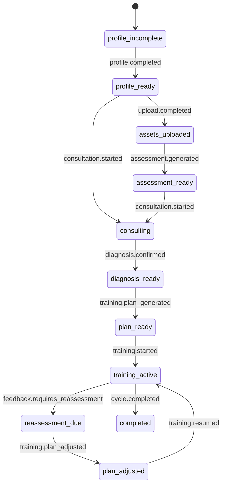

# Health Journey Workflow 架构设计

**文档版本**：v1.0  
**更新日期**：2026-06-29  
**状态**：设计稿  
**适用范围**：用户画像、健康评估、咨询问诊、诊断、训练计划、打卡、重评估

---

## Implementation Status

**当前状态**：未实现（0%）

| 模块 | 状态 | 说明 |
|---|---|---|
| HealthJourneyWorkflow 只读聚合 | 未实现 | 从现有表推导用户健康旅程阶段。Phase 06a 未完成。 |
| health_journeys / health_journey_events 表 | 未实现 | 旅程状态和事件持久化。 |
| JourneyEvent / JourneyAction 系统 | 未实现 | 旅程事件驱动。 |
| ContextBuilder 旅程状态注入 | 未实现 | 将旅程阶段注入 prompt。 |
| ToolRuntime 阶段限制 | 未实现 | 按旅程阶段限制可用工具。 |

**相关 Phase**：06a → 归档于 `docs/plan/archive/implementation/`

---

## 1. 背景

BodySense 不是一个单点 AI 聊天产品，而是一条健康管理旅程：

```txt
用户建档
  -> 上传体态照片 / 体检报告
  -> 生成健康评估
  -> 咨询问诊
  -> 形成诊断候选
  -> 生成训练计划
  -> 每日训练打卡
  -> 反馈不适或进展
  -> 重评估和调整计划
```

现在这些能力已经分散在不同 Module：

- `ProfileService`
- `UploadService`
- `AssessmentService`
- `ConsultationService`
- `ConversationService`
- `TrainingService`
- `ReassessmentService`

这些 Module 各自有自己的接口和状态，但缺少一个统一的健康旅程状态机。结果是：

- 前端需要自己推断下一步该展示什么。
- 评估报告、咨询诊断、训练计划之间的关系不够明确。
- 用户跳过某一步时，系统缺少统一降级策略。
- AI 工具调用和 Job Runtime 不知道当前业务阶段允许什么动作。
- 训练计划调整可能绕过咨询或评估状态。

本设计目标是建立 **Health Journey Workflow**，让 BodySense 的业务路径成为一个可查询、可推进、可审计的 Workflow Module。

---

## 2. 设计目标

1. **统一用户旅程状态**
   用户当前处于哪个阶段、下一步可以做什么，应由 Workflow 给出。

2. **跨 Module 编排**
   画像、上传、评估、咨询、训练、重评估之间的关系由 Workflow 维护。

3. **状态转移可控**
   不允许任意阶段倒退或跳跃，除非显式允许。

4. **前端少推断**
   前端通过 `available_actions` 渲染入口，而不是自己拼业务规则。

5. **Agent 可感知业务阶段**
   ContextBuilder 和 ToolRuntime 可以读取 Journey State，限制工具和建议。

6. **长期演进**
   MVP 可以是单用户单 journey，后续支持多问题、多训练周期。

---

## 3. Journey 阶段

建议第一版阶段：

```txt
profile_incomplete
profile_ready
assets_uploaded
assessment_ready
consulting
diagnosis_ready
plan_ready
training_active
reassessment_due
plan_adjusted
completed
```

阶段说明：

| stage | 说明 |
|---|---|
| `profile_incomplete` | 用户画像不足 |
| `profile_ready` | 基本画像完成 |
| `assets_uploaded` | 已上传照片或报告 |
| `assessment_ready` | 已生成健康评估 |
| `consulting` | 正在问诊 |
| `diagnosis_ready` | 有诊断候选 |
| `plan_ready` | 已生成训练计划 |
| `training_active` | 正在执行训练 |
| `reassessment_due` | 到达重评估条件 |
| `plan_adjusted` | 计划已根据反馈调整 |
| `completed` | 当前周期结束 |

---

## 4. Workflow State

```json
{
  "user_id": "...",
  "stage": "training_active",
  "profile_id": "...",
  "latest_assessment_id": "...",
  "active_conversation_id": "...",
  "confirmed_diagnosis_id": "...",
  "active_training_plan_id": "...",
  "current_cycle": 1,
  "available_actions": [
    "continue_consultation",
    "open_today_training",
    "submit_training_feedback"
  ],
  "blocking_reasons": [],
  "updated_at": "2026-06-29T12:00:00+08:00"
}
```

---

## 5. Module 设计

### 5.1 HealthJourneyWorkflow

**位置建议**：`apps/api/internal/workflow/health_journey.go`

Interface：

```go
type HealthJourneyWorkflow interface {
    GetState(ctx context.Context, userID uuid.UUID) (*JourneyState, error)
    ApplyEvent(ctx context.Context, event JourneyEvent) (*JourneyState, error)
    AvailableActions(ctx context.Context, userID uuid.UUID) ([]JourneyAction, error)
}
```

职责：

- 读取 profile / upload / assessment / consultation / training 状态。
- 计算当前 journey stage。
- 应用业务事件推进状态。
- 输出可执行动作。

不负责：

- 生成 AI 内容。
- 执行文件上传。
- 直接调用 Python。

### 5.2 JourneyEvent

Workflow 不直接依赖各 service 的内部实现，而是消费领域事件：

```txt
profile.completed
upload.report_ocr_completed
assessment.generated
consultation.started
consultation.diagnosis_confirmed
training.plan_generated
training.checked_in
training.feedback_submitted
training.plan_adjusted
cycle.completed
```

### 5.3 JourneyAction

前端和 Agent 都使用 `available_actions`。

```txt
complete_profile
upload_assets
generate_assessment
start_consultation
continue_consultation
confirm_diagnosis
generate_training_plan
open_today_training
submit_training_feedback
request_reassessment
adjust_plan
start_new_cycle
```

---

## 6. 状态转移



允许跳过：

- 没上传报告也可以咨询。
- 没评估报告也可以开始问诊。
- 没有完整照片时评估报告降级。

不允许：

- 无诊断候选直接生成正式训练计划。
- 红旗风险未处理时生成训练计划。
- 用户禁忌未确认时推荐高风险动作。

---

## 7. 数据库设计

### 7.1 health_journeys

```sql
CREATE TABLE health_journeys (
    id                      UUID PRIMARY KEY DEFAULT uuidv7(),
    user_id                 UUID NOT NULL REFERENCES users(id) ON DELETE CASCADE,
    stage                   VARCHAR(60) NOT NULL,
    current_cycle           INT NOT NULL DEFAULT 1,

    latest_assessment_id     UUID REFERENCES assessment_reports(id) ON DELETE SET NULL,
    active_conversation_id   UUID REFERENCES conversations(id) ON DELETE SET NULL,
    active_training_plan_id  UUID REFERENCES training_plans(id) ON DELETE SET NULL,

    state                   JSONB NOT NULL DEFAULT '{}',
    available_actions       JSONB NOT NULL DEFAULT '[]',

    created_at              TIMESTAMPTZ NOT NULL DEFAULT now(),
    updated_at              TIMESTAMPTZ NOT NULL DEFAULT now(),

    UNIQUE (user_id)
);
```

### 7.2 health_journey_events

```sql
CREATE TABLE health_journey_events (
    id              UUID PRIMARY KEY DEFAULT uuidv7(),
    journey_id      UUID NOT NULL REFERENCES health_journeys(id) ON DELETE CASCADE,
    user_id         UUID NOT NULL REFERENCES users(id) ON DELETE CASCADE,
    type            VARCHAR(100) NOT NULL,
    payload         JSONB NOT NULL DEFAULT '{}',
    caused_by       VARCHAR(80),
    created_at      TIMESTAMPTZ NOT NULL DEFAULT now()
);

CREATE INDEX idx_health_journey_events_user
    ON health_journey_events (user_id, created_at DESC);
```

---

## 8. API 设计

### 8.1 获取 Journey State

```http
GET /api/v1/health-journey
```

Response：

```json
{
  "stage": "training_active",
  "available_actions": [
    "open_today_training",
    "submit_training_feedback"
  ],
  "active_training_plan_id": "...",
  "latest_assessment_id": "...",
  "blocking_reasons": []
}
```

### 8.2 执行动作

多数动作仍由原业务 endpoint 执行。Workflow 只提供统一校验：

```txt
POST /api/v1/assessment/generate
  -> check action generate_assessment
  -> execute
  -> ApplyEvent(assessment.generated)
```

---

## 9. 和 Context / Tool / Job 的关系

### 9.1 ContextBuilder

ContextBuilder 注入：

```json
{
  "journey_state": {
    "stage": "consulting",
    "available_actions": ["continue_consultation", "confirm_diagnosis"]
  }
}
```

模型不需要猜用户在哪个阶段。

### 9.2 ToolRuntime

ToolRuntime 根据 journey stage 限制工具：

| stage | 允许工具 |
|---|---|
| `consulting` | `ask_user`、`search_knowledge`、`save_extracted_info` |
| `diagnosis_ready` | `generate_summary`、`finish_consultation` |
| `training_active` | `search_knowledge`、`request_reassessment` |
| `reassessment_due` | `confirm_action`、`adjust_training_plan` |

### 9.3 JobRuntime

Job 完成后发 JourneyEvent：

```txt
assessment.generate completed -> assessment.generated
training.generate_plan completed -> training.plan_generated
training.reassess completed -> feedback.requires_reassessment or training.plan_adjusted
```

---

## 10. 前端设计

前端不再硬编码复杂入口条件。

页面入口：

```txt
DashboardPage
  -> useHealthJourney()
  -> render action cards based on available_actions
```

示例：

```ts
if (actions.includes('complete_profile')) showProfileCard()
if (actions.includes('continue_consultation')) showConsultationCard()
if (actions.includes('open_today_training')) showTodayTrainingCard()
```

---

## 11. 测试策略

### 11.1 Go 单元测试

```txt
apps/api/internal/workflow/health_journey_test.go
```

覆盖：

- profile 完成后进入 `profile_ready`。
- 无评估也能进入 `consulting`。
- diagnosis confirmed 后允许生成训练计划。
- 红旗阻塞训练计划。
- feedback 后进入 `reassessment_due`。
- 计划调整后回到 `training_active`。

### 11.2 集成测试

```txt
apps/api/internal/handler/health_journey_handler_test.go
```

覆盖：

- `GET /health-journey` 返回可执行动作。
- 业务 endpoint 完成后 journey state 更新。

---

## 12. 分阶段落地

### Phase 1：只读 Journey State

- 新增 Workflow Module。
- 不落库，仅聚合现有 profile / assessment / consultation / training 状态。
- Dashboard 使用 available_actions。

### Phase 2：持久化 Journey

- 新增 `health_journeys`。
- 业务关键动作后 ApplyEvent。

### Phase 3：接入 ContextBuilder

- Go -> Python context 注入 journey_state。

### Phase 4：接入 ToolRuntime

- 工具允许列表按 journey stage 变化。

### Phase 5：训练周期

- 支持 cycle、completed、start_new_cycle。

---

## 13. 成功标准

落地后应满足：

1. 前端 Dashboard 能通过 available_actions 判断下一步。
2. 咨询、评估、训练计划之间的关系明确。
3. 训练计划生成前能检查诊断和安全状态。
4. Agent prompt 能感知用户所处健康旅程阶段。
5. Job 完成后能自动推进业务阶段。
6. 后续新增业务阶段只改 Workflow，不需要在多个页面散改判断。

