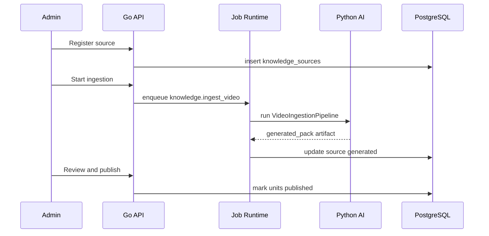

# Knowledge Lifecycle 架构设计

**文档版本**：v1.0
**更新日期**：2026-08-23
**状态**：设计稿
**适用范围**：视频知识入库、RAG、知识精修、向量索引、引用、知识质量管理

---

## Implementation Status

**当前状态**：部分实现（~25%）

| 模块 | 状态 | 说明 |
|---|---|---|
| lifecycle_status 列 | ✅ 已完成 | knowledge_units 表添加 lifecycle_status 字段。Phase 07a 完成。 |
| quality_score / content_hash 列 | ✅ 已完成 | knowledge_units 表扩展。Phase 07a 完成。 |
| license_status 列 | ✅ 已完成 | knowledge_sources 表扩展。Phase 07a 完成。 |
| knowledge_publications 表 | ✅ 已完成 | 发布批次管理表。Phase 07a 完成。 |
| KnowledgePublication Repository | ✅ 已完成 | Go 侧 repository 实现。 |
| KnowledgeSourceRegistry | 未实现 | 知识源注册和管理。 |
| 发布批次工作流 | 未实现 | 从 reviewed → embedded → published 的自动化流程。 |
| 质量阈值门控 | 未实现 | 基于 quality_score 的自动发布/拒绝。 |
| 检索质量评估 | 未实现 | published 知识的检索效果评估。 |

**相关 Phase**：07a → 归档于 `docs/plan/archive/implementation/`

---

## 1. 背景

BodySense 的 RAG 知识来源主要来自体态、康复、训练相关视频。现有 Python 侧已经有较完整的入库能力：

- ASR Provider：whisper.cpp、FunASR、API provider。
- `VideoIngestionPipeline`：抽音频、ASR、切分、clip 导出、generated pack。
- `AICurator`：AI 精修知识单元。
- `KnowledgeLibrary`：写入 PostgreSQL / pgvector，并支持检索。
- `curated_pack.json` 和 `generated_pack.json` 两类产物。

当前主要问题不是“没有管道”，而是知识从原始视频到线上检索结果之间，还缺一个正式生命周期：

```txt
source -> generated -> curated -> reviewed -> embedded -> published -> deprecated
```

如果没有生命周期治理，会出现：

- generated 内容未人工确认就被检索使用。
- ASR 噪声进入线上回答。
- 知识单元缺少来源和证据片段。
- embedding 与原文版本不一致。
- 无法回滚某次知识发布。
- citation 指向不稳定。
- 质量差的数据影响工具调用和训练建议。

本设计目标是建立 **Knowledge Lifecycle**，把知识库从“能检索”升级为“可发布、可审计、可回滚、可评估”的工程系统。

---

## 2. 设计目标

1. **知识有状态**
   每条知识单元都有 lifecycle status。

2. **线上只用 published 知识**
   RAG 默认只检索已发布版本。

3. **来源可追溯**
   每条知识必须能追溯 source video、timestamp、evidence excerpt。

4. **发布可回滚**
   知识发布按 batch/version 管理。

5. **质量可度量**
   知识单元有质量评分、审核状态和问题标记。

6. **与 Tool Runtime 对齐**
   `search_knowledge` 工具只返回满足质量门槛的结果。

---

## 3. 生命周期状态

```txt
raw
  原始视频或文本资源已登记

transcribed
  ASR 完成

generated
  自动切分生成知识底稿

curated
  AI 或人工完成精修

reviewed
  人工审核通过

embedded
  已生成 embedding

published
  已进入线上检索范围

deprecated
  不再推荐使用

rejected
  不允许进入知识库
```

---

## 4. 总体架构

```txt
Knowledge Admin / CLI
  - register source
  - start ingestion job
  - review curated units
  - publish / rollback
        |
        v
Go API
  - KnowledgeLifecycle Runtime
  - job orchestration
  - publish state
  - admin audit
        |
        v
Python AI Service
  - VideoIngestionPipeline
  - ASR
  - Splitter
  - AICurator
  - EmbeddingGenerator
  - KnowledgeLibrary
        |
        v
PostgreSQL + pgvector + file artifacts
```

---

## 5. Module 设计

### 5.0 Online KnowledgeLibrary async boundary

当前在线 Python RAG 路径不允许在 `async def` 中隐藏同步 PostgreSQL 或本地 transformer 推理：

- FastAPI lifespan 调用 `initialize_knowledge_library()` / `shutdown_knowledge_library()`；
- `KnowledgeLibrary` 持有一个有界 `AsyncConnectionPool`（默认 min=1 / max=8，可配置），启动连接等待上限为 5 秒；
- pgvector 通过 `register_vector_async` 在 async connection configure hook 注册；
- `search`、`list_sources`、`stats` 使用 async connection/cursor；
- `ingest_generated_pack` 的 source/segments/units/clips 仍在**同一个 async transaction** 内原子提交/回滚；
- 不允许 lazy singleton accessor 自己做网络 I/O；测试可显式注入非 owned pool；
- local `SentenceTransformer` 初始化和 `encode()` 用 `asyncio.to_thread`，并受 `LOCAL_EMBEDDING_MAX_CONCURRENCY` semaphore 限制；远程 embedding 继续使用原生 async API。

这些规则属于 runtime resource ownership；它们不改变 knowledge publication/review authority。

### 5.1 KnowledgeSourceRegistry

登记原始来源。

字段：

```txt
source_id
source_type
title
author
problem_slug
original_uri
license_status
language
status
```

职责：

- 管理来源元数据。
- 避免重复入库。
- 记录授权状态。

### 5.2 KnowledgeIngestionJob

由 Job Runtime 管理。

Job type：

```txt
knowledge.ingest_video
knowledge.curate_pack
knowledge.embed_pack
knowledge.publish_batch
```

对应 Python pipeline：

```txt
VideoIngestionPipeline.ingest
AICurator.refine_pack
KnowledgeLibrary.ingest_generated_pack
EmbeddingGenerator.generate_batch
```

### 5.3 KnowledgePack

KnowledgePack 是文件产物层。

```txt
generated_pack.json
curated_pack.json
reviewed_pack.json
```

原则：

- 文件产物保留完整中间过程。
- 数据库保存可查询状态和线上索引。
- pack 里必须有 schema version。

### 5.4 KnowledgePublication

发布批次 Module。

```txt
publication_id
version
source_ids
unit_ids
status
published_at
rollback_of
```

职责：

- 将 reviewed/embedded 知识切换到 published。
- 支持回滚到上一版本。
- 记录发布人和发布时间。

---

## 6. 数据库设计

### 6.1 knowledge_sources

```sql
CREATE TABLE knowledge_sources (
    id              UUID PRIMARY KEY DEFAULT uuidv7(),
    source_key      TEXT NOT NULL UNIQUE,
    source_type     VARCHAR(40) NOT NULL,
    title           TEXT NOT NULL,
    author          TEXT,
    problem_slug    TEXT NOT NULL,
    original_uri    TEXT,
    artifact_dir    TEXT,
    license_status  VARCHAR(40) NOT NULL DEFAULT 'unknown',
    status          VARCHAR(40) NOT NULL DEFAULT 'raw',
    metadata        JSONB NOT NULL DEFAULT '{}',
    created_at      TIMESTAMPTZ NOT NULL DEFAULT now(),
    updated_at      TIMESTAMPTZ NOT NULL DEFAULT now()
);
```

### 6.2 knowledge_units

当前已有 `knowledge_entries`，建议演进或新增状态字段：

```sql
ALTER TABLE knowledge_entries
ADD COLUMN IF NOT EXISTS source_id UUID REFERENCES knowledge_sources(id),
ADD COLUMN IF NOT EXISTS unit_key TEXT,
ADD COLUMN IF NOT EXISTS lifecycle_status VARCHAR(40) NOT NULL DEFAULT 'generated',
ADD COLUMN IF NOT EXISTS quality_score NUMERIC,
ADD COLUMN IF NOT EXISTS review_status VARCHAR(40) NOT NULL DEFAULT 'unreviewed',
ADD COLUMN IF NOT EXISTS evidence JSONB NOT NULL DEFAULT '{}',
ADD COLUMN IF NOT EXISTS publication_id UUID,
ADD COLUMN IF NOT EXISTS content_hash TEXT;
```

### 6.3 knowledge_publications

```sql
CREATE TABLE knowledge_publications (
    id              UUID PRIMARY KEY DEFAULT uuidv7(),
    version         TEXT NOT NULL UNIQUE,
    status          VARCHAR(40) NOT NULL,
    summary         TEXT,
    unit_count      INT NOT NULL DEFAULT 0,
    created_by      UUID REFERENCES users(id),
    published_at    TIMESTAMPTZ,
    rollback_of     UUID REFERENCES knowledge_publications(id),
    metadata        JSONB NOT NULL DEFAULT '{}',
    created_at      TIMESTAMPTZ NOT NULL DEFAULT now()
);
```

---

## 7. 质量门槛

线上 published 知识必须满足：

```txt
lifecycle_status = published
review_status in (reviewed, curated)
quality_score >= threshold
source timestamp exists
evidence excerpt exists
content_hash matches embedded text
license_status != rejected
```

`search_knowledge` 工具默认过滤：

```sql
WHERE lifecycle_status = 'published'
  AND review_status IN ('reviewed', 'curated')
```

开发环境可以开启 `include_generated=true`，但必须在 context_trace 中标记。

---

## 8. 引用设计

每个 SearchResult 应返回：

```json
{
  "unit_id": "...",
  "title": "...",
  "summary": "...",
  "source": {
    "title": "...",
    "author": "...",
    "timestamp": "03:12-04:20",
    "clip_url": "...",
    "source_key": "..."
  },
  "evidence_excerpt": "...",
  "quality_score": 0.91
}
```

前端 citation 不直接依赖 RAG chunk 文本，而依赖稳定 `unit_id` 和 source metadata。

---

## 9. 发布流程

```txt
1. register source
2. run knowledge.ingest_video
3. generated_pack.json
4. run knowledge.curate_pack
5. curated_pack.json
6. human review
7. run knowledge.embed_pack
8. create publication
9. publish
10. search_knowledge can retrieve
```

Mermaid：



---

## 10. 与 AI Output Governance 的关系

知识精修输出类型：

```txt
knowledge.curated_unit
```

必须经过：

- schema validation。
- evidence excerpt 检查。
- toxic / noisy ASR 清洗检查。
- source timestamp 检查。
- claim 是否能被 transcript 支持。

只有治理通过的 unit 才能进入 reviewed / embedded。

---

## 11. 测试和评估

### 11.1 Pipeline 测试

```txt
apps/ai-service/tests/unit/test_video_pipeline.py
apps/ai-service/tests/unit/test_curated_source.py
apps/ai-service/tests/unit/test_knowledge_library.py
```

### 11.2 检索质量评估

维护 query set：

```txt
docs/knowledges/eval/queries.jsonl
```

字段：

```json
{
  "query": "肩关节弹响怎么自测",
  "expected_problem_slug": "shoulder-joint",
  "expected_unit_types": ["self_test"],
  "must_include_terms": ["肩胛", "锁骨"]
}
```

指标：

```txt
top1 relevance
top3 recall
citation completeness
knowledge_gap accuracy
```

---

## 12. 分阶段落地

### Phase 1：状态字段和过滤

- 给 knowledge entries 增加 lifecycle / review / quality 字段。
- `search_knowledge` 默认只查 published。

### Phase 2：Source Registry

- 新增 `knowledge_sources`。
- 视频 pipeline 输出 source_id。

### Phase 3：Publication

- 新增 `knowledge_publications`。
- 支持发布批次。

### Phase 4：Review 工具

- CLI 或简单 admin 页面审核 generated/curated units。
- 支持 reject / approve / edit。

### Phase 5：检索评估

- 建立 query set。
- CI 或手动命令跑检索质量。

---

## 13. 成功标准

落地后应满足：

1. generated 知识不会误入线上检索。
2. 每条 citation 能追溯到 source、timestamp、evidence。
3. 知识发布可以按批次回滚。
4. RAG 检索质量可以用 query set 评估。
5. `search_knowledge` 工具只返回满足质量门槛的结果。
6. 视频入库从脚本能力升级为可管理生命周期。

