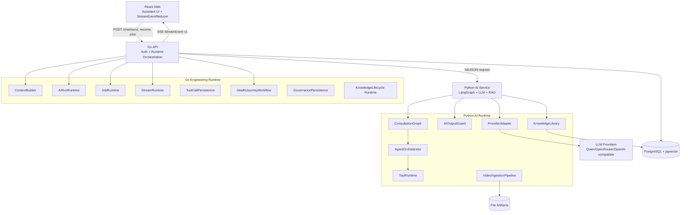
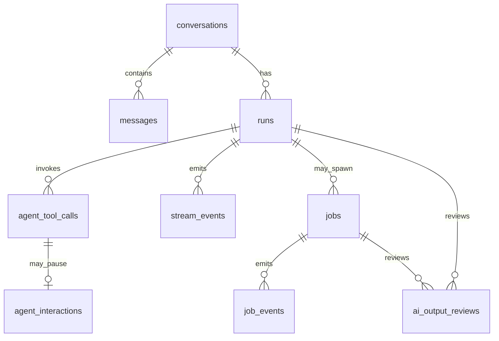
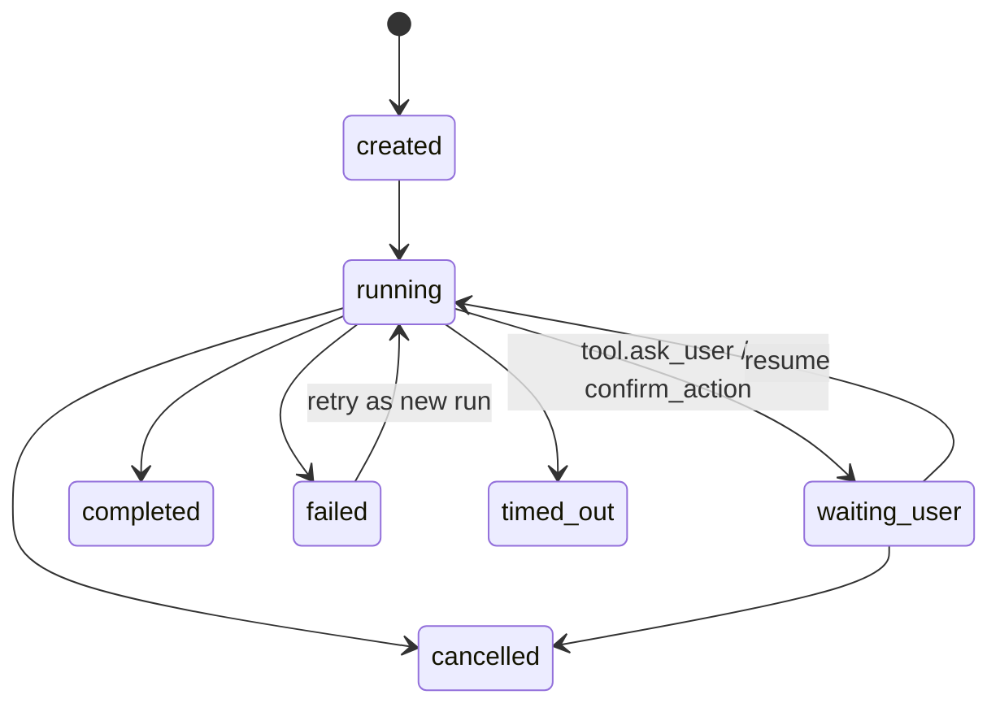
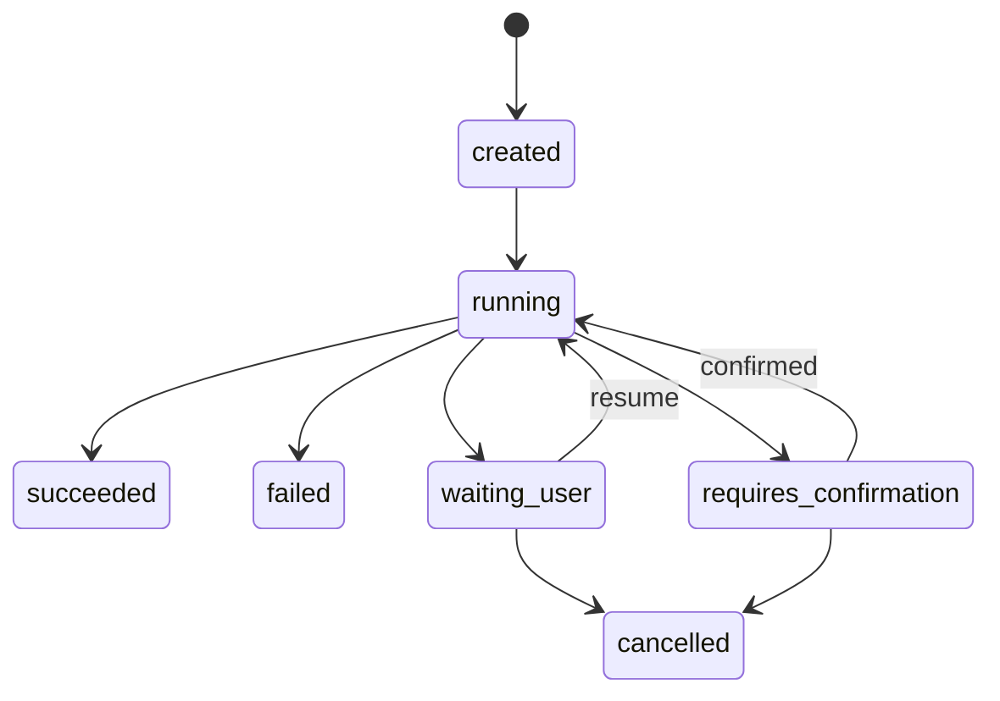
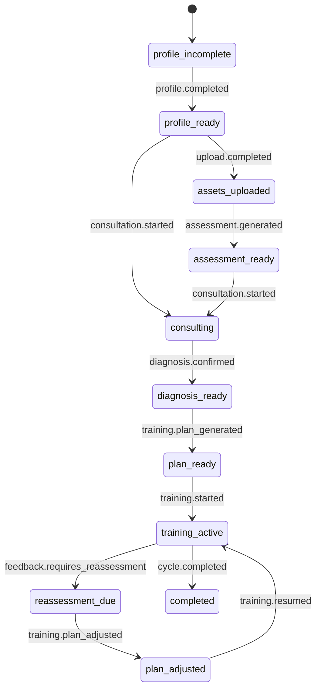

# System Engineering Refactor Plan

**文档版本**：v1.0  
**更新日期**：2026-06-29  
**状态**：下一阶段工程化重构设计稿  
**适用范围**：AI Health Agent 工程底座、咨询工作台、AI 长任务、工具调用、SSE、知识库、健康旅程

---

## Implementation Status

**当前状态**：总控计划 — 各子模块部分实现

本文件是七个子架构文档的汇总重构方案。各子模块实现进度如下：

| 子模块 | 架构文档 | 实现进度 | 关键已实现 |
|---|---|---|---|
| Context Engineering | [context-engineering-architecture.md](./context-engineering-architecture.md) | ~50% | ask_user 契约、agent_interactions |
| Agent Tool Calling | [agent-tool-calling-runtime.md](./agent-tool-calling-runtime.md) | ~40% | ToolRegistry 骨架、2 个工具已迁移 |
| AI Run / Job Runtime | [ai-run-job-runtime.md](./ai-run-job-runtime.md) | ~50% | jobs schema、Go JobRuntime、OCR 迁移 |
| Stream Event Contract | [stream-event-contract-runtime.md](./stream-event-contract-runtime.md) | ~30% | Go StreamRuntime、StreamEvent v1 |
| AI Output Governance | [ai-output-governance.md](./ai-output-governance.md) | ~35% | AIOutputGuard 骨架、OutputReviewService |
| Knowledge Lifecycle | [knowledge-lifecycle-architecture.md](./knowledge-lifecycle-architecture.md) | ~25% | lifecycle schema、publication repo |
| Health Journey | [health-journey-workflow.md](./health-journey-workflow.md) | 0% | 未开始 |

**未完成事项**汇总在各子文档的 Implementation Status 段中。原始实施计划归档于 `docs/plan/archive/implementation/`。

---

## 1. 背景

BodySense 当前已经不是单纯的聊天应用，而是由多条 AI 驱动业务链路组成的健康 Agent 系统：

- React 咨询工作台通过 SSE 展示流式 AI 回复，并联动右侧结构化信息面板。
- Go API 负责鉴权、conversation / message / run 持久化、SSE 转发、问诊领域状态和业务接口。
- Python AI Service 负责 LangGraph 问诊流程、LLM provider 适配、RAG、OCR、评估、诊断、训练计划和视频知识入库。
- PostgreSQL / pgvector 已承载会话、用户画像、问诊状态、训练计划、知识库和向量检索。

新增架构文档已经把多个重要方向拆出来：

- [Context Engineering](./context-engineering-architecture.md)
- [Agent Tool Calling Runtime](./agent-tool-calling-runtime.md)
- [AI Run / Job Runtime](./ai-run-job-runtime.md)
- [Stream Event Contract Runtime](./stream-event-contract-runtime.md)
- [AI Output Governance](./ai-output-governance.md)
- [Knowledge Lifecycle](./knowledge-lifecycle-architecture.md)
- [Health Journey Workflow](./health-journey-workflow.md)

本文件的目标是把这些设计汇总成下一阶段系统工程化重构方案：明确 Module、Interface、Seam、数据模型、事件契约、状态机和分阶段实施顺序，让当前系统升级为更稳定、可扩展、可观测、可测试的 AI Health Agent 工程底座。

---

## 2. 审计范围

本设计基于当前代码和文档审计，不凭空假设项目结构。

已审计的文档：

- `docs/architecture/ai-run-job-runtime.md`
- `docs/architecture/stream-event-contract-runtime.md`
- `docs/architecture/ai-output-governance.md`
- `docs/architecture/knowledge-lifecycle-architecture.md`
- `docs/architecture/health-journey-workflow.md`
- `docs/architecture/context-engineering-architecture.md`
- `docs/architecture/agent-tool-calling-runtime.md`
- `docs/architecture/technical-approach.md`

已审计的主要代码：

- Go 会话与 SSE：`apps/api/internal/handler/chat_handler.go`、`sse_writer.go`、`apps/api/internal/service/ai_client.go`
- Go run/message/conversation：`apps/api/internal/model/run.go`、`message.go`、`conversation.go`
- Go 问诊/评估/训练/上传/知识：`consultation_service.go`、`assessment_service.go`、`training_service.go`、`upload_service.go`、`knowledge.go`
- Python 问诊图和事件：`apps/ai-service/src/services/consultation_graph.py`、`chat_service.py`、`models/stream_event.py`
- Python provider/tool call：`apps/ai-service/src/ai/types.py`、`ai/providers/openai_compatible.py`
- Python 输出治理雏形：`diagnosis_service.py`、`faithfulness_checker.py`、`red_flag_detector.py`
- Python 知识库：`rag/knowledge_library.py`、`rag/video_pipeline.py`
- 前端 SSE 和 Chat UI：`useSSEProcessor.ts`、`useAssistantChatRuntime.ts`、`AssistantChatPanel.tsx`、`consultation.ts`
- 共享契约：`packages/contracts/src/stream-events.ts`、`packages/contracts/schemas/stream-event.v1.schema.json`
- 数据库迁移：`000013_session_redesign.up.sql`、`000010_create_knowledge_library.up.sql`、评估/训练/profile/upload 相关 migration

---

## 3. 当前问题

### 3.1 已经存在的能力

当前系统已经具备以下基础，重构时应复用，而不是重建：

- `conversations` / `messages` / `runs` 已经完成会话重设计，`runs.request_id` 已支持用户级幂等。
- `messages.parts` 已支持多 part 结构，虽然前端当前主要稳定消费 text。
- Go `ChatHandler` 已作为 SSE 对外出口，能创建 user message、assistant placeholder、run，并补全 outbound event 的 `seq` 和 ids。
- `@bodysense/contracts` 已定义 `StreamEvent v1` 的 TypeScript 类型和 JSON schema。
- Python `StreamEventFactory` 已能生成 versioned event envelope。
- Python `OpenAICompatibleProvider` 已能把 OpenAI-compatible streaming tool call delta 聚合为 `AiStreamEvent(type="tool_call_done")`。
- Python `consultation_graph.py` 已实现 LangGraph 问诊流程、多轮 tool loop、`extract_symptom_info`、`search_knowledge`、citation、knowledge gap、red flag。
- Python 已有 `RedFlagDetector`、`FaithfulnessChecker`、诊断/训练相关 Pydantic 或手写校验。
- 知识库已经不是单表雏形，`000010_create_knowledge_library.up.sql` 已有 `knowledge_sources`、`knowledge_segments`、`knowledge_units`、`knowledge_clips`。
- 前端已通过 `useSSEProcessor.ts` 解析 SSE，并把 extracted info、phase、citation、red flag 回调给页面。
- 用户画像、上传、评估报告、问诊 session、训练计划、训练日志都有基本表和业务 Module。

### 3.2 文档中规划但尚未实现的能力

以下能力已在架构文档中成型，但当前代码还没有落地：

- 独立 `ContextBuilder` Module。当前上下文拼装仍在 `ChatHandler.SendMessage` 内。
- `consultation_state` 结构化状态和 revision。当前仍以 `extracted_info []` 为主。
- `AgentOrchestrator`、`ToolRegistry`、`ToolExecutor`。当前工具执行逻辑仍内联在 `consultation_graph.generate_response`。
- `ask_user` / `confirm_action` 这类 HITL 暂停型工具，以及 `agent_interactions`。
- `agent_tool_calls` 审计表。
- `jobs` / `job_events` 统一长任务运行底座。
- `stream_events` 可回放事件表和 Go `StreamRuntime`。
- `ai_output_reviews` 输出治理审计表和统一 `AIOutputGuard`。
- `knowledge_publications`、知识 lifecycle status、quality gate、人工审核发布流程。
- `health_journeys` / `health_journey_events` 和 `available_actions`。

### 3.3 建议新增的能力

下一阶段应新增以下深 Module，让调用方获得更高 Leverage，让故障和状态变化具备 Locality：

- `AIRunRuntime`：统一管理一次 Agent / LLM 执行的状态、超时、取消、等待用户、事件落库。
- `JobRuntime`：统一管理 OCR、评估、训练生成、重评估、知识入库等可恢复长任务。
- `StreamRuntime`：统一校验、映射、分配 seq、写 SSE、可选落库和回放。
- `StreamEventReducer`：前端用 reducer 消费事件，分别维护 message、tool、state、job、error。
- `ToolRuntime`：Python 执行工具循环，Go 保存工具调用和 interaction 真值。
- `AIOutputGuard`：统一输出 schema、安全、忠实度、业务规则治理。
- `KnowledgeLifecycleRuntime`：围绕现有 normalized knowledge schema 增加状态、发布、审核和质量门槛。
- `HealthJourneyWorkflow`：从分散业务状态中计算用户健康旅程阶段和可执行动作。

### 3.4 暂时不建议做的能力

这些能力有价值，但不适合当前阶段优先引入：

- 不建议第一版引入 Temporal、复杂 DAG、分布式 worker 集群。先用 Go 进程内 worker + DB 状态机，保留替换 Seam。
- 不建议让 Python 直接写用户业务数据库。Python 可以读写知识库管道所需数据，但用户态状态仍以 Go 为权威编排器。
- 不建议做多 Agent 协作。先完成单 Agent 的 run/tool/context/stream 工程底座。
- 不建议把所有 AI 任务同时改为异步 Job。先迁移 OCR、训练重评估、知识入库，再迁移评估和训练计划。
- 不建议把 LangGraph checkpoint 当正式业务真相源。它可用于 run 内恢复或开发调试，但正式状态应在 PostgreSQL。
- 不建议马上建设完整 admin 审核后台。知识生命周期第一版可以先用 CLI 或轻量内部页面。

---

## 4. 总体目标

下一阶段重构目标：

1. **运行模型清晰**  
   明确 `conversation`、`message`、`run`、`job`、`job_step`、`tool_call`、`interaction` 的关系。

2. **事件契约稳定**  
   所有客户端可见 SSE 都遵守 `StreamEvent v1`，由 Go 对外统一发送，支持调试和关键事件回放。

3. **工具调用可暂停、可恢复、可审计**  
   模型只提出工具调用意图，工具执行、权限、状态、interaction 和幂等由 Runtime 控制。

4. **AI 输出先治理再落库**  
   诊断、训练计划、评估报告、问诊结构化状态、知识精修都必须经过统一校验和安全策略。

5. **知识库可发布、可回滚、可引用**  
   线上检索只使用通过质量门槛的知识单元，引用稳定可追溯。

6. **健康旅程成为正式业务状态机**  
   前端和 Agent 不再猜下一步，而是读取 `available_actions`。

7. **重构可分阶段落地**  
   保持 MVP 节奏，每个阶段都能独立验收，不做大爆炸重写。

---

## 5. 核心架构图



核心原则：

```txt
Go 管用户态真相、权限、运行状态、SSE 对外契约
Python 管 AI 推理、工具循环、RAG、输出治理计算
PostgreSQL 管正式持久化和审计
Frontend 管事件 reducer、交互卡片、用户确认和展示
```

---

## 6. 模块边界设计

### 6.1 Go API Module

| Module | 建议位置 | Interface 职责 | 不负责 |
|---|---|---|---|
| `ContextBuilder` | `apps/api/internal/context/` | 组装 Go -> Python 上下文 bundle，过滤 messages，生成 context trace | 调用 LLM |
| `AIRunRuntime` | `apps/api/internal/airun/` | 创建、完成、失败、取消、暂停、恢复 run | 具体 AI 业务逻辑 |
| `JobRuntime` | `apps/api/internal/job/` | enqueue、execute、retry、cancel、progress、artifact | 直接解析所有 AI 输出 |
| `StreamRuntime` | `apps/api/internal/stream/` | 校验事件、补 ids、分配 seq、写 SSE、落 replayable event | 业务状态推理 |
| `AgentToolService` | `apps/api/internal/agent/` | 保存 tool_call、interaction、resume 权限和幂等 | 执行模型工具循环 |
| `OutputReviewService` | `apps/api/internal/governance/` | 保存治理结果，决定是否落业务表 | 重新实现 AI 规则 |
| `HealthJourneyWorkflow` | `apps/api/internal/workflow/` | 计算 stage 和 available_actions，应用 journey event | 生成 AI 内容 |
| `KnowledgeLifecycleRuntime` | `apps/api/internal/knowledge/` | source、publish、review、rollback、admin audit | 运行 ASR/embedding |

### 6.2 Python AI Service Module

| Module | 建议位置 | Interface 职责 | 不负责 |
|---|---|---|---|
| `AgentOrchestrator` | `apps/ai-service/src/services/agent/orchestrator.py` | 多轮 LLM + tool loop，控制 max iterations | 写用户业务 DB |
| `ToolRegistry` | `apps/ai-service/src/services/agent/tool_registry.py` | 注册工具 schema、category、handler、timeout | 执行权限判断 |
| `ToolExecutor` | `apps/ai-service/src/services/agent/tool_executor.py` | 参数校验、执行 handler、返回 ToolResult | 前端事件格式 |
| `AIOutputGuard` | `apps/ai-service/src/services/governance/output_guard.py` | schema/safety/faithfulness/business policy | 最终业务落库 |
| `StreamEventMapper` | `apps/ai-service/src/services/events/` | graph/tool/governance event -> public-like event | 对外 SSE seq 真值 |
| `KnowledgeLibrary` | 现有 `rag/knowledge_library.py` | 检索、入库 normalized knowledge units | 发布审批 |
| `VideoIngestionPipeline` | 现有 `rag/video_pipeline.py` | ASR、切分、clip、pack | job 状态真值 |

### 6.3 Frontend Module

| Module | 建议位置 | Interface 职责 |
|---|---|---|
| `StreamEventReducer` | `apps/web/src/features/consultation/runtime/streamEventReducer.ts` | 纯 reducer 消费事件，维护 message/tool/state/job/error |
| `useChatStream` | `apps/web/src/features/consultation/hooks/useChatStream.ts` | 建立请求、消费 SSE、dispatch reducer |
| `MessagePartRenderer` | `apps/web/src/features/consultation/components/message-parts/` | 渲染 text/source/tool/ask/error |
| `AskUserCard` | `apps/web/src/features/consultation/components/AskUserCard.tsx` | 渲染 HITL 追问并调用 resume |
| `useHealthJourney` | `apps/web/src/features/health-journey/` | 读取 stage 和 available_actions |
| `useJobStatus` | `apps/web/src/features/jobs/` | 展示长任务状态、取消、重试 |

---

## 7. 数据模型设计

### 7.1 现有核心表关系

```txt
users
  -> user_profiles
  -> user_uploads
  -> conversations
       -> messages
       -> runs
       -> consultation_sessions
  -> assessment_reports
  -> training_plans
       -> training_logs

knowledge_sources
  -> knowledge_segments
  -> knowledge_units
       -> knowledge_clips
```

### 7.2 新增核心表

建议新增：

```txt
runs                  已有，扩展状态和 metadata 语义
jobs                  新增，后台长任务真值
job_events            新增，job 进度和审计
stream_events         新增，可回放关键 SSE 事件
agent_tool_calls      新增，模型工具调用审计
agent_interactions    新增，ask_user/confirm_action 等 HITL 状态
ai_output_reviews     新增，AI 输出治理审计
health_journeys       新增，用户健康旅程状态
health_journey_events 新增，旅程推进事件
knowledge_publications 新增，知识发布批次
```

### 7.3 Run / Job / Tool / Message 关系



语义约束：

- `message` 是用户可见聊天内容和消息状态。
- `run` 是一次 Agent / LLM 执行记录，属于 conversation / turn。
- `job` 是可恢复后台任务，可由页面操作、run、tool call 触发。
- `tool_call` 是模型请求某个工具的审计记录。
- `interaction` 是 HITL 工具创建的用户待办。
- `stream_event` 是可选回放的客户端可见事件。
- `ai_output_review` 是关键 AI 输出进入业务状态前的治理记录。

### 7.4 Run 状态扩展

当前 `runs.status` 为：

```txt
running / completed / failed / cancelled
```

建议扩展为：

```txt
created
running
waiting_user
completed
failed
cancelled
timed_out
```

状态流转：



建议规则：

- `run` 不应该被原地重复执行。重试应创建新 run，并通过 `metadata.retry_of_run_id` 关联。
- `waiting_user` 不是失败，不应触发自动重试。
- 客户端断连不一定等于模型取消。第一阶段可以保持当前行为标记 `failed/aborted`，第二阶段增加 server-side run continuation 时再区分。
- `request_id` 继续作为用户级幂等键。

### 7.5 Job 状态

Job 状态：

```txt
pending
running
waiting_user
completed
failed
cancelled
timed_out
```

Job 输入、进度和结果：

- `input`：创建任务的业务参数，必须可重放。
- `progress`：当前 step、percent、message、artifact summary。
- `result`：正式输出引用，例如 `assessment_report_id`、`training_plan_id`。
- `artifacts`：文件路径、pack 路径、OCR 原始 JSON、embedding batch 统计。
- `error`：统一错误结构。

### 7.6 持久化和运行时状态边界

必须持久化：

- conversation、message、run、job、tool_call、interaction。
- consultation_state / extracted_info / diagnosis / treatment_plan。
- journey stage、available_actions、journey events。
- AI 输出治理结果和关键问题。
- knowledge source/unit/publication/review status。
- replayable stream event：message lifecycle、state、tool、interaction、job、usage。

只作为运行时状态：

- LLM provider 私有 chunk。
- 单 token text delta 缓冲。
- Python graph 中间变量。
- 未通过治理的 raw prompt 临时上下文。
- 非关键 debug event。

可选持久化：

- `message.text.delta`。最终 message 可恢复文本时，delta 可只写 debug log；需要精确回放时再进入 `stream_events`。
- LangGraph checkpoint。只用于 waiting_user / 长 run 恢复，不作为正式业务状态。

---

## 8. SSE 事件契约设计

### 8.1 标准事件 envelope

继续使用 `StreamEvent v1`：

```ts
type StreamEvent = {
  version: 1;
  seq: number;
  channel: StreamChannel;
  type: string;
  ids: {
    conversation_id?: string | null;
    run_id?: string | null;
    turn_id?: string | null;
    message_id?: string | null;
    tool_call_id?: string | null;
    job_id?: string | null;
    interaction_id?: string | null;
  };
  payload: Record<string, unknown>;
};
```

建议扩展 `StreamChannel`：

```txt
conversation
message
tool
state
source
safety
usage
job
governance
debug
stream
```

### 8.2 标准事件类型

必须稳定支持：

```txt
conversation.created
message.persisted
message.created
message.text.delta
message.completed
message.failed

tool.call.created
tool.call.running
tool.call.delta
tool.call.succeeded
tool.call.failed
tool.call.interrupted

state.consultation.patch
state.extracted_info.upsert
state.phase.changed
state.health_journey.changed
state.interaction.required
state.interaction.answered

source.citation.added
source.knowledge_gap

safety.red_flag.detected
governance.reviewed
governance.degraded
governance.rejected

job.created
job.progress
job.completed
job.failed
job.cancelled

usage.reported
stream.heartbeat
stream.done
stream.error
stream.interrupted
```

兼容策略：

- 当前已有 `tool.call` / `tool.result` 可以短期保留。
- 新 Runtime 内部使用更明确的 `tool.call.created` / `tool.call.succeeded`。
- 迁移完成后统一 contracts 和前端 reducer，再删除旧事件名。

### 8.3 text delta 传输

`message.text.delta` 只传输文本增量：

```json
{
  "channel": "message",
  "type": "message.text.delta",
  "payload": {
    "delta": "建议你先确认疼痛场景。"
  }
}
```

规则：

- text delta 不夹带 tool、citation、state patch。
- Go 可以做小缓冲，避免每个 token 一个 SSE frame。
- 前端把 delta append 到当前 assistant message 的 text part。
- 最终 message 持久化为合并后的 text part，不把每个 delta 存为 message part。

### 8.4 tool call 事件

工具调用生命周期事件：

```json
{
  "channel": "tool",
  "type": "tool.call.created",
  "ids": {
    "tool_call_id": "call_xxx"
  },
  "payload": {
    "tool_name": "search_knowledge",
    "arguments": {
      "query": "膝盖 下坠感 上下楼梯"
    }
  }
}
```

```json
{
  "channel": "tool",
  "type": "tool.call.succeeded",
  "payload": {
    "tool_name": "search_knowledge",
    "result_summary": {
      "has_results": true,
      "result_count": 3
    }
  }
}
```

不建议把完整工具结果都塞进前端事件。大结果应进入 DB / artifact / trace，前端只接收摘要和 source citation。

### 8.5 结构化状态事件

`state.consultation.patch` 是未来主事件：

```json
{
  "channel": "state",
  "type": "state.consultation.patch",
  "payload": {
    "base_revision": 7,
    "patch": {
      "symptoms": [
        {
          "id": "sym_01",
          "body_part": "knee",
          "trigger": "上下楼梯"
        }
      ],
      "missing_slots": ["severity", "swelling"]
    }
  }
}
```

当前 `state.extracted_info.upsert` 可作为过渡事件继续存在。

### 8.6 done / error / interrupted / heartbeat

语义区分：

- `stream.done`：本次 SSE 正常结束，不一定代表 run 成功；最终状态看 `message.completed` 或 `run.status`。
- `message.completed`：assistant message 已完成并可持久化展示。
- `stream.error`：流协议或运行错误。
- `stream.interrupted`：run 因 waiting_user / confirmation 暂停。
- `stream.heartbeat`：长任务或慢工具保持连接。
- `message.failed`：当前 assistant message 失败。

`ask_user` 暂停时应发送：

```txt
tool.call.interrupted
state.interaction.required
stream.interrupted
stream.done
```

### 8.7 前端 reducer 化消费

前端新增 `StreamEventReducer`，状态形状：

```ts
type StreamState = {
  messagesById: Record<string, ChatMessageState>;
  currentRun: RunViewState | null;
  toolsById: Record<string, ToolCallViewState>;
  interactionsById: Record<string, InteractionViewState>;
  consultationState: ConsultationStateView;
  citations: Citation[];
  jobsById: Record<string, JobViewState>;
  errors: StreamErrorView[];
};
```

原则：

- reducer 是纯函数，便于 fixture 测试。
- Markdown 只渲染 text part。
- tool / state / citation / error 作为独立 part 或 side panel state，不混进 Markdown 字符串。
- 重复事件必须幂等。
- 未知 optional event 不打断 UI。

### 8.8 可回放、可调试、可测试

Go `StreamRuntime` 负责：

```txt
Python NDJSON event
  -> decode
  -> validate channel/type/payload
  -> enrich ids
  -> assign outbound seq
  -> persist replayable event
  -> write SSE
```

测试策略：

- `packages/contracts/fixtures/stream-events/*.json`
- Go validator 用 fixtures 测试。
- Python event mapper 用 fixtures 测试。
- 前端 reducer 用 fixtures 测试。

---

## 9. Tool Calling 生命周期设计

### 9.1 Tool Registry

Python `ToolRegistry` 是工具定义真值：

```python
class ToolDefinition(BaseModel):
    name: str
    description: str
    args_model: type[BaseModel]
    parameters_schema: dict[str, Any]
    category: Literal["query", "write", "human", "dangerous"]
    auto_execute: bool
    requires_confirmation: bool
    timeout_seconds: int
    max_retries: int = 0
```

第一批工具：

```txt
extract_symptom_info      query-ish extraction, no direct DB write
search_knowledge          query
ask_user                  human
save_extracted_info       write via Go persistence
finish_consultation       write via Go persistence
```

### 9.2 Tool Call 状态机



DB status 建议：

```txt
created / running / waiting_user / requires_confirmation / succeeded / failed / cancelled / timed_out
```

### 9.3 ask_user HITL 暂停

`ask_user` 不是同步函数，而是 interrupt：

```txt
LLM requests ask_user
  -> ToolExecutor validates args
  -> returns ToolResult(status=interrupted)
  -> Python emits interaction.required
  -> Go inserts agent_tool_calls + agent_interactions
  -> Go marks run waiting_user
  -> Frontend renders AskUserCard
```

用户回答：

```txt
Frontend POST /interactions/:id/resume
  -> Go checks ownership + idempotency
  -> interaction answered
  -> Go creates/resumes run
  -> Python appends tool message with answer
  -> Agent continues
```

### 9.4 工具结果进入上下文

规则：

- ToolResult 先进入 `tool` message，供下一轮 LLM 使用。
- 大结果进入 DB/artifact，只给模型摘要。
- `search_knowledge` 的结果通过 citations 进入 `source` 事件，不长期塞进 conversation history。
- `save_extracted_info` 输出 patch，由 Go 校验合并到 consultation state。
- `ask_user` 的 answer 成为 tool result，同时结构化写入 consultation state 或 active question。

### 9.5 防止模型乱调工具

必须同时做 prompt 约束和 runtime 约束：

- 工具白名单：未注册工具拒绝。
- 按 journey stage 过滤工具。
- 每轮最多 1 次 `ask_user`，连续 `ask_user` 最多 2 次。
- `max_tool_iterations` 默认 5。
- Pydantic args model 强校验。
- `answer_type/options/question/reason` 有长度和枚举限制。
- 高风险工具必须 confirmation。
- 权限和 session ownership 只在 Go 检查。
- 写入工具使用 idempotency key：`conversation_id + run_id + tool_call_id`。

### 9.6 失败、重试和降级

错误结构：

```json
{
  "code": "INVALID_TOOL_ARGUMENTS",
  "message": "Missing required field: question",
  "retryable": false
}
```

策略：

- 参数校验失败：可作为 tool error 喂回模型修正一次。
- 查询超时：重试一次，仍失败则让模型保守回答并标记 knowledge gap。
- 权限失败：不喂回模型绕过，直接失败。
- unknown tool：视为后端配置或模型失控，失败并审计。
- loop 超限：结束 run，返回安全降级提示。

---

## 10. AI Run / Job 生命周期设计

### 10.1 Run 和 Job 的边界

`run`：

- 一次 Agent / LLM 执行记录。
- 通常由用户消息、resume、系统生成标题等触发。
- 可流式输出。
- 与 conversation / message / turn 强关联。
- 可以产生 tool_call、interaction、stream_event、ai_output_review。

`job`：

- 一个可恢复、可重试、可取消、可展示进度的后台任务。
- 可以包含 0 个、1 个或多个 AI run。
- 适合 OCR、评估报告、训练计划、重评估、知识入库、视频处理。
- 可能没有 conversation。

### 10.2 任务拆分

建议映射：

| 业务 | Run | Job | Step |
|---|---|---|---|
| 咨询回复 | 是 | 否 | tool calls as sub-steps |
| ask_user resume | 是 | 可选 | restore -> append tool result -> generate |
| 标题生成 | 是 | 可选轻量 job | load messages -> generate -> persist title |
| OCR 报告 | 否 | 是 | validate file -> call OCR -> parse -> persist |
| 健康评估 | 可作为 job 内 run | 是 | load profile -> call AI -> govern -> persist |
| 训练计划 | 可作为 job 内 run | 是 | load diagnosis -> call AI -> govern -> persist |
| 训练反馈重评估 | 可作为 job 内 run | 是 | load logs -> call AI -> govern -> propose adjustment |
| 知识视频入库 | 否或多个 run | 是 | ASR -> split -> curate -> embed -> publish |

### 10.3 Run Runtime Interface

```go
type AIRunRuntime interface {
    Start(ctx context.Context, req StartRunRequest) (*model.Run, error)
    MarkWaitingUser(ctx context.Context, runID uuid.UUID, interactionID uuid.UUID) error
    Complete(ctx context.Context, runID uuid.UUID, result RunResult) error
    Fail(ctx context.Context, runID uuid.UUID, err RunError) error
    Cancel(ctx context.Context, runID uuid.UUID, reason string) error
    Retry(ctx context.Context, runID uuid.UUID, requestID string) (*model.Run, error)
}
```

第一阶段可以在现有 `RunService` 上演进，后续再抽到 `internal/airun/`。

### 10.4 Job Runtime Interface

```go
type JobRuntime interface {
    Enqueue(ctx context.Context, req EnqueueJobRequest) (*model.Job, error)
    Get(ctx context.Context, jobID, userID uuid.UUID) (*model.Job, error)
    Cancel(ctx context.Context, jobID, userID uuid.UUID) error
    Retry(ctx context.Context, jobID, userID uuid.UUID) (*model.Job, error)
}
```

第一版执行策略：

```txt
Enqueue -> insert jobs -> start goroutine worker
Startup -> scan pending/stale running -> recover or fail
Handler -> write job_events -> update progress/result/error
```

### 10.5 前端进度感知

两种方式并行：

- 页面主动轮询 `GET /api/v1/jobs/:id`，适合评估/训练/知识入库。
- 在聊天 SSE 中转发 `job.*`，适合工具触发的长任务。

Job UI 展示：

```txt
pending: 等待执行
running: 当前 step + percent
waiting_user: 需要用户确认或补充材料
failed: 错误码 + 是否可重试
completed: 结果入口
cancelled: 已取消
```

---

## 11. AI 输出质量治理

### 11.1 Prompt 分层

建议统一 prompt 分层：

```txt
System Prompt
  身份、安全边界、医疗免责声明、禁止事项

Developer Prompt
  BodySense 业务规则、工具使用规则、输出格式、引用规则

Task Prompt
  本次任务输入、用户状态、知识结果、输出 schema

Runtime Context
  recent messages、consultation_state、journey_state、tool results
```

规则：

- System / Developer prompt 应有版本号，写入 `runs.metadata.system_prompt_version`。
- Task prompt 不应包含不可追溯的大块历史，应由 ContextBuilder 控制。
- 对结构化输出使用 JSON schema / Pydantic，不依赖 Markdown 解析。

### 11.2 AIOutputGuard

统一 Interface：

```python
class AIOutputGuard:
    async def validate(
        self,
        output_type: str,
        raw_output: Any,
        context: GovernanceContext,
    ) -> GovernanceResult:
        ...
```

输出状态：

```txt
accepted
repaired
degraded
rejected
```

Policy：

- Schema Policy：JSON / Pydantic 结构校验。
- Safety Policy：红旗、禁忌、医疗诊断边界、危险动作。
- Faithfulness Policy：训练动作和关键建议是否被 RAG 支持。
- Business Rule Policy：是否符合 journey stage、phase、用户禁忌、状态合并规则。

### 11.3 医疗健康安全边界

所有用户可见健康建议必须满足：

- 不作确定医学诊断。
- 红旗症状明确建议就医。
- 高风险动作不在缺失信息时直接推荐。
- 对低置信判断使用保守措辞。
- 建议明确适用条件、停止条件和升级建议。
- 没有知识库支持的具体动作参数必须标记为通用建议或降级。

### 11.4 Markdown 输出规范

用户可见 Markdown 只用于解释性文本：

- 不包含 JSON。
- 不包含隐藏状态。
- 不包含工具结果原文。
- 不包含与结构化事件重复的完整列表。

结构化内容通过 SSE state/tool/source/governance event 传输。

### 11.5 Bad Case 和评估集

新增评估集目录建议：

```txt
apps/ai-service/tests/golden/
  consultation_reply/
  diagnosis/
  treatment_plan/
  training_plan/
  reassessment/
  knowledge_curated_unit/
```

Bad case 记录字段：

```json
{
  "id": "badcase_001",
  "output_type": "training.plan",
  "input_context": {},
  "raw_output": {},
  "expected_status": "rejected",
  "reason": "recommended high-risk exercise despite red flag"
}
```

---

## 12. 健康旅程状态机设计

### 12.1 关系模型

```txt
user
  -> user_profile             长期档案
  -> health_journey           当前健康旅程
  -> consultation_session     单次问诊短期状态
  -> assessment_report        某次评估产物
  -> training_plan            当前或历史训练周期
  -> training_log             每日反馈和打卡
  -> user_memory              后续长期摘要，可选
```

单次会话信息：

- 当前主诉、当前症状细节、active question。
- 当前问诊 phase、未确认诊断、临时 RAG 结果。
- 当前 run/tool/interactions。

长期档案信息：

- 基本身体档案、既往伤病、运动习惯。
- 已确认的重要健康问题。
- 历史训练偏好和禁忌。
- 已完成周期摘要。

### 12.2 Journey 阶段



### 12.3 Workflow Interface

```go
type HealthJourneyWorkflow interface {
    GetState(ctx context.Context, userID uuid.UUID) (*JourneyState, error)
    ApplyEvent(ctx context.Context, event JourneyEvent) (*JourneyState, error)
    AvailableActions(ctx context.Context, userID uuid.UUID) ([]JourneyAction, error)
}
```

### 12.4 下一次会话继承上下文

ContextBuilder 注入：

```json
{
  "journey_state": {
    "stage": "training_active",
    "available_actions": ["continue_consultation", "submit_training_feedback"],
    "active_training_plan_id": "...",
    "latest_assessment_id": "..."
  },
  "long_term_profile_summary": "...",
  "recent_cycle_summary": "..."
}
```

避免上下文无限膨胀：

- 最近消息只取最近 N 轮。
- 会话历史进入 `conversations.summary`。
- 长期画像只保留结构化字段和周期摘要。
- 旧 tool result 不进入 prompt，只保留摘要或引用。
- 被用户修正/删除的信息标记 inactive 或从 prompt 过滤。

### 12.5 问诊信息汇总单

`generate_summary` 或 `finish_consultation` 生成结构化汇总：

```json
{
  "chief_complaint": "膝盖下坠感",
  "symptoms": [
    {
      "body_part": "knee",
      "trigger": "上下楼梯",
      "duration": "一周",
      "severity": "中等",
      "confirmed": true
    }
  ],
  "negative_findings": ["无明显外伤", "无发热"],
  "red_flags": [],
  "diagnosis_candidates": [],
  "recommended_next_actions": []
}
```

该汇总单属于 `consultation_session` 的正式产物，并可被 `health_journey` 和下一次 ContextBuilder 引用。

---

## 13. 知识库生命周期设计

### 13.1 基于现有 normalized schema 演进

当前已有：

```txt
knowledge_sources
knowledge_segments
knowledge_units
knowledge_clips
```

下一步不建议重建知识库，而是在现有 schema 上增加：

- `knowledge_units.lifecycle_status`
- `knowledge_units.quality_score`
- `knowledge_units.publication_id`
- `knowledge_units.content_hash`
- `knowledge_sources.license_status`
- `knowledge_publications`

### 13.2 source / chunk / embedding / version 关系

```txt
knowledge_source
  原始视频、作者、授权、标题、原始路径、ASR 元数据

knowledge_segment
  原始 transcript chunk，带 start/end seconds

knowledge_unit
  可检索知识单元，来自一个或多个 segment，带 embedding

knowledge_clip
  动作演示或证据片段，关联 source/unit

knowledge_publication
  发布批次，控制哪些 unit 进入线上检索
```

### 13.3 生命周期

```txt
raw
transcribed
generated
curated
reviewed
embedded
published
deprecated
rejected
```

线上 `search_knowledge` 默认只查：

```sql
WHERE lifecycle_status = 'published'
  AND review_status IN ('reviewed', 'curated')
  AND quality_score >= :threshold
  AND embedding IS NOT NULL
```

### 13.4 B 站视频知识批量导入

建议批量导入流程：

```txt
1. Register source list
2. Enqueue knowledge.ingest_video jobs
3. ASR/transcribe
4. Split into generated units
5. AI curate units through AIOutputGuard
6. Human review approve/reject/edit
7. Embed reviewed units
8. Publish batch
9. Run eval query set
```

第一版可以通过 CLI 驱动：

```txt
bodysense knowledge register sources.json
bodysense knowledge ingest --source-key xxx
bodysense knowledge review --pack curated_pack.json
bodysense knowledge publish --version 2026-06-knee-v1
```

### 13.5 引用进入回答

`SearchResult` 返回稳定引用：

```json
{
  "unit_id": 123,
  "title": "膝关节上下楼不适的自测",
  "summary": "...",
  "source": {
    "source_id": 7,
    "title": "视频标题",
    "author": "UP 主",
    "timestamp": "03:12-04:20",
    "clip_url": "..."
  },
  "evidence_excerpt": "...",
  "quality_score": 0.91
}
```

前端 citation 应依赖 `unit_id/source_id/timestamp`，而不是依赖 RAG chunk 文本。

---

## 14. 前端改造方案

### 14.1 必须新增或调整

1. 新增 `StreamEventReducer`
   - 替代 callback-only `useSSEProcessor`。
   - 使用 fixtures 测试每类事件。
   - 支持 unknown event 降级。

2. 重构 `useAssistantChatRuntime`
   - 修复当前 `fullText` 在 callback 中先用后声明的问题。
   - 把 SSE 消费和 assistant-ui adapter 分开。
   - adapter 只接收 reducer 产出的 message text snapshot。

3. 扩展 `MessagePart`
   - 增加 `ask-user`、`tool-error`、`state-patch`、`job-status`。
   - 保持 Markdown 只处理 text。

4. 新增 HITL UI
   - `AskUserCard`
   - `ConfirmActionCard`
   - pending / answered / cancelled 状态。

5. 新增 Job UI
   - `useJobStatus`
   - JobProgressCard
   - retry / cancel 按钮。

6. 新增 Journey UI
   - `useHealthJourney`
   - Dashboard 基于 `available_actions` 渲染入口。

### 14.2 Chat UI 处理规则

```txt
text      -> assistant bubble Markdown
source    -> citation strip / side panel
tool      -> compact tool status row，默认可折叠
ask-user  -> interactive card
state     -> right panel / hidden state update
error     -> inline error + retry action
job       -> progress card
```

### 14.3 可后置

- 完整 trace viewer。
- Stream replay UI。
- 知识审核 admin 页面。
- 多 run 并发可视化。

---

## 15. 后端改造方案

### 15.1 必须新增或调整

1. 抽 `ContextBuilder`
   - 从 `ChatHandler.SendMessage` 移出 profile、history、consultation state 拼装。
   - 输出 `ContextTrace`。

2. 抽 `StreamRuntime`
   - 从 `ChatHandler` 移出 event switch、seq、ids、SSE 写入、replayable event 落库。

3. 加深 `RunService`
   - 扩展 status。
   - 增加 waiting_user、cancel、timeout、retry 语义。

4. 新增 `AgentToolService`
   - 保存 `agent_tool_calls`。
   - 保存 `agent_interactions`。
   - 提供 resume API。

5. 新增 `JobRuntime`
   - 迁移 OCR goroutine。
   - 后续迁移评估、训练、重评估、知识入库。

6. 新增 `OutputReviewService`
   - 保存 AI governance result。
   - 决定 accepted/repaired/degraded/rejected 后业务落库。

7. 新增 `HealthJourneyWorkflow`
   - 第一版可只读聚合。
   - 第二版持久化 journey state。

8. 演进 Knowledge Handler
   - 管理 source/publish/review。
   - ingestion 改为 job。

### 15.2 ChatHandler 目标职责

重构后 `ChatHandler.SendMessage` 只保留：

```txt
parse request
auth user
call ChatApplicationService.SendMessage
return SSE response
```

复杂行为进入深 Module：

```txt
ChatApplicationService
  -> AIRunRuntime
  -> ContextBuilder
  -> AIClient
  -> StreamRuntime
  -> AgentToolService
  -> ConsultationService
```

---

## 16. Python AI 服务改造方案

### 16.1 必须新增或调整

1. 新增 `services/agent/`
   - `orchestrator.py`
   - `tool_registry.py`
   - `tool_executor.py`
   - `tool_types.py`
   - `tools/`

2. 重构 `consultation_graph.generate_response`
   - 保留 graph 节点职责。
   - 移除内联 `if tc_name == ...`。
   - 调用 `AgentOrchestrator.stream_turn`。

3. 新增 `ask_user`
   - 返回 interrupted ToolResult。
   - 输出 interaction required event payload。

4. 新增 `services/governance/`
   - `output_guard.py`
   - `policies.py`
   - 复用 `RedFlagDetector`、`FaithfulnessChecker`。

5. 扩展 `ChatRequest`
   - 支持 `context` bundle。
   - 迁移后删除扁平 `profile/messages/extracted_info/phase`。

6. 新增 resume endpoint
   - `/api/chat/resume`
   - 追加 tool result message 后继续 Agent。

7. 知识库检索过滤
   - `KnowledgeLibrary.search` 默认只返回 published/reviewed。

### 16.2 Provider Adapter 保持薄

`OpenAICompatibleProvider` 当前职责合理：

- 转换 messages。
- 转换 tools。
- 聚合 streaming tool call arguments。
- 输出 `AiStreamEvent`。

不应把工具执行或业务规则放进 provider。

---

## 17. 数据库迁移建议

建议按实施阶段新增 migration，不一次性加完所有表。

### Phase A migration

- `runs.status` 放宽长度或约束，支持 `waiting_user/timed_out`。
- 新增 `stream_events`。
- 新增 `agent_tool_calls`。

### Phase B migration

- 新增 `agent_interactions`。
- `consultation_sessions` 增加：
  - `consultation_state JSONB`
  - `state_revision INT`
  - `summary JSONB`

### Phase C migration

- 新增 `jobs`。
- 新增 `job_events`。

### Phase D migration

- 新增 `ai_output_reviews`。

### Phase E migration

- 演进 `knowledge_units`：
  - `lifecycle_status`
  - `quality_score`
  - `publication_id`
  - `content_hash`
- 演进 `knowledge_sources`：
  - `license_status`
- 新增 `knowledge_publications`。

### Phase F migration

- 新增 `health_journeys`。
- 新增 `health_journey_events`。

---

## 18. 分阶段实施计划

### Phase 1：事件和上下文底座

目标：先降低 ChatHandler 和前端 SSE 消费复杂度。

内容：

- 扩展 `@bodysense/contracts` event union 和 fixtures。
- 抽 Go `ContextBuilder`。
- 抽 Go `StreamRuntime`，保持现有事件行为。
- 前端新增 `StreamEventReducer`，保持 UI 行为不变。

验收：

- 当前问诊流式输出、extracted_info、phase、citation、red flag 行为不变。
- reducer fixture 测试覆盖主要事件。
- ChatHandler 中上下文拼装和事件 switch 明显减少。

### Phase 2：ToolRuntime 和工具审计

目标：把现有工具从 graph 节点内联逻辑迁出。

内容：

- Python 新增 `ToolRegistry` / `ToolExecutor` / `AgentOrchestrator`。
- 迁移 `extract_symptom_info` 和 `search_knowledge`。
- Go 新增 `agent_tool_calls`，写入 tool lifecycle。

验收：

- 新增查询工具只需注册 handler。
- 每次工具调用可在 DB 查到 arguments/status/result/error。
- Provider 切换不影响工具执行。

### Phase 3：ask_user 暂停恢复

目标：让 Agent 支持真正 HITL。

内容：

- Python 新增 `ask_user` tool。
- Go 新增 `agent_interactions` 和 resume endpoint。
- Run 支持 `waiting_user`。
- 前端新增 `AskUserCard`。

验收：

- Agent 可暂停并结束 SSE。
- 刷新页面 pending ask_user 不丢。
- 用户回答后 Agent 继续生成。
- 重复 resume 不重复执行。

### Phase 4：AI Run / Job Runtime

目标：统一长任务状态。

内容：

- 新增 `jobs` / `job_events` / `JobRuntime`。
- 迁移 OCR。
- 迁移训练反馈重评估。
- 增加 job progress events。

验收：

- OCR 不再依赖不可恢复 goroutine。
- 前端能查询和展示 job 状态。
- job 失败可重试，可取消。

### Phase 5：AI 输出治理

目标：关键 AI 输出先治理再落库。

内容：

- 新增 `AIOutputGuard`。
- 诊断、治疗方案、训练计划、评估报告接入 governance。
- 新增 `ai_output_reviews`。
- 建立 golden cases。

验收：

- schema 不合法输出不落业务表。
- 红旗/危险动作被拦截或降级。
- 训练动作缺少引用时可 degraded。
- bad case 可进入评估集。

### Phase 6：健康旅程状态机

目标：业务阶段和可执行动作统一。

内容：

- 新增 `HealthJourneyWorkflow` 只读聚合。
- Dashboard 使用 `available_actions`。
- Job/run 完成后发 JourneyEvent。
- 第二步持久化 `health_journeys`。

验收：

- 前端入口不再散落推断。
- Agent context 注入 journey_state。
- 训练计划生成前可检查诊断和安全状态。

### Phase 7：知识生命周期

目标：知识库从可检索升级为可发布。

内容：

- 增加 lifecycle / quality / publication 字段。
- `search_knowledge` 默认过滤 published。
- 视频导入接入 job。
- 建立人工审核和发布批次。
- 建立检索 eval query set。

验收：

- generated 知识不会进入线上回答。
- citation 可追溯 source、timestamp、unit。
- publication 可回滚。
- 批量 B 站视频导入有状态、有审计。

---

## 19. 风险与取舍

### 19.1 主要风险

1. **改造面过大**
   - 取舍：分阶段，每阶段保持现有行为可用。

2. **Run 和 Job 混淆**
   - 取舍：聊天推理用 run，后台可恢复任务用 job；job 可关联 run，但不替代 run。

3. **SSE 事件膨胀**
   - 取舍：只把客户端需要展示或恢复的事件设为 public event；大对象写 DB/artifact。

4. **Python / Go 双写状态**
   - 取舍：用户态业务状态只由 Go 落库；Python 输出 patch/result。

5. **工具调用导致模型过度追问**
   - 取舍：prompt + runtime 限制 `ask_user` 次数、长度和必要性。

6. **知识 lifecycle 影响现有检索命中**
   - 取舍：开发环境允许 `include_generated=true`，生产默认 published。

7. **输出治理误杀**
   - 取舍：区分 rejected 和 degraded；先对高风险输出强拦截，对普通建议保守降级。

### 19.2 关键架构取舍

- 先用 Postgres + 进程内 worker，不立刻引入外部队列。这样 Interface 可以先稳定，后续换 Redis queue/Temporal 是 Adapter 替换。
- Go 是业务真值，Python 是 AI 计算和推理运行时。这样权限、审计、前端恢复集中在 Go。
- StreamEvent 以 `@bodysense/contracts` 为契约真值，但 Go 是对外发送真值。Python 可以产出 public-like event，仍需 Go 校验和补全。
- Message 不承担所有结构化状态。聊天文本、工具、状态、引用、job 进度要分开建模。

---

## 20. 验收标准

### 20.1 系统级验收

- 任意一次 AI 响应可以追踪到：request、run、messages、context trace、tool calls、stream events、output review。
- 任意一个长任务可以查询状态、进度、错误、结果、重试记录。
- 用户刷新页面后不会丢失 pending interaction、job progress、已落库结构化状态。
- Go、Python、前端对同一 StreamEvent 的理解由 contract fixtures 验证。
- 新增工具不需要修改 provider，不需要改 ChatHandler 主流程。
- 关键 AI 输出不绕过治理直接落库。
- 知识引用能追溯到 source、unit、timestamp、publication。
- Dashboard 和 Agent 可通过 health journey 判断下一步动作。

### 20.2 模块级验收

`ContextBuilder`：

- current turn、streaming、failed、aborted message 不进入模型上下文。
- 输出 context trace。

`StreamRuntime`：

- seq 单调递增。
- ids 补全。
- unknown event 可控降级或拒绝。
- replayable event 可落库。

`ToolRuntime`：

- unknown tool 拒绝。
- invalid args 返回结构化错误。
- ask_user 暂停 run。
- tool_call 全量审计。

`JobRuntime`：

- pending/running/completed/failed/cancelled 状态正确。
- OCR 任务服务重启后不会静默丢失。
- retry 不重复创建业务产物。

`AIOutputGuard`：

- schema invalid -> rejected。
- red flag unsafe -> rejected/degraded。
- missing citation -> degraded。
- golden cases 可回归。

`KnowledgeLifecycle`：

- search 默认只返回 published/reviewed。
- generated/rejected 不进入线上检索。
- citation 稳定。

`HealthJourneyWorkflow`：

- profile/assessment/consultation/training 事件能推进 stage。
- available_actions 可驱动 Dashboard。
- journey_state 能进入 ContextBuilder。

---

## 21. 结论

下一阶段的核心不是继续堆更多 AI 功能，而是把现有 AI 能力背后的工程底座加深：

```txt
ContextBuilder
  -> StreamRuntime
  -> ToolRuntime
  -> AIRunRuntime / JobRuntime
  -> AIOutputGuard
  -> KnowledgeLifecycle
  -> HealthJourneyWorkflow
```

这些 Module 的共同目标是把分散在 handler、graph、前端 callback、业务 service 里的隐式状态，变成可校验、可审计、可恢复、可测试的显式运行模型。

完成后，BodySense 的 Agent 不再只是“能流式聊天 + 能查知识库”，而是一个具备工程运行时、工具运行时、输出治理、知识发布和健康旅程状态机的 AI Health Agent 平台底座。
