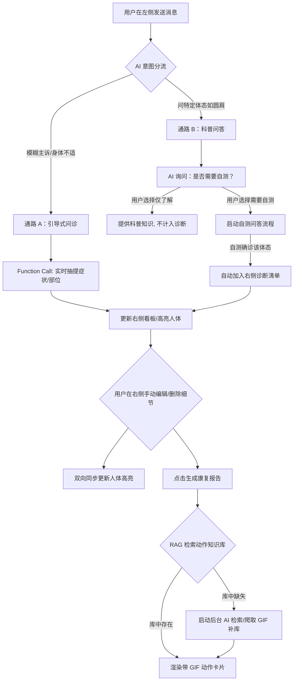

# 功能设计文档：AI 咨询工作台与康复报告 (Feature Line 2)

## 1. 功能概述
本功能线是「体悟」(BodySense) 的核心工作台。系统采用左右分栏布局：左侧为智能对话区，右侧为结构化健康看板（包含高亮人体图与诊断结果清单）。
通过 AI 自然语言对话，系统能实时抽提用户症状，并在右侧高亮对应的人体部位。对话支持“普通描述引导”与“特定体态科普自测”双通路。用户可在右侧诊断清单中直接编辑或删除诊断细节，同步影响人体高亮。对话结束后，AI 将基于 RAG 检索生成深度康复报告，使用“松解 ➔ 激活 ➔ 强化”知识卡片，并具备**在库动作精准匹配**与**缺失动作自动网络检索补全**能力。

---

## 2. 业务流程与状态机

### 2.1 对话与自测流程双通路


### 2.2 左右分栏实时联动机制
1. **左发右显（流式抽提）**：
   * 用户发送主诉时，AI 服务在流式生成回复的同时，使用独立的 AI 抽提节点（或 Function Calling 并发）解析症状。
   * 解析出 `body_part`（如“肩部”）、`symptom_type`（如“酸胀”）、`severity` 后，通过 SSE 推送给前端。
   * 前端更新右侧“诊断结果清单”，并在人体三视图（SVG）中高亮对应 `path` 或 `g` 节点。
2. **右改左同步（手动干预）**：
   * 右侧诊断清单中，每一项诊断为独立的一行卡片。
   * 用户可以点击编辑按钮修改：**痛点部位**、**疼痛性质**（酸痛/放射痛等）、**严重程度**，或直接**删除**该项。
   * 手动编辑或删除后，前端向后端发送 `/api/v1/consultation/:id/confirm` 更新请求，并即时刷新人体高亮状态（如删除“膝盖酸痛”，右侧 SVG 膝盖高亮熄灭，并同步从上下文变量中剥离该症状）。

---

## 3. AI 节点设计

### 3.1 节点 1：意图分流与对话节点 (Natural Dialogue Agent)
*   **核心意图**：在不设硬编码阶段的前提下，通过 Prompt 引导 AI 自然流转：先问诊抽提 ➔ （若用户询问特定体态）主动提供自测入口 ➔ 自测确认后加入诊断 ➔ 引导生成康复报告。
*   **提示词策略 (Prompt Strategy)**：
    *   **上下文注入**：必须始终携带用户 Onboarding 阶段的基础档案。
    *   **行为规范**：
        1. **主动追问**：当用户主诉模糊时，主动使用多选格式引导用户细化。
        2. **科普自测路由**：一旦用户提及具体体态名词（如“骨盆前倾是什么”），在回答后必须追问：“您是否担心自己有这个问题？我可以带您进行一个 3 步的快速自测。”
        3. **自测引导**：如果用户同意自测，进入分步提问（如“靠墙站立时，腰部与墙面的距离是否能容纳一个拳头？”），并根据结果调用 `add_to_diagnosis` 工具。
    *   **Prompt 模板**：
        ```
        你是一位资深的物理治疗师与体态健康顾问。你正在与用户进行在线咨询。
        
        [用户基础档案]
        {{user_profile}}
        
        [当前诊断看板状态]
        {{current_diagnoses}}
        
        [对话守则]
        1. 保持同理心，语言通俗专业。
        2. 如果用户只是宽泛说“不舒服”，请主动询问痛点位置、是酸胀还是刺痛、持续了多久。
        3. 如果用户问到“圆肩/驼背/骨盆前倾/长短腿”等专业名词，请解释该词，并主动发送引导语：“您是否想测试一下自己是否有此体态？我们可以立刻开始一个简单的自测。”
        4. 当确定用户存在某种体态问题时，必须调用工具 `add_to_diagnosis(issue_name, body_part, details)` 将其添加至右侧诊断栏。
        ```

### 3.2 节点 2：动作检索与后台自主补库节点 (Action Retrieval & Scraping Agent)
*   **核心意图**：针对康复方案中的动作进行匹配。若本地知识库缺失，自主到网络抓取相关动作详细描述与动图并补充入库。
*   **输入**：`action_name` (如 "泡沫轴松解胸小肌")
*   **输出**：`action_detail` (包含介绍、讲解、GIF_URL、引用)
*   **工具与接口 (Tools)**：
    *   `db_action_lookup(action_name)`：本地 PostgreSQL 知识库向量检索。
    *   `web_search_action(action_name)`：网络搜索 API。
    *   `scrape_gif_from_url(url, action_name)`：将符合条件的 GIF/图片 下载并上传至云对象存储（OSS），返回 OSS URL，并自动将数据写入 `knowledge_entries` 数据库。
*   **异常兜底**：若自主补库失败或未搜到有效动图，输出“库中暂无该动作动图，已提供详细文字指导”，并附上标准动作描述。

---

## 4. 数据结构与上下文

### 4.1 诊断看板状态 JSON 格式 (DB / Session Context)
右侧看板由以下 JSON 结构描述，用户编辑后会回传修改该结构：
```json
{
  "diagnoses": [
    {
      "id": "diag-001",
      "issue_name": "上交叉综合征",
      "body_parts": ["neck", "shoulder"], // 对应前端 SVG 的高亮 ID 列表
      "symptom_details": {
        "pain_type": "酸胀感，按压有痛点",
        "severity": "moderate",
        "triggers": "电脑前久坐超过2小时"
      },
      "is_confirmed_by_user": true
    }
  ]
}
```

### 4.2 康复方案与动作知识卡片 JSON
报告生成时，AI 输出的动作卡片格式：
```json
{
  "rehab_report": {
    "pathology_explanation": {
      "academic_term": "上交叉综合征 (Upper Crossed Syndrome)",
      "tight_muscles": ["胸大肌", "胸小肌", "上斜方肌", "肩胛提肌"],
      "weak_muscles": ["深层颈屈肌", "前锯肌", "中下斜方肌"],
      "mechanism": "由于长时间低头久坐，胸侧肌肉过度紧张缩短，而背侧及颈前肌肉被动拉长无力，导致头前伸及圆肩姿态。"
    },
    "stages": [
      {
        "phase": 1,
        "phase_name": "阶段一：紧张肌肉松解 (Release)",
        "actions": [
          {
            "action_id": "act-release-01",
            "action_name": "网球松解胸小肌",
            "description": "利用网球放置在锁骨下方凹陷处，身体靠墙，微调角度寻找痛点按压。",
            "frequency": "每侧按压 2 分钟，每天 1 次",
            "gif_url": "https://cdn.bodysense.club/actions/release_pectoralis_minor.gif",
            "media_status": "in_library", // in_library 或 web_scraped 或 missing_fallback
            "citation": "引用自 B 站 UP 主 @XXXX 视频《教你三步改善高低肩与圆肩》",
            "instruction_details": "注意避开锁骨骨骼，专注于肌肉酸胀点。呼吸保持平稳，不要憋气。"
          }
        ]
      },
      {
        "phase": 2,
        "phase_name": "阶段二：无力肌肉激活 (Activate)",
        "actions": [...]
      },
      {
        "phase": 3,
        "phase_name": "阶段三：正确体态强化 (Strengthen)",
        "actions": [...]
      }
    ]
  }
}
```

---

## 5. 异常与兜底策略

### 5.1 对话脱轨/进入循环
*   **情况**：大模型由于上下文过多或用户提问刁钻，陷入无限追问同一个症状的循环。
*   **兜底策略**：
    1.  **历史窗口控制**：Python 服务端限制最大对话历史为 10 轮。
    2.  **“跳过问诊”按钮**：前端在左侧对话框底端持续悬浮一个操作项：“信息已足够？直接生成诊断方案”。用户点击后，后端立即抓取右侧现有的结构化 JSON并调用“报告生成节点”，截断对话。

### 5.2 动作 GIF 后台检索超时/爬取失败
*   **情况**：后台 AI 自主补库节点在百度/Google 检索动作 GIF 时，因网络超时、反爬或未找到相关 GIF 失败。
*   **兜底策略**：
    1.  **超时控制**：后台媒体检索最大时长设为 6 秒。
    2.  **静态图降级**：若超时或解析失败，`media_status` 设为 `missing_fallback`。
    3.  **前端展示**：前端渲染知识卡片时，动作图区域展示一张标准占位骨骼图，并显示提示文本：“「体悟」小助手正努力在网络上搜集本动作的动图... 暂为您提供详尽的文字动作指南”。

### 5.3 右侧看板手动编辑与 AI 上下文冲突
*   **情况**：用户在右侧手动修改了痛点位置（如删除了“脖子酸胀”，增加了“腰部刺痛”），但大模型的左侧对话记忆里仍保留了之前关于脖子酸胀的讨论。
*   **兜底策略**：
    1.  **强制上下文同步**：每次用户在右侧编辑卡片后，前端在发送下一条消息时，Payload 必须携带最新的 `diagnoses` JSON。
    2.  **System Prompt 强制服从**：在 Agent System Prompt 中写入硬性约束：“用户的诊断看板具有最高优先级。如果用户的诊断看板状态与你之前的对话记忆产生矛盾，请无条件以当前诊断看板的最新数据为准，并顺着最新诊断数据进行回答。”
