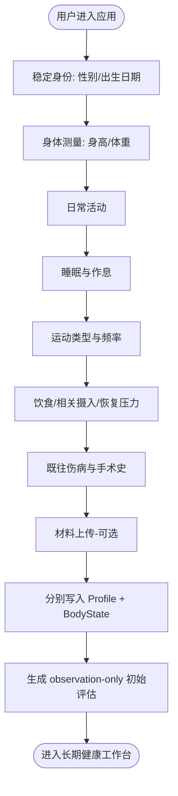

# 功能设计文档：用户信息构建与健康评估 (Feature Line 1)

## 1. 功能概述
本功能线是用户进入 BodySense 的起点，但 **Onboarding 只是采集入口，不是数据所有者**。一次表单会把不同语义的信息分别交给稳定 Profile、BodyState Fact、BodyState Observation 与上传/评估管线，而不是把所有答案压进 `user_profiles`。

当前 North Star（ADR 0007）：

- `UserProfile`：只保存性别、出生日期等稳定身份背景；年龄按出生日期派生。
- `BodyState Observation`：身高、体重等身体测量；后续更新保留历史。
- `BodyState Lifestyle Fact`：日常活动、睡眠、运动、饮食节律、酒精/烟草/咖啡因、恢复压力。
- `BodyState history Fact`：既往伤病/手术摘要。
- 上传资料：继续进入现有 Upload / OCR / posture-analysis 流程。
- 当前症状、目标和主观困扰：进入长期 Consultation + BodyState，而不是静态档案。

采集遵循“少填表、讲真实情况”的原则：不问职业名称；不强迫不规律作息变成固定入睡/起床时间；生活方式优先自然语言，只在运动频率等适合比较的地方做轻量量化。

---

## 2. 业务流程与状态机

### 2.1 步骤流转流程 (User Wizard Flow)


1. **稳定身份**：性别、出生日期写入 `UserProfile`；出生日期是年龄的唯一来源。
2. **身体测量**：身高/体重写入 `anthropometry.height/weight` Observation；BMI 只作为当前投影派生。
3. **日常活动**：自然语言描述久坐、久站、走动、搬抬、重复动作或轮班，写入 `lifestyle.activity`。
4. **睡眠与作息**：描述规律性、轮班、通常睡眠时长、夜醒和缺觉，写入 `lifestyle.sleep`。
5. **运动**：类型文本 + 轻量频率选择，形成 `lifestyle.exercise` summary/details。
6. **其他生活方式**：饮食节律、酒精/烟草/咖啡因、恢复与压力分别进入 nutrition/substances/recovery；全部可选。
7. **既往状况**：重要伤病/手术摘要写入 `history.injury_summary`，不进入 Profile。
8. **材料上传（可选）**：体态照片与体检报告沿用现有上传流程。
9. **初始评估**：Assessment 明确接收 stable Profile 与 current BodyState 两个独立输入，形成待审核 Observation。

后续“生活方式”编辑器与 Consultation 都复用同一 BodyState taxonomy，但写入权限不同：编辑器是直接用户确认，可立即形成 confirmed current；Consultation 的模型归一化先保存为 `ai_extracted / unverified / excluded_from_reasoning` 候选，并在“生活方式”页等待用户确认。确认候选后，若旧事实曾经为真，则使用 temporal transition / supersedes 形成历史；若旧事实本身错误，则使用 correction。

### 2.2 状态机设计 (User Onboarding State Machine)

| 当前状态 | 触发事件 | 目标状态 | 动作/说明 |
| :--- | :--- | :--- | :--- |
| `UNINITIALIZED` | 进入页面 | `STEP_IDENTITY` | 初始化分步表单 |
| `STEP_IDENTITY` | 完成身份 | `STEP_METRICS` | 校验出生日期 |
| `STEP_METRICS` | 完成测量 | `STEP_LIFESTYLE` | 校验身高/体重范围 |
| `STEP_LIFESTYLE` | 完成/跳过生活方式 | `STEP_HISTORY` | 自由文本可为空 |
| `STEP_HISTORY` | 完成/跳过伤病史 | `STEP_UPLOAD` | - |
| `STEP_UPLOAD` | 点击开始评估 | `PERSISTING_CONTEXT` | 先按领域边界写 stable Profile 与 BodyState |
| `PERSISTING_CONTEXT` | 写入成功 | `ANALYZING_MULTIMODAL` | Assessment 读取刚写入的 current BodyState |
| `PERSISTING_CONTEXT` | 写入失败 | `STEP_UPLOAD` | 显式错误；不得只保存一份胖 Profile 作为降级真值 |
| `ANALYZING_MULTIMODAL` | 报告生成成功 | `REPORT_COMPLETED` | Observation 写入 BodyState；进入工作台 |
| `ANALYZING_MULTIMODAL` | 生成失败 | `STEP_UPLOAD` | 保留已提交的用户健康上下文，允许重试 Assessment |

---

## 3. AI 节点设计

### 3.1 节点 1：体检报告 OCR 提取节点
*   **核心意图**：从 PaddleOCR 识别出的松散文本行中，精准提炼与肌肉、骨骼、炎症、代谢相关的关键健康指标。
*   **输入**：`ocr_raw_text` (String)
*   **输出**：`extracted_health_metrics` (JSON)
*   **提示词策略 (Prompt Strategy)**：
    *   **意图设定**：你是一位专业的医学数据清洗助手。
    *   **约束条件**：
        1. 仅提取与运动、骨骼、肌肉、炎症、酸碱平衡、微量元素（如钙、镁、维生素D、尿酸、类风湿因子、C反应蛋白等）相关的指标。过滤其他无关指标（如乙肝五项、视力测试等）。
        2. 输出格式必须是合法 JSON，不要输出 Markdown 标记外的任何废话。
        3. 对于每一项提取的指标，包含：指标名称、数值、参考单位、状态（正常/偏高/偏低）。
    *   **Prompt 模板**：
        ```
        你是一位专业的医学数据清洗助手。请从以下通过 OCR 识别出的体检报告文本中，提取出所有与“骨骼、肌肉、微量元素、维生素、炎性反应、电解质”相关的关键指标。
        
        [输入文本]
        {{ocr_raw_text}}
        
        [输出格式要求]
        必须输出为以下 JSON 格式：
        {
          "metrics": [
            {
              "name": "指标名称(中文)",
              "value": "测量值(数字/正负号)",
              "unit": "单位(如 ng/ml)",
              "status": "normal / high / low / positive"
            }
          ]
        }
        如未发现相关指标，请返回空数组：{"metrics": []}。不要添加任何解释说明。
        ```

### 3.2 节点 2：多模态健康评估节点

**核心意图**：生成 reviewable observation candidates，而不是把 Onboarding 资料直接变成诊断或治疗建议。

**输入边界必须分开**：

```text
profile
  stable identity only
  -> gender / birth_date / derived age_years

body_state
  current health truth
  -> lifestyle facts
  -> injury/history facts
  -> confirmed anthropometry observations
  -> other current facts/observations

report_indicators
  -> 本次外部报告结构化指标

posture_analysis / images
  -> 本次体态视觉输入
```

禁止为了 Prompt 方便把 BodyState、OCR 指标或 lifestyle 再嵌回 `profile`。Assessment 需要健康上下文时以 `body_state` 为准。

**输出**：沿用当前 typed `AssessmentAgentOutput`，核心产物是待审核 `observations[]`、summary、information gaps 与 safety notes；不得在这个节点偷偷建立第二套健康真值。

**证据来源**：Observation 的依据应明确区分 `photo / profile / body_state / report`。其中 `profile` 仅代表稳定身份背景。

---

## 4. 数据结构与上下文

### 4.1 Onboarding 持久化边界

Onboarding 前端可以维护一个临时 form state，但提交时只发送一个 **application command**：

```text
PUT /api/v1/onboarding/context
```

请求按领域语义分组，而不是伪装成一个长期 Profile：

```json
{
  "profile": {
    "gender": "male",
    "birth_date": "1998-05-20"
  },
  "body_metrics": {
    "height_cm": 178.5,
    "weight_kg": 75.0
  },
  "lifestyle": {
    "activity": {"summary": "工作日久坐为主，每次连续坐 2-3 小时"},
    "sleep": {"summary": "白班和夜班交替，平均每天睡 6-7 小时"},
    "exercise": {
      "summary": "健身房抗阻训练；频率：1-2",
      "details": {"type": "健身房抗阻训练", "frequency": "1-2"}
    },
    "nutrition": {"summary": "三餐通常规律"},
    "substances": {"summary": "每天咖啡 2 杯，不吸烟"},
    "recovery": {"summary": "工作日压力偏高，周末恢复较好"}
  },
  "injury_history": "两年前左膝轻微拉伤，偶有酸痛"
}
```

后端 `OnboardingContextService` 使用现有 `TransactionManager` 协调 ProfileRepository 与 BodyStateRepository：

```text
one HTTP command
    |
    +-- stable identity -> user_profiles
    |
    +-- height / weight ------------------+
    +-- six lifestyle sections -----------+--> one BodyStateCurrentContextPatch
    +-- injury-history summary ------------+        -> one BodyStateRevision

all writes participate in one database transaction
```

因此一次 onboarding 基线提交具有两个强约束：

1. **原子性**：Profile 或 BodyState 任一写入失败，整个 onboarding context 提交回滚；不会留下“档案写了一半”的状态。
2. **语义 revision**：身高、体重、六类生活方式和伤病摘要一起构成一个 BodyState revision，而不是按字段生成多条 revision。

后续的 Lifestyle / Body Metrics / Health History 编辑器仍可分别提供聚焦的 application API；它们写入相同 BodyState 真值，不形成第二套数据。

然后触发 Assessment。Assessment 的 replay input 分别保存 `profile`、`body_state`、`report_indicators` 与 posture input，以保证反事实评测不重新混淆领域边界。

#### 数据库持久化结构 (assessment_reports 表)
```json
{
  "id": "8f8b8a8b-4a5d-4f1a-b6d8-74431e7845ba",
  "user_id": "33b8a32a-5b12-4c07-95ba-13d8756c9a62",
  "health_grade": "B",
  "dimension_scores": {
    "posture": 70,
    "habit": 65,
    "exercise": 75
  },
  "identified_issues": [
    {
      "issue_name": "上交叉综合征（圆肩头前伸）",
      "severity": "moderate",
      "evidence": "侧面照片耳屏垂线落于肩峰前侧约3cm，且自述日常低头有肩颈酸胀"
    },
    {
      "issue_name": "骨骼矿物质及维生素D缺乏风险",
      "severity": "mild",
      "evidence": "体检报告显示 25-羟基维生素D 偏低 (12.5 ng/ml)"
    }
  ],
  "improvement_summary": "建议先从松解胸小肌与上斜方肌入手，结合颈部深层屈肌激活；日常注意调整显示器高度，并适当增加户外活动或补充维生素D3。",
  "created_at": "2026-06-29T11:24:22+08:00"
}
```

---

## 5. 异常与兜底策略

### 5.1 OCR 处理异常
*   **情况 1：上传的图片不是体检单，或字迹模糊导致 PaddleOCR 提取内容为空**。
    *   *降级处理*：后端跳过 LLM 结构化提取节点，直接返回空的 `metrics` 数组。
    *   *前端交互*：前端检测到解析结束但 `metrics` 为空，在上传组件处使用 **Sonner Toast 吐司提示**：“未能在图片中识别出有效的体检指标，我们将在健康评估中忽略体检数据，不影响其他评估。”
*   **情况 2：OCR 服务超时或挂掉**。
    *   *降级处理*：Go 后端在转发 Python 服务时设置 8s 超时。若超时，则直接返回空结果，并在 Onboarding 请求中标记 `health_report_status = "skipped"`。

### 5.2 多模态图像损坏或服务受阻
*   **情况：多模态大模型在读取 Base64 图像时报错（如图片损坏、分辨率超限）或限流**。
    *   *降级处理*：Python AI 服务捕获异常后，**自动降级为单模态纯文本评估**（仅将表单的 JSON 数据发送给普通 LLM 进行文本评估）。
    *   *数据标记*：返回的评估报告数据中，标记 `visual_analyzed = false`。
    *   *前端交互*：报告页照常渲染，但在体态对比区提示：“由于图片读取异常，本次报告仅基于文字档案生成。”

### 5.3 LLM 输出格式解析失败
*   **情况：LLM 返回的 JSON 包含截断或非法字符，导致后端 `json.Unmarshal` 失败**。
    *   *容错三部曲*：
        1.  **正则提取**：使用 Python 端的 `json-repair` 库或正则匹配 `\{.*\}` 尝试强行修复并提取 JSON。
        2.  **二次修复**：若失败，使用较低温度的轻量级大模型进行快速修正。
        3.  **兜底渲染**：若依然失败，则采用静态兜底报告结构：
            ```json
            {
              "health_grade": "B",
              "dimension_scores": {"posture": 70, "habit": 70, "exercise": 70},
              "identified_issues": [{"issue_name": "日常体态亚健康倾向", "severity": "mild", "evidence": "根据自述存在日常肌肉疲劳，建议在对话工作台中进一步咨询。"}],
              "improvement_summary": "请在咨询工作台中进一步向 AI 发送具体症状，以获取详尽改善建议。"
            }
            ```
            同时前端通过 Sonner 提示：“生成报告时部分组件加载异常，您可随时在历史记录中重新生成或发起问诊。”
