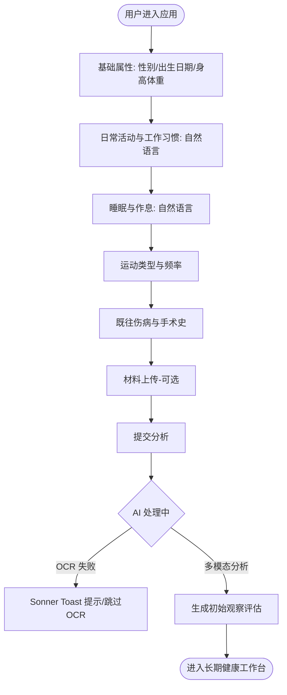

# 功能设计文档：用户信息构建与健康评估 (Feature Line 1)

## 1. 功能概述
本功能线是用户进入「体悟」(BodySense) 应用的起点。Onboarding 只收集对后续健康判断有价值的**身体档案基线**：基本生理属性、日常活动模式、睡眠/轮班模式、运动习惯、重要伤病史，以及可选的体检报告和体态照片（正/侧/背）。当前症状、目标和主观困扰不在档案里重复填写，而是在进入长期健康工作台后通过自然对话持续进入 BodyState。

档案采集遵循“少填表、讲真实情况”的原则：出生日期取代需要维护的整数年龄；不要求职业名称；不强迫用户把不规律作息压成固定入睡/起床时间；生活与睡眠模式优先使用带示例提示的自由文本。

---

## 2. 业务流程与状态机

### 2.1 步骤流转流程 (User Wizard Flow)


1. **基础属性**：输入性别、出生日期、身高/体重。出生日期是年龄的唯一档案来源，需要年龄时由系统按时间计算。
2. **日常活动与工作习惯**：不询问职业名称。用户用自然语言描述久坐、久站、走动频率、搬抬/重复动作、轮班等身体使用模式；界面可提供快捷示例，但最终保存的是用户可编辑的描述。
3. **睡眠与作息**：不强制固定入睡/起床时间。用户描述规律性、轮班、通常睡眠时长、夜醒和缺觉等真实模式。
4. **运动习惯**：运动类型使用简短文本，运动频率保留轻量量化选项，便于比较和后续趋势追踪。
5. **既往状况**：文本框输入重要的既往伤病或手术史。当前症状和改善目标不在这里重复收集。
6. **材料上传（可选）**：体态照片与体检报告沿用现有上传流程。
7. **初始评估**：保存身体档案后生成 observation-only 初始评估，并进入长期健康工作台。

### 2.2 状态机设计 (User Onboarding State Machine)

| 当前状态 (State) | 触发事件 (Event) | 目标状态 (Target State) | 动作/说明 |
| :--- | :--- | :--- | :--- |
| `UNINITIALIZED` | 进入页面 | `STEP_BASIC` | 初始化分步表单 |
| `STEP_BASIC` | 完成基础属性并下一步 | `STEP_HABIT` | 校验身高/体重/出生日期合法性 |
| `STEP_HABIT` | 完成活动/作息/运动基线并下一步 | `STEP_HISTORY` | 自由文本可为空；运动频率按受控选项保存 |
| `STEP_HISTORY` | 完成伤病史录入并下一步 | `STEP_UPLOAD` | - |
| `STEP_UPLOAD` | 点击开始评估（未传报告） | `ANALYZING_MULTIMODAL` | 仅多模态体态分析流程 |
| `STEP_UPLOAD` | 点击开始评估（上传报告） | `PROCESSING_OCR` | 启动 OCR 节点，提取文本 |
| `PROCESSING_OCR` | OCR 完成 / 发生异常 | `ANALYZING_MULTIMODAL` | 异常时 Sonner 提示并降级继续 |
| `ANALYZING_MULTIMODAL` | 报告生成成功 | `REPORT_COMPLETED` | 写入 DB，前端渲染报告 |
| `ANALYZING_MULTIMODAL` | 生成超时/解析失败 | `STEP_UPLOAD` | 回滚，Sonner 提示错误，并提供降级选项 |

---

## 3. AI 节点设计

### 3.1 节点 1：体检报告 OCR 提取节点
*   **核心意图**：从 PaddleOCR 识别出的松散文本行中，精准提炼与肌肉、骨骼、炎症、代谢相关的关键健康指标。
*   **输入**：`ocr_raw_text` (String)
*   **输出**：`extracted_health_metrics` (JSON)
*   **提示词策略 (Prompt Strategy)**：
    *   **意图设定**：你是一位专业的医学数据清洗助手。
    *   **约束条件**：
        1. 仅提取与运动、骨骼、肌肉、炎症、酸碱平衡、微量元素（如钙、镁、维生素D、尿酸、类风湿因子、C反应蛋白等）相关的指标。过滤其他无关指标（如乙肝五项、视力测试等）。
        2. 输出格式必须是合法 JSON，不要输出 Markdown 标记外的任何废话。
        3. 对于每一项提取的指标，包含：指标名称、数值、参考单位、状态（正常/偏高/偏低）。
    *   **Prompt 模板**：
        ```
        你是一位专业的医学数据清洗助手。请从以下通过 OCR 识别出的体检报告文本中，提取出所有与“骨骼、肌肉、微量元素、维生素、炎性反应、电解质”相关的关键指标。
        
        [输入文本]
        {{ocr_raw_text}}
        
        [输出格式要求]
        必须输出为以下 JSON 格式：
        {
          "metrics": [
            {
              "name": "指标名称(中文)",
              "value": "测量值(数字/正负号)",
              "unit": "单位(如 ng/ml)",
              "status": "normal / high / low / positive"
            }
          ]
        }
        如未发现相关指标，请返回空数组：{"metrics": []}。不要添加任何解释说明。
        ```

### 3.2 节点 2：多模态健康评估报告生成节点
*   **核心意图**：结合用户填写的身体档案基线、体检 OCR 结构化数据，以及上传的体态正/侧/背三视图（Base64），形成首份可审核的身体观察评估。当前症状与目标由长期工作台中的 Consultation / BodyState 持续收集，不作为静态 profile 重复输入。
*   **输入**：
    *   `profile_data` (JSON)：含出生日期、性别、BMI、日常活动模式、睡眠/轮班模式、运动习惯、重要伤病史和体检 OCR 提取值。
    *   `images` (List[Base64])：正、侧、背面照片（最多3张，可选）。
*   **输出**：`assessment_report` (JSON)
*   **提示词策略 (Prompt Strategy)**：
    *   **核心意图**：你是一位资深的运动康复专家与多模态体态评估师。
    *   **必须包含的约束条件**：
        1. **视觉分析约束**：如果提供了照片，必须仔细对比正面（高低肩、锁骨倾斜、头歪斜）、侧面（头前伸、圆肩驼背、骨盆前倾/后倾）、背面（骨盆倾斜、脊柱侧弯弯曲迹象），提取明显或疑似的姿态异常趋势。
        2. **安全与免责声明约束**：在报告中必须说明这是基于多模态 AI 的筛查评估，非临床诊断。
        3. **逻辑一致性**：各维度的评分（体态健康度、作息习惯度、运动习惯度）必须与输入数据保持绝对的逻辑闭环。若久坐超 8h 且有腰疼史，体态健康度及作息习惯度不得超过 60 分。
    *   **Prompt 模板**：
        ```
        你是一位资深的运动康复专家与多模态体态评估师。请根据用户的身体档案基线、体检异常指标，并结合上传的体态照片进行综合评估。
        
        [用户身体档案]
        {{profile_data}}
        
        [分析要求]
        1. 视觉评估：从正面、侧面、背面体态照片中，提取用户可能的物理体态偏离（如头前伸、圆肩、骨盆前倾等）。
        2. 关联分析：结合用户描述的日常活动模式、伤病史以及体检报告中偏低/偏高的指标（如维生素D偏低、尿酸偏高），给出综合健康评分与等级。
        3. 给出 1-3 个最首要、最需要关注的体态或习惯问题，并说明评估依据。
        
        [输出格式要求]
        必须且仅输出以下 JSON 结构：
        {
          "health_grade": "S / A / B / C / D",
          "dimension_scores": {
            "posture": 80, // 体态健康度 (0-100)
            "habit": 60,   // 日常作息度 (0-100)
            "exercise": 45 // 运动能力/习惯 (0-100)
          },
          "identified_issues": [
            {
              "issue_name": "问题名称(如：圆肩头前伸)",
              "severity": "mild / moderate / severe", // 轻度/中度/重度
              "evidence": "评估依据(例如：结合侧面体态照片有明显的耳垂线前移，且自述有久坐肩颈酸胀)"
            }
          ],
          "improvement_summary": "针对性的日常改善方向概述（例如：减少连续久坐，优先进行胸肌拉伸，并在饮食中补充维生素D）"
        }
        ```

---

## 4. 数据结构与上下文

### 4.1 核心 JSON 结构
#### Onboarding 提交至后端的 Payload (API Request)
```json
{
  "gender": "male",
  "birth_date": "1998-05-20",
  "height_cm": 178.5,
  "weight_kg": 75.0,
  "activity_pattern": "工作日久坐为主，每次连续坐 2-3 小时；每天步行通勤约 40 分钟，偶尔需要搬重物",
  "sleep_pattern": "白班和夜班交替，起床时间不固定；平均每天睡 6-7 小时，换班后容易睡不够",
  "exercise_type": "健身房抗阻训练",
  "exercise_frequency": "1-2",
  "injury_history": "两年前左膝关节十字韧带轻微拉伤，偶有酸痛",
  "posture_photos": {
    "front": "data:image/jpeg;base64,...",
    "side": "data:image/jpeg;base64,...",
    "back": "data:image/jpeg;base64,..."
  },
  "health_reports": [
    "data:image/jpeg;base64,..."
  ]
}
```

#### 数据库持久化结构 (assessment_reports 表)
```json
{
  "id": "8f8b8a8b-4a5d-4f1a-b6d8-74431e7845ba",
  "user_id": "33b8a32a-5b12-4c07-95ba-13d8756c9a62",
  "health_grade": "B",
  "dimension_scores": {
    "posture": 70,
    "habit": 65,
    "exercise": 75
  },
  "identified_issues": [
    {
      "issue_name": "上交叉综合征（圆肩头前伸）",
      "severity": "moderate",
      "evidence": "侧面照片耳屏垂线落于肩峰前侧约3cm，且自述日常低头有肩颈酸胀"
    },
    {
      "issue_name": "骨骼矿物质及维生素D缺乏风险",
      "severity": "mild",
      "evidence": "体检报告显示 25-羟基维生素D 偏低 (12.5 ng/ml)"
    }
  ],
  "improvement_summary": "建议先从松解胸小肌与上斜方肌入手，结合颈部深层屈肌激活；日常注意调整显示器高度，并适当增加户外活动或补充维生素D3。",
  "created_at": "2026-06-29T11:24:22+08:00"
}
```

---

## 5. 异常与兜底策略

### 5.1 OCR 处理异常
*   **情况 1：上传的图片不是体检单，或字迹模糊导致 PaddleOCR 提取内容为空**。
    *   *降级处理*：后端跳过 LLM 结构化提取节点，直接返回空的 `metrics` 数组。
    *   *前端交互*：前端检测到解析结束但 `metrics` 为空，在上传组件处使用 **Sonner Toast 吐司提示**：“未能在图片中识别出有效的体检指标，我们将在健康评估中忽略体检数据，不影响其他评估。”
*   **情况 2：OCR 服务超时或挂掉**。
    *   *降级处理*：Go 后端在转发 Python 服务时设置 8s 超时。若超时，则直接返回空结果，并在 Onboarding 请求中标记 `health_report_status = "skipped"`。

### 5.2 多模态图像损坏或服务受阻
*   **情况：多模态大模型在读取 Base64 图像时报错（如图片损坏、分辨率超限）或限流**。
    *   *降级处理*：Python AI 服务捕获异常后，**自动降级为单模态纯文本评估**（仅将表单的 JSON 数据发送给普通 LLM 进行文本评估）。
    *   *数据标记*：返回的评估报告数据中，标记 `visual_analyzed = false`。
    *   *前端交互*：报告页照常渲染，但在体态对比区提示：“由于图片读取异常，本次报告仅基于文字档案生成。”

### 5.3 LLM 输出格式解析失败
*   **情况：LLM 返回的 JSON 包含截断或非法字符，导致后端 `json.Unmarshal` 失败**。
    *   *容错三部曲*：
        1.  **正则提取**：使用 Python 端的 `json-repair` 库或正则匹配 `\{.*\}` 尝试强行修复并提取 JSON。
        2.  **二次修复**：若失败，使用较低温度的轻量级大模型进行快速修正。
        3.  **兜底渲染**：若依然失败，则采用静态兜底报告结构：
            ```json
            {
              "health_grade": "B",
              "dimension_scores": {"posture": 70, "habit": 70, "exercise": 70},
              "identified_issues": [{"issue_name": "日常体态亚健康倾向", "severity": "mild", "evidence": "根据自述存在日常肌肉疲劳，建议在对话工作台中进一步咨询。"}],
              "improvement_summary": "请在咨询工作台中进一步向 AI 发送具体症状，以获取详尽改善建议。"
            }
            ```
            同时前端通过 Sonner 提示：“生成报告时部分组件加载异常，您可随时在历史记录中重新生成或发起问诊。”
