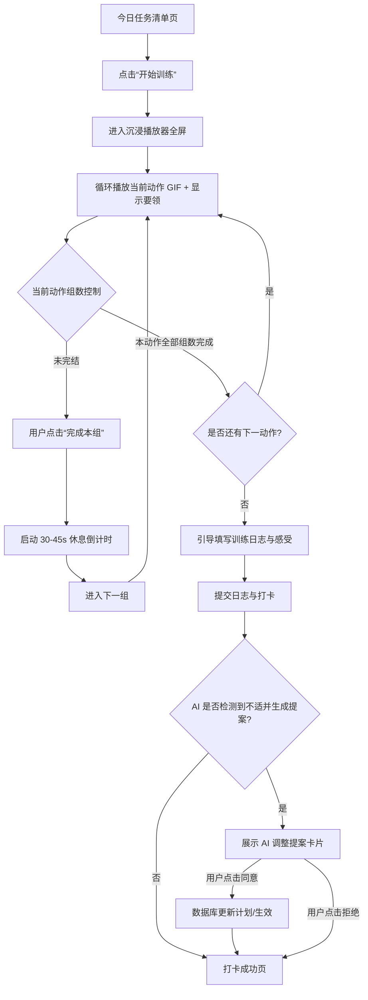

# 功能设计文档：训练计划日程管理与进度追踪 (Feature Line 3)

## 1. 功能概述
本功能线负责将 AI 生成的体态矫正方案转化为可持续执行的每日/每周日程计划。系统支持**“自动顺延”与“固定周历”双排期模式**，并允许用户在设置中自由切换。
在执行端，系统提供**沉浸式训练播放器**，指导用户完成每组动作与休息。
在反馈端，若用户提交的日志中包含疼痛等身体不适，AI 会**即时生成“动作调整提案”**，供用户一键确认替换。

---

## 2. 业务流程与状态机

### 2.1 沉浸式训练播放器工作流 (Immersion Mode Player Flow)


### 2.2 双排期模式逻辑设计 (Dual Scheduling Modes)
用户可在“个人设置”中切换以下两种模式，影响数据库 `training_logs` 的写入和未来计划展示：

| 排期模式 | 缺勤表现 (Missed Day) | 系统处理逻辑 (Logic) |
| :--- | :--- | :--- |
| **模式 A：自动顺延 (Auto-shift)** | 用户在周二有训练，但直到周三零点都未进行任何打卡或日志记录。 | 周三进入页面时，系统检测到周二未完成。系统自动将原定“周二”的任务无缝平移到“周三”，后续所有未执行天数也整体后移 1 天。周历展示为“第 N 天任务”，而非具体的星期几。 |
| **模式 B：固定周历 (Fixed Calendar)** | 同上，周二未打卡。 | 周三进入页面时，周二状态标记为 `UNCOMPLETED`。周三展示“周三”的预定任务。用户可手动在历史清单中点击周二卡片选择“补卡”（允许录入补发日志）或直接“跳过”。 |

---

## 3. AI 节点设计

### 3.1 节点 1：即时日志分析与康复调整提案节点 (Real-time Feedback Adaptor)
*   **核心意图**：当用户在训练打卡后提交文本日志，AI 实时分析是否包含“疼痛、关节弹响、严重不适”等负面反馈。若包含，自动查询知识库中相同肌群的低负荷替代动作，输出标准替换 JSON 提案。
*   **输入**：
    *   `last_exercise_logs` (JSON)：当日完成动作及组数。
    *   `user_note` (String)：用户手写感受（如：“做深蹲的时候，左边膝盖髌骨有刺痛感，蹲不下去”）。
*   **输出**：`adaptation_proposal` (JSON)
*   **提示词策略 (Prompt Strategy)**：
    *   **分析意图**：你是一位精密的临床运动康复医生。
    *   **提取约束**：
        1. 必须判断 `user_note` 中是否包含物理性“疼痛/不适”（过滤单纯的“肌肉酸胀、疲劳、流汗”，这些属于正常训练反应）。
        2. 若判定有异常疼痛，必须精确定位受累关节/肌肉（如：膝关节）。
        3. 给出 1 个或多个替代动作提案（优先选择 RAG 知识库中的低门槛动作，如深蹲替代为靠墙静蹲）。
        4. 提供详尽的“替换依据”，向用户合理解释为什么要用此动作替代，以增强信任度。
    *   **Prompt 模板**：
        ```
        你是一位精密的临床运动康复医生。请分析用户今天刚完成的训练日志与感受描述。
        
        [今日已做动作]
        {{last_exercise_logs}}
        
        [用户手写感受描述]
        "{{user_note}}"
        
        [分析守则]
        1. 判断是否存在病理性疼痛（如刺痛、弹响、关节酸痛、牵扯痛等）。正常的肌肉泵感、酸胀和劳累无需调整。
        2. 如果确实存在疼痛，定位受损部位与引起疼痛的动作。
        3. 检索并推荐一个替代动作，要求对受累部位的关节剪切力/压力极小，但保留相似的训练目的。
        
        [输出格式要求]
        必须且仅输出以下 JSON：
        {
          "has_proposal": true, // 是否需要生成提案
          "proposal_reason": "判定原委（如：检测到您反馈深蹲时存在膝盖髌骨刺痛...）",
          "substitutions": [
            {
              "original_action_name": "原动作名称(如：自重深蹲)",
              "replacement_action_name": "替代动作名称(如：靠墙静蹲)",
              "sets": 3,
              "reps_or_duration": "30秒/组", // 次数或持续时间
              "reason": "为什么替换该动作（学术加康复原理说明）"
            }
          ]
        }
        如无不适或无需替换，请返回：{"has_proposal": false}
        ```

---

## 4. 数据结构与上下文

### 4.1 用户计划与日程结构 (training_plans 表的 phases 字段 JSON)
```json
{
  "phases": [
    {
      "week": 1,
      "focus": "痛点松解与基础激活",
      "days": [
        {
          "day_index": 1, // 自动顺延模式下使用
          "day_of_week": "mon", // 固定周历模式下使用
          "is_rest_day": false,
          "exercises": [
            {
              "action_id": "act-01",
              "action_name": "自重深蹲",
              "sets": 3,
              "reps": 12,
              "rest_seconds": 30,
              "gif_url": "https://cdn.bodysense.club/actions/squat.gif"
            }
          ],
          "status": "completed" // completed / uncompleted / pending
        }
      ]
    }
  ]
}
```

### 4.2 设置项扩展 (user_profiles 数据库字段)
```sql
ALTER TABLE user_profiles ADD COLUMN schedule_mode VARCHAR(20) DEFAULT 'fixed_calendar'; 
-- 可选值: 'fixed_calendar' (固定周历), 'auto_shift' (自动顺延)
```

---

## 5. 异常与兜底策略

### 5.1 沉浸式播放器运行中断
*   **情况**：用户在做第二组时，刷新了浏览器，或者手机锁屏导致前端状态丢失。
*   **兜底策略**：
    1.  **缓存恢复**：前端使用 `localStorage` 实时保存当前进行的会话状态，格式为 `{ plan_id, current_exercise_index, current_set_index, start_timestamp }`。
    2.  **中断重连**：当页面重新加载时，系统检测到缓存中存在未完结的训练，弹窗提示：“检测到您有进行中的训练任务，是否恢复到上一次的进度（第 2 组）？” 用户同意则恢复，拒绝则废弃并清空缓存。

### 5.2 日志分析 API 超时/崩盘
*   **情况**：打卡提交日志后，Python 侧分析服务过载，导致用户在提交页面转圈，无法完成打卡。
*   **兜底策略**：
    1.  **打卡优先**：Go 后端接口采用**非阻塞/异步**处理日志评估。当用户提交日志时，接口立刻修改 `training_logs` 的打卡状态，返回 `status: "success"`，确保打卡打上。
    2.  **异步生成提案**：AI 日志评估作为后台任务。若分析完成且需要替换，生成一条“未读提醒通知”写入数据库。用户在下次进入训练计划页面时，页面顶部弹出红点提示：“AI 发现您昨天的训练有膝部不适，已为您生成动作微调提案，点击查看并应用”。

### 5.3 频繁替换导致计划骨架瓦解
*   **情况**：用户今天反馈膝盖疼替换了深蹲，明天反馈脚踝疼替换了静蹲，导致原本的计划骨架被 AI 完全打乱。
*   **兜底策略**：
    1.  **最大替换次数限制**：在一个为期 4 周的计划中，同一大类动作的替换上限为 3 次。
    2.  **强制复评拦截**：若替换动作达到 3 次，系统锁定自动替换功能，弹出提示：“您的身体不适频次较高，系统已暂停自动微调。建议您进入「咨询工作台」重新向 AI 发起全面复评，或咨询线下专业康复师。”
