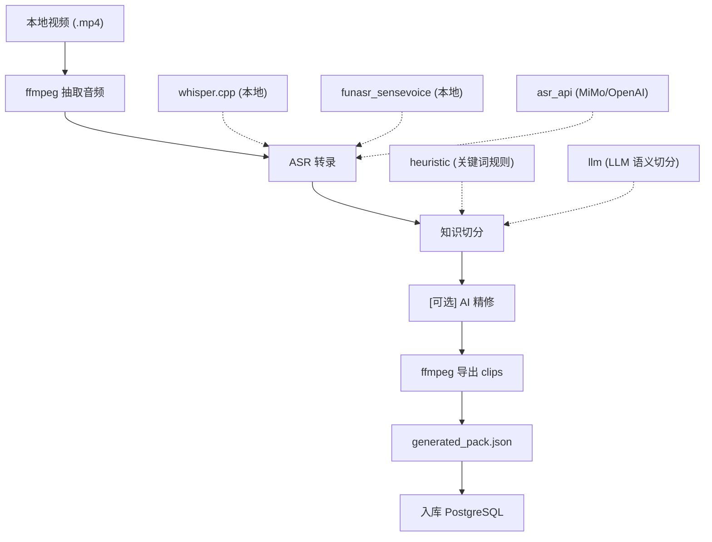

# Issue #13: 从视频到知识库，再到前端问答的完整链路

## 概述

Issue #13 的核心目标，不是"把视频字幕存起来"这么简单，而是把合作专家视频转成 BodySense 可复用、可检索、可引用、可展示动作演示的结构化知识资产。

这条链路当前已经具备三种工作模式：

1. **自动生成链路**
   - 输入一个本地视频
   - 自动抽音频、做 ASR、切分知识单元、导出演示片段
   - 生成 `generated_pack.json`
   - 写入数据库

2. **AI 增强链路**
   - 在自动生成基础上，可选启用 LLM 语义切分和 AI 精修
   - 切分质量更高，标题/摘要更自然
   - 自动质量评分，低分单元标记为 `ai_flagged`

3. **人工精修链路**
   - 基于自动生成出来的 `generated_pack.json`
   - 人工编写更高质量的 `curated_source` 规格
   - 生成 `curated_pack.json`
   - 覆盖入库，成为问答时优先可用的高质量知识

换句话说，Issue #13 实际上搭出来的是一套"视频知识生产线"，而不是一次性的脚本。

## 系统架构总览



## 模块结构

当前代码已拆分为清晰的模块结构：

```
apps/ai-service/src/rag/
├── video_pipeline.py        # 编排层：串联所有阶段
├── asr/                     # ASR 子系统
│   ├── base.py              # ASRProvider Protocol
│   ├── whisper_cpp.py       # 本地 whisper.cpp
│   ├── funasr.py            # 本地 FunASR SenseVoice
│   └── whisper_api.py       # 远程 ASR API (MiMo/OpenAI/LocalAI)
├── splitter.py              # Splitter Protocol + HeuristicSplitter
├── ai_splitter.py           # LLMSplitter（LLM 语义切分）
├── ai_curator.py            # AICurator（AI 辅助精修）
├── clip_exporter.py         # 视频 clip 导出
├── knowledge_pack.py        # 领域数据模型
├── knowledge_library.py     # 数据库持久化 + 向量搜索
├── curated_source.py        # 人工精修工具
└── embedding.py             # Embedding 生成（3 种策略）

apps/ai-service/src/prompts/
├── splitter.py              # 切分 prompt 模板
└── curator.py               # 精修 prompt 模板
```

### 设计模式

所有可替换的环节都采用 **Protocol + 工厂函数** 模式：

| 环节 | Protocol | 工厂函数 | 环境变量 |
|------|----------|---------|---------|
| ASR | `ASRProvider` | `get_asr_provider()` | `ASR_PROVIDER` |
| 切分 | `Splitter` | `get_splitter()` | `SPLITTER_PROVIDER` |
| Embedding | — | `get_embedding_generator()` | `EMBEDDING_PROVIDER` |

AI 精修通过 `VideoIngestionRequest.ai_refine` 参数控制，不需要独立的环境变量。

## 为什么要重构成新知识库结构

早期 RAG 基础设施以 `knowledge_entries` 这种扁平结构为主，更适合"单条文本知识"。

但视频知识有 4 个天然特点：

1. 一个视频本身就是一个完整来源，需要保留作者、原始路径、转录模型、时长等来源元数据。
2. 视频先产生的是**转录片段**，不是直接产生高质量知识。
3. 面向用户使用时，需要的是**知识单元**，例如"什么是头前移""头前移怎么自测""头前移怎么练"。
4. 很多回答还需要绑定**动作演示 clip**，否则用户只拿到一段文字，不知道动作怎么做。

所以现在的正式结构拆成了 4 层：

1. `knowledge_sources`
2. `knowledge_segments`
3. `knowledge_units`
4. `knowledge_clips`

## 数据表怎么分工

数据库迁移定义在 `apps/api/migrations/000010_create_knowledge_library.up.sql`。

### 1. `knowledge_sources`

表示"这份知识来自哪一个原始视频来源"。

关键字段包括：

- `source_key`：来源唯一键，例如 `凯圣王-forward-head-posture-头前移`
- `title` / `author`
- `problem_slug` / `problem_display_name`
- `original_file_path`
- `transcript_provider` / `transcript_model`
- `metadata`（含 `splitter_provider` 等运行时信息）

这一层解决的是**可追溯性**问题。

### 2. `knowledge_segments`

表示 ASR 切出来的原始转录片段。

关键字段包括：

- `segment_index`
- `start_sec` / `end_sec`
- `transcript`
- `confidence`

这一层解决的是**证据留存**问题。

### 3. `knowledge_units`

表示真正面向 RAG 检索和问答消费的知识卡片。

关键字段包括：

- `unit_key`
- `unit_type`（self_check / exercise / warning / cause / explanation）
- `title` / `summary` / `body_markdown`
- `source_start_sec` / `source_end_sec`
- `evidence_segment_indices`
- `tags`
- `review_status`（generated / ai_flagged / curated）

这一层是整个系统的核心。

### 4. `knowledge_clips`

表示和知识单元关联的视频片段。

这一层解决的是**动作演示可回放**问题。

## ASR 子系统

当前支持三种 ASR 提供商，通过 `ASR_PROVIDER` 环境变量或 `--transcript-provider` 参数选择。

### whisper.cpp（本地，离线）

- OpenAI Whisper 的 C++ 实现
- 通过 ffmpeg 的内置 whisper filter 直接推理
- 支持 `ggml-tiny.bin` / `ggml-base.bin` / `ggml-small.bin`
- 模型首次使用自动下载，缓存在 `data/.cache/whisper/`

### FunASR SenseVoice（本地，离线）

- 阿里达摩院的中文 ASR 模型
- 基于 llama.cpp 的 Windows 预编译版本
- 长音频先做静音检测，切成小 chunk 逐个推理
- 运行时和模型首次使用自动下载

### ASR API（远程）

- 支持任何 OpenAI-compatible 的 `/v1/audio/transcriptions` 接口
- 请求 `verbose_json` 格式获取 segment 时间戳
- 已验证支持：MiMo ASR（`mimo-v2.5-asr`）、OpenAI Whisper API

配置：

```env
ASR_PROVIDER=asr_api
ASR_API_KEY=your-api-key
ASR_API_BASE_URL=https://token-plan-cn.xiaomimimo.com/v1
ASR_API_MODEL=mimo-v2.5-asr
```

## 知识切分子系统

通过 `SPLITTER_PROVIDER` 环境变量或 `--splitter-provider` 参数选择。

### 启发式切分（默认）

零成本、零外部依赖、可离线运行。

算法：
1. 用关键词规则把每个片段分为 5 种类型（self_check / exercise / warning / cause / explanation）
2. 用滑动窗口判断切分点（时长 ≥ 42s、转折词、类型跃迁等）
3. 每个分组生成一个 KnowledgeUnitCandidate

### LLM 语义切分

用 LLM 做语义理解，切分质量更高。

特点：
- 将完整转录文本（带时间戳）发给 LLM
- LLM 返回结构化 JSON（切分点 + 类型 + 标题 + 摘要）
- 长转录自动分批处理（每批 ~4000 字，前后重叠 2 条保证连贯）
- 失败自动 fallback 到启发式切分

配置：

```env
SPLITTER_PROVIDER=llm
LLM_API_KEY=your-key
LLM_BASE_URL=your-base-url
LLM_MODEL=your-model
```

## AI 精修子系统

通过 `--ai-refine` 参数或 `VideoIngestionRequest(ai_refine=True)` 启用。

### 工作方式

1. 逐单元调 LLM 润色（非流式，temperature=0.3）
2. 并发控制：`asyncio.Semaphore(3)` 避免 API 限流
3. 每个单元独立处理，一个失败不影响其他

### 润色内容

- 标题：更准确、更有吸引力
- 摘要：完整通顺（不是简单截断）
- 正文：结构化 Markdown（要点、步骤、注意事项）
- 标签：补充语义标签
- 质量评分：0.0-1.0

### 质量标记

- `quality_score ≥ 0.6`：正常，`review_status` 保持不变
- `quality_score < 0.6`：自动标记为 `review_status="ai_flagged"`，提醒人工复核

## 核心数据模型（knowledge_pack.py）

整个管道的中间产物和最终产物，统一由 `knowledge_pack.py` 中的 dataclass 承载：

### TranscriptSegment

ASR 输出的单条转录片段：

- `segment_index`：片段序号
- `start_sec` / `end_sec`：起止时间（秒）
- `text`：转录文本
- `confidence`：置信度（可选）

### KnowledgeUnitCandidate

切分后产出的知识单元候选：

- `unit_key`：唯一标识（由 slug 派生）
- `problem_slug` / `problem_display_name`：关联的体态问题
- `category`：分类（如 `definition`、`exercise`）
- `unit_type`：类型（`self_check` / `exercise` / `warning` / `cause` / `explanation` / `muscle_imbalance` / `impact` / `habit`）
- `title` / `summary` / `body_markdown`：面向用户的内容
- `source_start_sec` / `source_end_sec`：对应视频时间区间
- `evidence_segment_indices`：关联的原始转录片段索引列表
- `tags`：语义标签
- `transcript_excerpt`：原始转录摘录
- `review_status`：`generated` / `ai_flagged` / `curated`

### KnowledgeClipCandidate

与知识单元关联的动作演示片段：

- `clip_key`：唯一标识
- `clip_type`：片段类型
- `title`：片段标题
- `source_unit_key`：关联的 unit_key
- `start_sec` / `end_sec`：起止时间
- `transcript_excerpt`：转录摘录

### GeneratedKnowledgePack

完整的自动生成知识包：

- `source`：`SourceVideoMetadata`（来源元数据）
- `artifact_dir`：产物目录路径
- `transcript_segments`：全部转录片段
- `units`：全部知识单元
- `clips`：全部动作片段
- `write_json()`：序列化为 `generated_pack.json`

### 只有特定类型才导出 clips

根据 `splitter.py` 中的定义，只有 `self_check`、`exercise`、`warning` 三种类型的单元会导出对应的视频片段（`CLIP_WORTHY_TYPES`）。

## 视频片段导出（clip_exporter.py）

`clip_exporter.py` 负责从原始视频中截取与知识单元对应的演示片段。

### 工作方式

1. 遍历切分产出的 `KnowledgeUnitCandidate` 列表
2. 只对 `CLIP_WORTHY_TYPES`（`self_check`、`exercise`、`warning`）类型的单元导出片段
3. 用 ffmpeg 按 `source_start_sec` ~ `source_end_sec` 截取对应时间段
4. 输出到 `{artifact_dir}/clips/` 目录
5. 返回 `KnowledgeClipCandidate` 列表，写入 `generated_pack.json`

### 目的

让用户在问答时不仅能读到"怎么练"的文字说明，还能直接看到对应的动作演示视频片段。

## 知识资产落盘目录

视频生产出的中间产物和最终产物，都落在 `apps/ai-service/data/` 下。

典型结构如下：

```text
apps/ai-service/data/
  knowledge_sources/
    凯圣王-forward-head-posture-头前移/
      audio.wav
      transcript.raw.jsonl
      transcript.txt
      generated_pack.json
      curated_pack.json
      clips/
        ...
  curated_sources/
    forward-head-posture/
      kai-sheng-wang-head-forward-v1.json
```

## Embedding 策略

当前 `EmbeddingGenerator` 支持三种模式：

1. `hashing`（默认）— 本地确定性哈希，零依赖，语义能力弱
2. `local_transformer` — sentence-transformers，需安装 `ml` 额外依赖
3. OpenAI 兼容 API — 通过 `EMBEDDING_BASE_URL` 配置

维度固定为 1536（与数据库 `VECTOR(1536)` 对齐）。

## 为什么还要有"人工精修版"

自动链路能跑通，不等于生成的知识适合直接给用户。

自动版本常见问题包括：

1. ASR 错字
2. 标题不够自然
3. 段落结构只是"摘录"，不是"解释"
4. 肌肉失衡、风险边界、动作错误、停止条件等高价值信息不完整

所以 Issue #13 的关键不是"只有自动入库"，而是"自动打底 + AI 增强 + 人工精修覆盖"。

## 精修链路怎么工作

精修脚本入口是：

- `apps/ai-service/scripts/ingest_curated_source.py`

它会做这几步：

1. 读取某个 `generated_pack.json`
2. 读取对应的人工精修 spec
3. 调用 `build_curated_pack()`
4. 产出 `curated_pack.json`
5. 覆盖写库

### 精修 spec 里一般写什么

精修 spec 会显式定义：

1. `problem_slug`
2. `problem_display_name`
3. 每个精修后的 `unit`
4. 每个精修后的 `clip`

对于 `unit`，会人工补齐：

- 更自然的 `title`
- 面向用户的 `summary`
- 系统化的 `body_markdown`
- 更准确的 `unit_type`
- 更稳定的 `tags`

这一步才是真正把"视频内容"升格成"可诊断、可解释、可训练建议"的产品知识。

## 推荐的实际生产策略

### 第 1 层：素材资产标准化

统一每个视频都有：

- 问题 slug
- 中文显示名
- 专家作者名
- 原始视频路径

### 第 2 层：自动底稿批量跑

```powershell
# 最简模式：本地 ASR + 启发式切分
uv run python scripts\ingest_video_source.py <video> --problem-slug <slug> --problem-display-name <name> --author <author> --dry-run

# AI 增强模式：API ASR + LLM 切分 + AI 精修
uv run python scripts\ingest_video_source.py <video> --problem-slug <slug> --problem-display-name <name> --author <author> --transcript-provider asr_api --splitter-provider llm --ai-refine --dry-run
```

### 第 3 层：人工精修模板化

围绕一套统一模板修：

1. `definition`
2. `self_check`
3. `impact`
4. `warning`
5. `muscle_imbalance`
6. `cause`
7. `habit`
8. `exercise`

### 第 4 层：正式覆盖入库

```powershell
uv run python scripts\ingest_curated_source.py <generated_pack.json> <curated_spec.json> --overwrite-source
```

## 当前这套方案的边界和真实限制

### 1. ASR 仍然会有错字

尤其是专业术语、口音、连读、口头禅场景。`asr_api` 通常比本地模型质量更好，但也不能完全避免。

### 2. 默认 hashing embedding 适合跑通，不适合追求高语义精度

如果后面知识量越来越大，跨病种串扰会更明显。这时就应该考虑升级 embedding 策略。

### 3. LLM 切分和 AI 精修的质量取决于模型

不同模型的切分和润色效果差异较大。建议先用 dry-run 对比启发式和 LLM 两种切分效果。

### 4. 当前问答正确性的关键，已经越来越依赖精修 pack 质量

因为系统链路已经打通，下一阶段真正拉开体验差距的，不是"还能不能入库"，而是：

- 单元命名是否稳定
- 标签是否足够清晰
- 风险边界是否守得住
- 动作卡片是否真的能指导用户执行

## 当前实现现状（2026-06-27）

### 代码层面

`apps/ai-service/src/rag/` 目录下共 15 个模块文件，结构稳定，核心分工如下：

| 模块 | 职责 | 是否可插拔 |
|------|------|-----------|
| `video_pipeline.py` | 端到端编排：视频 → 音频 → ASR → 切分 → clips → pack → 入库 | 否（编排层） |
| `knowledge_pack.py` | 领域数据模型：`TranscriptSegment`、`KnowledgeUnitCandidate`、`KnowledgeClipCandidate`、`GeneratedKnowledgePack`、`SourceVideoMetadata` | 否（数据层） |
| `knowledge_library.py` | PostgreSQL 持久化 + pgvector 向量检索 + 意图加权重排 | 否（存储层） |
| `embedding.py` | Embedding 生成（hashing / local_transformer / OpenAI API） | 是，`EMBEDDING_PROVIDER` |
| `asr/` 子目录 | ASR 提供商（whisper.cpp / funasr / asr_api） | 是，`ASR_PROVIDER` |
| `splitter.py` + `ai_splitter.py` | 知识切分（heuristic / llm） | 是，`SPLITTER_PROVIDER` |
| `ai_curator.py` | AI 精修（逐单元 LLM 润色 + 质量评分） | 否，通过 `ai_refine` 参数开关 |
| `clip_exporter.py` | ffmpeg 导出动作演示片段 | 否 |
| `curated_source.py` | 人工精修 pack 构建工具 | 否 |

### 数据库层面

4 张归一化表，迁移文件在 `apps/api/migrations/000010_create_knowledge_library.up.sql`：

- `knowledge_sources`：视频来源元数据
- `knowledge_segments`：ASR 原始转录片段
- `knowledge_units`：面向 RAG 检索的知识卡片（含 pgvector embedding）
- `knowledge_clips`：关联的动作演示视频片段

### 已入库数据

3 个来源，45 个知识单元，25 个动作片段（详见 `docs/plan/active/issue-13-live-ingestion-status.md`）。

### 数据流一句话概括

```
本地视频 (.mp4)
  → ffmpeg 抽音频 (mono 16kHz WAV)
  → ASR 转录 (whisper.cpp / funasr / asr_api)
  → 知识切分 (heuristic 关键词规则 / LLM 语义切分)
  → [可选] AI 精修 (逐单元 LLM 润色 + 质量评分)
  → ffmpeg 导出动作演示 clips
  → serialized 为 generated_pack.json
  → KnowledgeLibrary 写入 PostgreSQL (含 embedding 向量)
  → 检索时：pgvector 余弦相似度 + 意图关键词加权重排
```

## 一句话总结 Issue #13

Issue #13 本质上做成了 3 件事：

1. 把专家视频变成可追溯的结构化知识库资产
2. 把这些知识资产接进了咨询、诊断、改善方案三条实际产品链路
3. 建立了"自动打底 → AI 增强 → 人工精修 → 覆盖入库"的可批量复用生产模式

## 相关代码与文档入口

- 操作手册：`docs/knowledges/issue-13-manual-video-ingestion-runbook.md`
- 自动入库脚本：`apps/ai-service/scripts/ingest_video_source.py`
- 精修入库脚本：`apps/ai-service/scripts/ingest_curated_source.py`
- 视频自动管道：`apps/ai-service/src/rag/video_pipeline.py`
- ASR 子系统：`apps/ai-service/src/rag/asr/`
- 知识切分：`apps/ai-service/src/rag/splitter.py`
- AI 切分：`apps/ai-service/src/rag/ai_splitter.py`
- AI 精修：`apps/ai-service/src/rag/ai_curator.py`
- 切分 prompt：`apps/ai-service/src/prompts/splitter.py`
- 精修 prompt：`apps/ai-service/src/prompts/curator.py`
- 精修 pack 构建：`apps/ai-service/src/rag/curated_source.py`
- 统一知识库：`apps/ai-service/src/rag/knowledge_library.py`
- embedding 生成：`apps/ai-service/src/rag/embedding.py`
- 知识库 API：`apps/ai-service/src/api/routes/knowledge.py`
- 聊天 SSE API：`apps/ai-service/src/api/routes/chat.py`
- 问答图：`apps/ai-service/src/services/consultation_graph.py`
