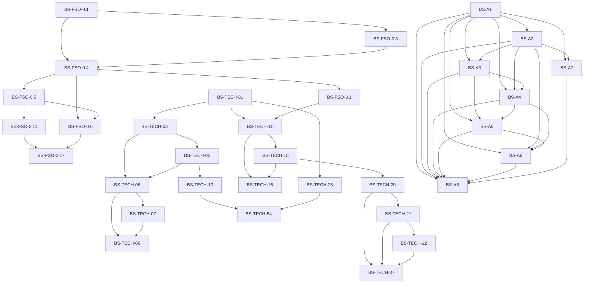

# Exercise-ready prerequisite spine

> Generated from ledger prerequisites. Do not hand-edit the graph.
> Only `EXERCISE_READY` / `LEARNER_VERIFIED` nodes are shown. The generator fails if a ready node depends on a non-ready node or if the ready graph contains a cycle.

## Ready roots

- `BS-FSO-0.1`
- `BS-TECH-01`
- `BS-A1`

## Dependency graph

## Topological study order

The graph allows parallel branches; this is one valid topological order:

1. `BS-A1`
2. `BS-A2`
3. `BS-A3`
4. `BS-A4`
5. `BS-A5`
6. `BS-A6`
7. `BS-A7`
8. `BS-A8`
9. `BS-FSO-0.1`
10. `BS-FSO-0.3`
11. `BS-FSO-0.4`
12. `BS-FSO-0.5`
13. `BS-FSO-0.6`
14. `BS-FSO-2.11`
15. `BS-FSO-2.17`
16. `BS-FSO-3.1`
17. `BS-TECH-01`
18. `BS-TECH-03`
19. `BS-TECH-05`
20. `BS-TECH-06`
21. `BS-TECH-07`
22. `BS-TECH-09`
23. `BS-TECH-10`
24. `BS-TECH-11`
25. `BS-TECH-15`
26. `BS-TECH-16`
27. `BS-TECH-20`
28. `BS-TECH-21`
29. `BS-TECH-22`
30. `BS-TECH-25`
31. `BS-TECH-37`
32. `BS-TECH-54`

A placement audit can skip a node only when prior evidence independently satisfies that node's L4/L5 acceptance card. Skipping a prerequisite because production code already exists is not sufficient.
