# Exercise-ready prerequisite spine

> Generated from ledger prerequisites. Do not hand-edit the graph.
> Only `EXERCISE_READY` / `LEARNER_VERIFIED` nodes are shown. The generator fails if a ready node depends on a non-ready node or if the ready graph contains a cycle.

## Ready roots

- `BS-FSO-0.1`
- `BS-P9-CONCEPT-STRUCTURAL-TYPING`
- `BS-P12-CONCEPT-IMAGE-VS-CONTAINER`
- `BS-TECH-01`
- `BS-A1`

## Dependency graph

```mermaid
graph TD
  n_FSO_0_1["BS-FSO-0.1"]
  n_FSO_0_3["BS-FSO-0.3"]
  n_FSO_0_4["BS-FSO-0.4"]
  n_FSO_0_5["BS-FSO-0.5"]
  n_FSO_0_6["BS-FSO-0.6"]
  n_FSO_2_11["BS-FSO-2.11"]
  n_FSO_2_17["BS-FSO-2.17"]
  n_FSO_3_1["BS-FSO-3.1"]
  n_FSO_P2_CONCEPT_ASYNC_RUNTIME["BS-P2-CONCEPT-ASYNC-RUNTIME"]
  n_FSO_P2_CONCEPT_PROMISES["BS-P2-CONCEPT-PROMISES"]
  n_FSO_P2_CONCEPT_EFFECTS["BS-P2-CONCEPT-EFFECTS"]
  n_FSO_P7_CONCEPT_USEMEMO["BS-P7-CONCEPT-USEMEMO"]
  n_FSO_P7_CONCEPT_USECALLBACK["BS-P7-CONCEPT-USECALLBACK"]
  n_FSO_P7_CONCEPT_XSS["BS-P7-CONCEPT-XSS"]
  n_FSO_P7_CONCEPT_BROKEN_AUTHZ["BS-P7-CONCEPT-BROKEN-AUTHZ"]
  n_FSO_P1_CONCEPT_COMPONENT["BS-P1-CONCEPT-COMPONENT"]
  n_FSO_P1_CONCEPT_JSX["BS-P1-CONCEPT-JSX"]
  n_FSO_P1_CONCEPT_PROPS["BS-P1-CONCEPT-PROPS"]
  n_FSO_P1_CONCEPT_RENDER_CYCLE["BS-P1-CONCEPT-RENDER-CYCLE"]
  n_FSO_P1_CONCEPT_USESTATE["BS-P1-CONCEPT-USESTATE"]
  n_FSO_P1_CONCEPT_EVENT_HANDLING["BS-P1-CONCEPT-EVENT-HANDLING"]
  n_FSO_P1_CONCEPT_STATE_PROP_OWNERSHIP["BS-P1-CONCEPT-STATE-PROP-OWNERSHIP"]
  n_FSO_P1_CONCEPT_IMMUTABLE_ARRAY_STATE["BS-P1-CONCEPT-IMMUTABLE-ARRAY-STATE"]
  n_FSO_P1_CONCEPT_ASYNC_STATE_UPDATES["BS-P1-CONCEPT-ASYNC-STATE-UPDATES"]
  n_FSO_P1_CONCEPT_HOOK_RULES["BS-P1-CONCEPT-HOOK-RULES"]
  n_FSO_P2_CONCEPT_REACT_KEYS["BS-P2-CONCEPT-REACT-KEYS"]
  n_FSO_P2_CONCEPT_CONTROLLED_COMPONENT["BS-P2-CONCEPT-CONTROLLED-COMPONENT"]
  n_FSO_P3_CONCEPT_HTTP_SAFETY_IDEMPOTENCY["BS-P3-CONCEPT-HTTP-SAFETY-IDEMPOTENCY"]
  n_FSO_P3_CONCEPT_MIDDLEWARE_CHAIN["BS-P3-CONCEPT-MIDDLEWARE-CHAIN"]
  n_FSO_P3_CONCEPT_SAME_ORIGIN_CORS["BS-P3-CONCEPT-SAME-ORIGIN-CORS"]
  n_FSO_P3_CONCEPT_HTTP_ERROR_TAXONOMY["BS-P3-CONCEPT-HTTP-ERROR-TAXONOMY"]
  n_FSO_P4_CONCEPT_BEARER_AUTHORIZATION["BS-P4-CONCEPT-BEARER-AUTHORIZATION"]
  n_FSO_P4_CONCEPT_TOKEN_REVOCATION["BS-P4-CONCEPT-TOKEN-REVOCATION"]
  n_FSO_P5_CONCEPT_BROWSER_TOKEN_PERSISTENCE["BS-P5-CONCEPT-BROWSER-TOKEN-PERSISTENCE"]
  n_FSO_P5_CONCEPT_COMPONENT_TEST_RENDER["BS-P5-CONCEPT-COMPONENT-TEST-RENDER"]
  n_FSO_P5_CONCEPT_TESTING_LIBRARY_QUERIES["BS-P5-CONCEPT-TESTING-LIBRARY-QUERIES"]
  n_FSO_P5_CONCEPT_USER_EVENT_TESTING["BS-P5-CONCEPT-USER-EVENT-TESTING"]
  n_FSO_P5_CONCEPT_STATEFUL_COMPONENT_TESTS["BS-P5-CONCEPT-STATEFUL-COMPONENT-TESTS"]
  n_FSO_P6_CONCEPT_TANSTACK_QUERY["BS-P6-CONCEPT-TANSTACK-QUERY"]
  n_FSO_P6_CONCEPT_QUERY_MUTATION_INVALIDATION["BS-P6-CONCEPT-QUERY-MUTATION-INVALIDATION"]
  n_FSO_P6_CONCEPT_STATE_OWNERSHIP_CHOICE["BS-P6-CONCEPT-STATE-OWNERSHIP-CHOICE"]
  n_FSO_P7_CONCEPT_HOOKS_MENTAL_MODEL["BS-P7-CONCEPT-HOOKS-MENTAL-MODEL"]
  n_FSO_P7_CONCEPT_CUSTOM_HOOKS["BS-P7-CONCEPT-CUSTOM-HOOKS"]
  n_FSO_P7_CONCEPT_ERROR_BOUNDARY["BS-P7-CONCEPT-ERROR-BOUNDARY"]
  n_FSO_P7_CONCEPT_SERVER_PUSH_SYNC["BS-P7-CONCEPT-SERVER-PUSH-SYNC"]
  n_FSO_P9_CONCEPT_STRUCTURAL_TYPING["BS-P9-CONCEPT-STRUCTURAL-TYPING"]
  n_FSO_P9_CONCEPT_TYPE_ERASURE["BS-P9-CONCEPT-TYPE-ERASURE"]
  n_FSO_P9_CONCEPT_UNKNOWN_NARROWING["BS-P9-CONCEPT-UNKNOWN-NARROWING"]
  n_FSO_P9_CONCEPT_DISCRIMINATED_UNIONS["BS-P9-CONCEPT-DISCRIMINATED-UNIONS"]
  n_FSO_P9_CONCEPT_EXHAUSTIVE_NARROWING["BS-P9-CONCEPT-EXHAUSTIVE-NARROWING"]
  n_FSO_P9_CONCEPT_TYPED_SERVER_DATA["BS-P9-CONCEPT-TYPED-SERVER-DATA"]
  n_FSO_P9_CONCEPT_SCHEMA_VALIDATION["BS-P9-CONCEPT-SCHEMA-VALIDATION"]
  n_FSO_P11_CONCEPT_REPRODUCIBLE_PIPELINE["BS-P11-CONCEPT-REPRODUCIBLE-PIPELINE"]
  n_FSO_P11_CONCEPT_DEPLOYED_REVISION_PROVENANCE["BS-P11-CONCEPT-DEPLOYED-REVISION-PROVENANCE"]
  n_FSO_P11_CONCEPT_CI_QUALITY_GATES["BS-P11-CONCEPT-CI-QUALITY-GATES"]
  n_FSO_P11_CONCEPT_SAFE_DEPLOYMENT_SYSTEM["BS-P11-CONCEPT-SAFE-DEPLOYMENT-SYSTEM"]
  n_FSO_P11_CONCEPT_BRANCH_PROTECTION["BS-P11-CONCEPT-BRANCH-PROTECTION"]
  n_FSO_P12_CONCEPT_IMAGE_VS_CONTAINER["BS-P12-CONCEPT-IMAGE-VS-CONTAINER"]
  n_FSO_P12_CONCEPT_DOCKERFILE["BS-P12-CONCEPT-DOCKERFILE"]
  n_FSO_P12_CONCEPT_DOCKER_COMPOSE["BS-P12-CONCEPT-DOCKER-COMPOSE"]
  n_FSO_P12_CONCEPT_DOCKER_VOLUMES["BS-P12-CONCEPT-DOCKER-VOLUMES"]
  n_FSO_P12_CONCEPT_DOCKER_NETWORK_DNS["BS-P12-CONCEPT-DOCKER-NETWORK-DNS"]
  n_TECH_01["BS-TECH-01"]
  n_TECH_03["BS-TECH-03"]
  n_TECH_05["BS-TECH-05"]
  n_TECH_06["BS-TECH-06"]
  n_TECH_07["BS-TECH-07"]
  n_TECH_09["BS-TECH-09"]
  n_TECH_10["BS-TECH-10"]
  n_TECH_11["BS-TECH-11"]
  n_TECH_15["BS-TECH-15"]
  n_TECH_16["BS-TECH-16"]
  n_TECH_20["BS-TECH-20"]
  n_TECH_21["BS-TECH-21"]
  n_TECH_22["BS-TECH-22"]
  n_TECH_25["BS-TECH-25"]
  n_TECH_37["BS-TECH-37"]
  n_TECH_54["BS-TECH-54"]
  n_BS_A1["BS-A1"]
  n_BS_A2["BS-A2"]
  n_BS_A3["BS-A3"]
  n_BS_A4["BS-A4"]
  n_BS_A5["BS-A5"]
  n_BS_A6["BS-A6"]
  n_BS_A7["BS-A7"]
  n_BS_A8["BS-A8"]
  n_FSO_0_1 --> n_FSO_0_3
  n_FSO_0_1 --> n_FSO_0_4
  n_FSO_0_3 --> n_FSO_0_4
  n_FSO_0_4 --> n_FSO_0_5
  n_FSO_0_4 --> n_FSO_0_6
  n_FSO_0_5 --> n_FSO_0_6
  n_FSO_0_5 --> n_FSO_2_11
  n_FSO_2_11 --> n_FSO_2_17
  n_FSO_0_6 --> n_FSO_2_17
  n_FSO_0_4 --> n_FSO_3_1
  n_FSO_0_5 --> n_FSO_P2_CONCEPT_ASYNC_RUNTIME
  n_FSO_P2_CONCEPT_ASYNC_RUNTIME --> n_FSO_P2_CONCEPT_PROMISES
  n_FSO_P1_CONCEPT_HOOK_RULES --> n_FSO_P2_CONCEPT_EFFECTS
  n_FSO_P2_CONCEPT_PROMISES --> n_FSO_P2_CONCEPT_EFFECTS
  n_FSO_P7_CONCEPT_HOOKS_MENTAL_MODEL --> n_FSO_P7_CONCEPT_USEMEMO
  n_FSO_P7_CONCEPT_HOOKS_MENTAL_MODEL --> n_FSO_P7_CONCEPT_USECALLBACK
  n_FSO_0_1 --> n_FSO_P7_CONCEPT_XSS
  n_FSO_P4_CONCEPT_BEARER_AUTHORIZATION --> n_FSO_P7_CONCEPT_BROKEN_AUTHZ
  n_FSO_0_1 --> n_FSO_P1_CONCEPT_COMPONENT
  n_FSO_P1_CONCEPT_COMPONENT --> n_FSO_P1_CONCEPT_JSX
  n_FSO_P1_CONCEPT_COMPONENT --> n_FSO_P1_CONCEPT_PROPS
  n_FSO_P1_CONCEPT_JSX --> n_FSO_P1_CONCEPT_PROPS
  n_FSO_P1_CONCEPT_COMPONENT --> n_FSO_P1_CONCEPT_RENDER_CYCLE
  n_FSO_P1_CONCEPT_RENDER_CYCLE --> n_FSO_P1_CONCEPT_USESTATE
  n_FSO_P1_CONCEPT_USESTATE --> n_FSO_P1_CONCEPT_EVENT_HANDLING
  n_FSO_P1_CONCEPT_PROPS --> n_FSO_P1_CONCEPT_STATE_PROP_OWNERSHIP
  n_FSO_P1_CONCEPT_USESTATE --> n_FSO_P1_CONCEPT_STATE_PROP_OWNERSHIP
  n_FSO_P1_CONCEPT_USESTATE --> n_FSO_P1_CONCEPT_IMMUTABLE_ARRAY_STATE
  n_FSO_P1_CONCEPT_USESTATE --> n_FSO_P1_CONCEPT_ASYNC_STATE_UPDATES
  n_FSO_P1_CONCEPT_USESTATE --> n_FSO_P1_CONCEPT_HOOK_RULES
  n_FSO_P1_CONCEPT_JSX --> n_FSO_P2_CONCEPT_REACT_KEYS
  n_FSO_P1_CONCEPT_EVENT_HANDLING --> n_FSO_P2_CONCEPT_CONTROLLED_COMPONENT
  n_FSO_P1_CONCEPT_USESTATE --> n_FSO_P2_CONCEPT_CONTROLLED_COMPONENT
  n_FSO_3_1 --> n_FSO_P3_CONCEPT_HTTP_SAFETY_IDEMPOTENCY
  n_FSO_3_1 --> n_FSO_P3_CONCEPT_MIDDLEWARE_CHAIN
  n_FSO_0_5 --> n_FSO_P3_CONCEPT_SAME_ORIGIN_CORS
  n_FSO_P3_CONCEPT_MIDDLEWARE_CHAIN --> n_FSO_P3_CONCEPT_SAME_ORIGIN_CORS
  n_FSO_3_1 --> n_FSO_P3_CONCEPT_HTTP_ERROR_TAXONOMY
  n_FSO_P3_CONCEPT_MIDDLEWARE_CHAIN --> n_FSO_P3_CONCEPT_HTTP_ERROR_TAXONOMY
  n_TECH_22 --> n_FSO_P4_CONCEPT_BEARER_AUTHORIZATION
  n_FSO_P3_CONCEPT_MIDDLEWARE_CHAIN --> n_FSO_P4_CONCEPT_BEARER_AUTHORIZATION
  n_TECH_37 --> n_FSO_P4_CONCEPT_TOKEN_REVOCATION
  n_FSO_P4_CONCEPT_BEARER_AUTHORIZATION --> n_FSO_P4_CONCEPT_TOKEN_REVOCATION
  n_FSO_P4_CONCEPT_TOKEN_REVOCATION --> n_FSO_P5_CONCEPT_BROWSER_TOKEN_PERSISTENCE
  n_FSO_P1_CONCEPT_COMPONENT --> n_FSO_P5_CONCEPT_COMPONENT_TEST_RENDER
  n_FSO_P5_CONCEPT_COMPONENT_TEST_RENDER --> n_FSO_P5_CONCEPT_TESTING_LIBRARY_QUERIES
  n_FSO_P1_CONCEPT_EVENT_HANDLING --> n_FSO_P5_CONCEPT_USER_EVENT_TESTING
  n_FSO_P5_CONCEPT_TESTING_LIBRARY_QUERIES --> n_FSO_P5_CONCEPT_USER_EVENT_TESTING
  n_FSO_P1_CONCEPT_USESTATE --> n_FSO_P5_CONCEPT_STATEFUL_COMPONENT_TESTS
  n_FSO_P5_CONCEPT_USER_EVENT_TESTING --> n_FSO_P5_CONCEPT_STATEFUL_COMPONENT_TESTS
  n_FSO_P6_CONCEPT_STATE_OWNERSHIP_CHOICE --> n_FSO_P6_CONCEPT_TANSTACK_QUERY
  n_FSO_2_11 --> n_FSO_P6_CONCEPT_TANSTACK_QUERY
  n_FSO_P6_CONCEPT_TANSTACK_QUERY --> n_FSO_P6_CONCEPT_QUERY_MUTATION_INVALIDATION
  n_FSO_2_17 --> n_FSO_P6_CONCEPT_QUERY_MUTATION_INVALIDATION
  n_FSO_0_5 --> n_FSO_P6_CONCEPT_STATE_OWNERSHIP_CHOICE
  n_FSO_0_6 --> n_FSO_P6_CONCEPT_STATE_OWNERSHIP_CHOICE
  n_FSO_P1_CONCEPT_HOOK_RULES --> n_FSO_P7_CONCEPT_HOOKS_MENTAL_MODEL
  n_FSO_P2_CONCEPT_EFFECTS --> n_FSO_P7_CONCEPT_HOOKS_MENTAL_MODEL
  n_FSO_P7_CONCEPT_HOOKS_MENTAL_MODEL --> n_FSO_P7_CONCEPT_CUSTOM_HOOKS
  n_FSO_P5_CONCEPT_COMPONENT_TEST_RENDER --> n_FSO_P7_CONCEPT_ERROR_BOUNDARY
  n_FSO_P6_CONCEPT_QUERY_MUTATION_INVALIDATION --> n_FSO_P7_CONCEPT_SERVER_PUSH_SYNC
  n_FSO_P9_CONCEPT_STRUCTURAL_TYPING --> n_FSO_P9_CONCEPT_TYPE_ERASURE
  n_FSO_P9_CONCEPT_TYPE_ERASURE --> n_FSO_P9_CONCEPT_UNKNOWN_NARROWING
  n_FSO_P9_CONCEPT_STRUCTURAL_TYPING --> n_FSO_P9_CONCEPT_DISCRIMINATED_UNIONS
  n_FSO_P9_CONCEPT_DISCRIMINATED_UNIONS --> n_FSO_P9_CONCEPT_EXHAUSTIVE_NARROWING
  n_FSO_P9_CONCEPT_TYPE_ERASURE --> n_FSO_P9_CONCEPT_TYPED_SERVER_DATA
  n_FSO_P9_CONCEPT_UNKNOWN_NARROWING --> n_FSO_P9_CONCEPT_TYPED_SERVER_DATA
  n_FSO_2_11 --> n_FSO_P9_CONCEPT_TYPED_SERVER_DATA
  n_FSO_P9_CONCEPT_TYPED_SERVER_DATA --> n_FSO_P9_CONCEPT_SCHEMA_VALIDATION
  n_FSO_P9_CONCEPT_UNKNOWN_NARROWING --> n_FSO_P9_CONCEPT_SCHEMA_VALIDATION
  n_TECH_10 --> n_FSO_P11_CONCEPT_REPRODUCIBLE_PIPELINE
  n_FSO_P11_CONCEPT_SAFE_DEPLOYMENT_SYSTEM --> n_FSO_P11_CONCEPT_DEPLOYED_REVISION_PROVENANCE
  n_FSO_P11_CONCEPT_REPRODUCIBLE_PIPELINE --> n_FSO_P11_CONCEPT_CI_QUALITY_GATES
  n_FSO_P11_CONCEPT_CI_QUALITY_GATES --> n_FSO_P11_CONCEPT_SAFE_DEPLOYMENT_SYSTEM
  n_FSO_P11_CONCEPT_CI_QUALITY_GATES --> n_FSO_P11_CONCEPT_BRANCH_PROTECTION
  n_FSO_P12_CONCEPT_IMAGE_VS_CONTAINER --> n_FSO_P12_CONCEPT_DOCKERFILE
  n_FSO_P12_CONCEPT_DOCKERFILE --> n_FSO_P12_CONCEPT_DOCKER_COMPOSE
  n_FSO_P12_CONCEPT_DOCKER_COMPOSE --> n_FSO_P12_CONCEPT_DOCKER_VOLUMES
  n_FSO_P12_CONCEPT_DOCKER_COMPOSE --> n_FSO_P12_CONCEPT_DOCKER_NETWORK_DNS
  n_TECH_01 --> n_TECH_03
  n_TECH_03 --> n_TECH_05
  n_TECH_03 --> n_TECH_06
  n_TECH_05 --> n_TECH_06
  n_TECH_06 --> n_TECH_07
  n_TECH_06 --> n_TECH_09
  n_TECH_07 --> n_TECH_09
  n_TECH_05 --> n_TECH_10
  n_TECH_01 --> n_TECH_11
  n_FSO_3_1 --> n_TECH_11
  n_TECH_11 --> n_TECH_15
  n_TECH_11 --> n_TECH_16
  n_TECH_15 --> n_TECH_16
  n_TECH_15 --> n_TECH_20
  n_TECH_20 --> n_TECH_21
  n_TECH_21 --> n_TECH_22
  n_TECH_01 --> n_TECH_25
  n_TECH_20 --> n_TECH_37
  n_TECH_21 --> n_TECH_37
  n_TECH_22 --> n_TECH_37
  n_TECH_10 --> n_TECH_54
  n_TECH_25 --> n_TECH_54
  n_BS_A1 --> n_BS_A2
  n_BS_A1 --> n_BS_A3
  n_BS_A2 --> n_BS_A3
  n_BS_A1 --> n_BS_A4
  n_BS_A2 --> n_BS_A4
  n_BS_A3 --> n_BS_A4
  n_BS_A1 --> n_BS_A5
  n_BS_A3 --> n_BS_A5
  n_BS_A4 --> n_BS_A5
  n_BS_A1 --> n_BS_A6
  n_BS_A2 --> n_BS_A6
  n_BS_A4 --> n_BS_A6
  n_BS_A5 --> n_BS_A6
  n_BS_A1 --> n_BS_A7
  n_BS_A2 --> n_BS_A7
  n_BS_A1 --> n_BS_A8
  n_BS_A2 --> n_BS_A8
  n_BS_A3 --> n_BS_A8
  n_BS_A4 --> n_BS_A8
  n_BS_A5 --> n_BS_A8
  n_BS_A6 --> n_BS_A8
  n_BS_A7 --> n_BS_A8
```

## Topological study order

The graph allows parallel branches; this is one valid topological order:

1. `BS-A1`
2. `BS-A2`
3. `BS-A3`
4. `BS-A4`
5. `BS-A5`
6. `BS-A6`
7. `BS-A7`
8. `BS-A8`
9. `BS-FSO-0.1`
10. `BS-FSO-0.3`
11. `BS-FSO-0.4`
12. `BS-FSO-0.5`
13. `BS-FSO-0.6`
14. `BS-FSO-2.11`
15. `BS-FSO-2.17`
16. `BS-FSO-3.1`
17. `BS-P1-CONCEPT-COMPONENT`
18. `BS-P1-CONCEPT-JSX`
19. `BS-P1-CONCEPT-PROPS`
20. `BS-P1-CONCEPT-RENDER-CYCLE`
21. `BS-P1-CONCEPT-USESTATE`
22. `BS-P1-CONCEPT-ASYNC-STATE-UPDATES`
23. `BS-P1-CONCEPT-EVENT-HANDLING`
24. `BS-P1-CONCEPT-HOOK-RULES`
25. `BS-P1-CONCEPT-IMMUTABLE-ARRAY-STATE`
26. `BS-P1-CONCEPT-STATE-PROP-OWNERSHIP`
27. `BS-P12-CONCEPT-IMAGE-VS-CONTAINER`
28. `BS-P12-CONCEPT-DOCKERFILE`
29. `BS-P12-CONCEPT-DOCKER-COMPOSE`
30. `BS-P12-CONCEPT-DOCKER-NETWORK-DNS`
31. `BS-P12-CONCEPT-DOCKER-VOLUMES`
32. `BS-P2-CONCEPT-ASYNC-RUNTIME`
33. `BS-P2-CONCEPT-CONTROLLED-COMPONENT`
34. `BS-P2-CONCEPT-PROMISES`
35. `BS-P2-CONCEPT-EFFECTS`
36. `BS-P2-CONCEPT-REACT-KEYS`
37. `BS-P3-CONCEPT-HTTP-SAFETY-IDEMPOTENCY`
38. `BS-P3-CONCEPT-MIDDLEWARE-CHAIN`
39. `BS-P3-CONCEPT-HTTP-ERROR-TAXONOMY`
40. `BS-P3-CONCEPT-SAME-ORIGIN-CORS`
41. `BS-P5-CONCEPT-COMPONENT-TEST-RENDER`
42. `BS-P5-CONCEPT-TESTING-LIBRARY-QUERIES`
43. `BS-P5-CONCEPT-USER-EVENT-TESTING`
44. `BS-P5-CONCEPT-STATEFUL-COMPONENT-TESTS`
45. `BS-P6-CONCEPT-STATE-OWNERSHIP-CHOICE`
46. `BS-P6-CONCEPT-TANSTACK-QUERY`
47. `BS-P6-CONCEPT-QUERY-MUTATION-INVALIDATION`
48. `BS-P7-CONCEPT-ERROR-BOUNDARY`
49. `BS-P7-CONCEPT-HOOKS-MENTAL-MODEL`
50. `BS-P7-CONCEPT-CUSTOM-HOOKS`
51. `BS-P7-CONCEPT-SERVER-PUSH-SYNC`
52. `BS-P7-CONCEPT-USECALLBACK`
53. `BS-P7-CONCEPT-USEMEMO`
54. `BS-P7-CONCEPT-XSS`
55. `BS-P9-CONCEPT-STRUCTURAL-TYPING`
56. `BS-P9-CONCEPT-DISCRIMINATED-UNIONS`
57. `BS-P9-CONCEPT-EXHAUSTIVE-NARROWING`
58. `BS-P9-CONCEPT-TYPE-ERASURE`
59. `BS-P9-CONCEPT-UNKNOWN-NARROWING`
60. `BS-P9-CONCEPT-TYPED-SERVER-DATA`
61. `BS-P9-CONCEPT-SCHEMA-VALIDATION`
62. `BS-TECH-01`
63. `BS-TECH-03`
64. `BS-TECH-05`
65. `BS-TECH-06`
66. `BS-TECH-07`
67. `BS-TECH-09`
68. `BS-TECH-10`
69. `BS-P11-CONCEPT-REPRODUCIBLE-PIPELINE`
70. `BS-P11-CONCEPT-CI-QUALITY-GATES`
71. `BS-P11-CONCEPT-BRANCH-PROTECTION`
72. `BS-P11-CONCEPT-SAFE-DEPLOYMENT-SYSTEM`
73. `BS-P11-CONCEPT-DEPLOYED-REVISION-PROVENANCE`
74. `BS-TECH-11`
75. `BS-TECH-15`
76. `BS-TECH-16`
77. `BS-TECH-20`
78. `BS-TECH-21`
79. `BS-TECH-22`
80. `BS-P4-CONCEPT-BEARER-AUTHORIZATION`
81. `BS-P7-CONCEPT-BROKEN-AUTHZ`
82. `BS-TECH-25`
83. `BS-TECH-37`
84. `BS-P4-CONCEPT-TOKEN-REVOCATION`
85. `BS-P5-CONCEPT-BROWSER-TOKEN-PERSISTENCE`
86. `BS-TECH-54`

A placement audit can skip a node only when prior evidence independently satisfies that node's L4/L5 acceptance card. Skipping a prerequisite because production code already exists is not sufficient.
