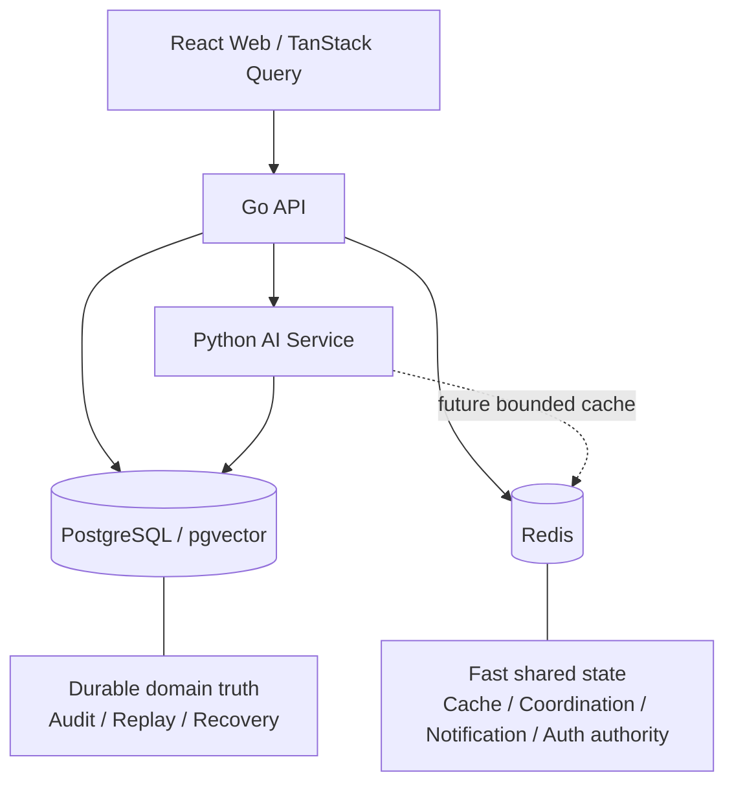
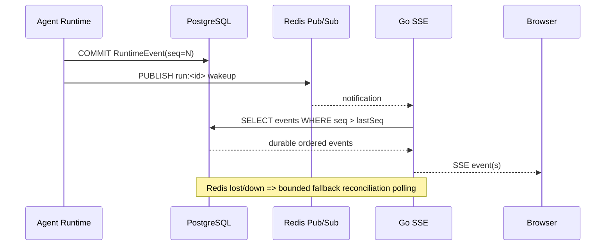

# BodySense Redis Learning & Architecture Optimization Plan

> 文档状态：ACTIVE PLAN / 学习与架构优化计划，尚未实施生产代码改造
> 创建日期：2026-09-16
> 适用项目：BodySense
> 目标：以 BodySense 现有 Redis 实现为真实工程载体，从零到一系统学习 Redis；在不破坏 PostgreSQL durable truth、认证安全边界、Runtime Event replay 与 JobRuntime 可恢复性的前提下，逐步将 Redis 用于共享快速状态、实时通知、缓存和异步唤醒，提升性能、实时性与工程可解释性。

---

## 0. Executive Summary

BodySense 已经不是一个“尚未使用 Redis”的项目。当前 Go API 已经把 Redis 用在几个很有学习价值、也很接近生产系统的场景中：

1. **Session revocation authority**：短期 JWT Access Token 在每次受保护请求中还需要通过 Redis 验证 Session 是否仍然有效；
2. **Refresh Token rotation / replay detection**：Refresh Token 使用 Redis 保存摘要派生 key，并通过 Lua 原子脚本实现并发下单赢家轮换与 replay tombstone；
3. **Refresh family / 全设备撤销**：使用 Redis Set 管理一个 Session Family 的 refresh token key；
4. **账户撤销竞态封锁**：使用 `user_auth_revoked:<uid>` tombstone 防止账户删除与登录并发时重新建立 Session；
5. **分布式认证限流**：使用 `INCR + EXPIRE + Lua` 实现跨 API 实例共享的 fixed-window rate limit；
6. **Redis durability**：生产 Redis 已开启 AOF `appendonly yes` + `appendfsync everysec` 并挂载 volume。

因此本计划不从“把 Redis 装起来”开始，而从一个更重要的问题开始：

> **一份状态为什么应该由 Redis 持有？为什么不能放 PostgreSQL、进程内存或前端 Query Cache？Redis 不可用时，系统应当 fail closed、fallback，还是继续工作？**

本计划把 Redis 的长期定位固定为：

```text
PostgreSQL
= Durable Truth / Audit / Recoverability / Domain Authority

Redis
= Shared Fast State / Cache / Coordination / Realtime Notification / Wakeup Plane
```

推荐实施顺序：

```text
Phase 0  基线、Key Registry、故障矩阵、性能基线
   ↓
Phase 1  Redis production hardening / 可观测性 / client policy
   ↓
Phase 2  Runtime Event Redis notifier：Pub/Sub 唤醒 SSE，Postgres 继续做 durable log
   ↓
Phase 3  HealthWorkspace cache + Knowledge/RAG cache
   ↓
Phase 4  Job wakeup + Redis Streams / Asynq 隔离实验
```

明确不做的事情：

- 不把 BodyState、Diagnosis、Treatment、Outcome 迁移成 Redis source of truth；
- 不把 Runtime Event durable log 迁出 PostgreSQL；
- 不因为 Redis 更快就替换现有 PostgreSQL JobRuntime、idempotency unique constraint 或 run lease authority；
- 不直接把当前所有后台任务迁移到 Asynq；
- 不把 Pub/Sub 当成可靠事件日志。

---

# 1. 当前系统事实基线

## 1.1 Redis 基础设施

当前 Redis 连接和部署入口：

```text
apps/api/internal/database/redis.go
docker/docker-compose.yml
docker/docker-compose.prod.yml
.env.example
.env.production
```

Go 使用：

```text
github.com/redis/go-redis/v9 v9.21.0
```

测试使用：

```text
github.com/alicebob/miniredis/v2 v2.38.0
```

开发 Compose：

```text
redis:7-alpine
appendonly yes
requirepass
healthcheck: redis-cli ping
```

生产 Compose：

```text
appendonly yes
appendfsync everysec
requirepass
persistent volume
localhost host bind
container memory limit
```

当前生产 resource envelope：

```text
REDIS_MEMORY_LIMIT=96m
REDIS_MEMORY_RESERVATION=16m
```

当前尚未显式配置 Redis 自身的 `maxmemory` / `maxmemory-policy`，因此容器 hard limit 与 Redis 内部内存治理还没有形成一条明确的应用级 invariant。

---

## 1.2 当前 Redis Key 模型

### Session authority

来源：

```text
apps/api/internal/cache/user_session.go
```

当前 key：

```text
session:<sid>
user_sessions:<userID>
user_auth_revoked:<userID>
```

用途：

| Key | Redis 类型 | TTL | 语义 |
|---|---|---:|---|
| `session:<sid>` | String | Refresh TTL | 该 Session 是否仍具有访问授权 |
| `user_sessions:<uid>` | Set | Refresh TTL | 用户当前存活 Session ID 集合 |
| `user_auth_revoked:<uid>` | String tombstone | Refresh TTL | 用户授权窗口已关闭，阻止并发登录重新建立 Session |

这里 Redis 不是普通性能缓存，而是**认证撤销权威的一部分**。

---

## 1.3 Refresh Token Rotation / Replay Detection

来源：

```text
apps/api/internal/service/auth_service.go
```

当前 key：

```text
refresh_token:<sha256(token)>
refresh_replay:<sha256(token)>
refresh_family:<sessionID>
```

重要设计：

- 浏览器持有 opaque refresh token；
- Redis key 使用 SHA-256 digest，而不是把 raw bearer credential 放进 Redis key；
- `refresh_family:<sid>` 使用 Set 记录该 Session Family 当前相关的 refresh keys；
- rotation 使用 Lua 完成 compare / delete / replay tombstone / new token / family update；
- `refresh_replay` 当前 TTL 为 10 分钟；
- 一旦检测到旧 Refresh Token replay，会撤销整个 Session Family。

正常轮换：

```text
Refresh A
  ↓
GET refresh_token:hash(A)
  ↓
Lua compare current value
  ├─ DEL refresh_token:hash(A)
  ├─ SET refresh_replay:hash(A) EX 10m
  ├─ SET refresh_token:hash(B) EX refreshTTL
  ├─ SREM family old key
  └─ SADD family new key
```

重放：

```text
Refresh A 再次出现
  ↓
refresh_token:hash(A) miss
  ↓
refresh_replay:hash(A) hit
  ↓
判定 reuse
  ↓
revoke entire session family
```

这是本 Redis Track 最重要的原子性案例之一。

---

## 1.4 Redis Rate Limiter

来源：

```text
apps/api/internal/auth/rate_limit.go
apps/api/internal/handler/auth_handler.go
```

当前策略：

```text
Login:    10 / 5 minutes
Register:  5 / 15 minutes
Refresh:  60 / 5 minutes
```

算法：Fixed Window。

Lua：

```text
INCR key
if first request:
    EXPIRE key window
TTL key
return count, ttl
```

限流维度在进入 Redis 前做 SHA-256，因此 Redis key 不直接暴露 email、refresh token 等敏感 dimension。

---

## 1.5 Redis Failure Semantics 已经有清晰安全边界

来源：

```text
apps/api/internal/middleware/auth.go
```

BodySense 已经正确地区分：

```text
Redis definitive miss
!=
Redis unavailable
```

对于 Session-bound JWT：

| 情况 | 已知事实 | HTTP 行为 |
|---|---|---|
| Session key 存在 | 已知授权仍有效 | allow |
| Session key 不存在 | 已知该 Session 已撤销/失效 | `401` |
| Redis 查询失败 | 无法证明 Session 是否仍有权限 | `503` fail closed |

这个边界必须长期保护。未来增加 Redis cache / PubSub 后，不能把“缓存 fallback”的语义错误套到认证 authority 上。

---

# 2. BodySense 当前认证系统到底是不是“自己写的”

## 2.1 结论

当前 BodySense **没有使用 Auth0、Clerk、Keycloak、Auth.js/NextAuth、Supabase Auth 等完整身份认证平台或认证框架**。

更准确的描述是：

> **BodySense 自研了认证业务流程、安全策略和 Session/Refresh 状态机，但底层密码学、JWT、Redis、HTTP、ORM 等能力使用成熟开源库。**

因此不能简单说“完全原生，什么库都没用”，也不能说“认证直接用某个现成框架”。

架构属于：

```text
BodySense-owned authentication architecture
        │
        ├─ open-source JWT primitive
        ├─ open-source bcrypt implementation
        ├─ open-source Redis client
        ├─ Gin HTTP framework
        └─ GORM persistence
```

---

## 2.2 自研的部分

以下逻辑是 BodySense 自己定义和维护的：

```text
apps/api/internal/auth/jwt.go
apps/api/internal/auth/rate_limit.go
apps/api/internal/cache/user_session.go
apps/api/internal/service/auth_service.go
apps/api/internal/handler/auth_handler.go
apps/api/internal/middleware/auth.go
```

包括：

- Access Token Claims 结构；
- Access Token TTL / Refresh TTL 配置；
- `session_id` 与 JWT 的绑定；
- opaque refresh token 生命周期；
- Refresh Token Redis key schema；
- refresh family；
- replay tombstone；
- Refresh Token rotation Lua；
- Session revoke / revoke all；
- account-erasure tombstone；
- Redis unavailable 时认证 fail-closed；
- login/register/refresh 限流策略；
- trusted Origin 检查；
- Refresh Token HttpOnly Cookie 策略；
- `SameSite=Strict`；
- Login 错误消息避免泄露“邮箱存在性”；
- Logout / Global revocation 行为。

这些不是某个认证框架自动生成的。

---

## 2.3 使用的核心开源库

### JWT

```text
github.com/golang-jwt/jwt/v5 v5.3.1
```

BodySense 在 `auth/jwt.go` 中使用该库：

- 构造 `RegisteredClaims`；
- 使用 HS256；
- 签名 Access Token；
- Parse / Validate JWT。

也就是说：

```text
JWT 标准实现 / cryptographic primitive
→ golang-jwt

JWT Claims / TTL / session binding / auth policy
→ BodySense
```

### Password hashing

```text
golang.org/x/crypto/bcrypt
```

当前注册：

```text
bcrypt cost = 12
```

Login 使用：

```text
bcrypt.CompareHashAndPassword
```

### Redis

```text
github.com/redis/go-redis/v9 v9.21.0
```

用于：

- Session authority；
- Refresh rotation；
- replay detection；
- family revoke；
- rate limit；
- Lua execution。

### HTTP framework

```text
github.com/gin-gonic/gin v1.12.0
```

负责 route / handler / middleware / cookie / request binding 等 HTTP 层能力。

### ORM / database

```text
gorm.io/gorm v1.31.2
```

负责用户数据访问等持久层能力。

### UUID

```text
github.com/google/uuid v1.6.0
```

Session ID、User ID 等身份标识使用 UUID。

---

## 2.4 当前浏览器认证流

```text
Register / Login
   ↓
Gin Handler
   ↓
Origin + Rate Limit
   ↓
AuthService
   ├─ PostgreSQL user lookup/create
   ├─ bcrypt verify/hash
   ├─ issue JWT Access Token
   ├─ generate opaque Refresh Token
   ├─ Redis refresh family
   └─ Redis Session authority
   ↓
Response
   ├─ Access Token: JSON
   └─ Refresh Token: HttpOnly + SameSite=Strict Cookie
```

`AuthResponse.RefreshToken` 使用：

```go
json:"-"
```

因此 Refresh Token 不进入 JSON 响应，只通过 HttpOnly Cookie 传给浏览器。

受保护请求：

```text
Authorization: Bearer <access-token>
   ↓
Validate HS256 JWT
   ↓
session_id
   ↓
Redis session:<sid>
   ├─ hit   → allow
   ├─ miss  → 401
   └─ error → 503 fail closed
```

Refresh：

```text
HttpOnly refresh cookie
   ↓
Rate Limit
   ↓
Redis old refresh lookup
   ↓
Lua atomic rotate
   ↓
New Access Token + New Refresh Cookie
```

这套系统因此非常适合作为学习 Redis 的认证案例。

---

# 3. Redis 的目标架构定位

## 3.1 North-star state ownership



### PostgreSQL 长期负责

- User durable data；
- BodyState；
- Consultation Session；
- Diagnosis Analysis；
- Treatment / Revision；
- Outcome；
- Run / Job ledger；
- Runtime Event durable log；
- Thread Projection；
- Idempotency unique constraints；
- Run Lease durable authority；
- Knowledge / pgvector data；
- 审计、回放、灾难恢复所需状态。

### Redis 负责或候选负责

- Session authority；
- Refresh Token / replay state；
- Rate Limit；
- bounded cache；
- cross-instance realtime wakeup；
- cache invalidation notification；
- background worker wakeup；
- 后续有明确需求时的 Stream / queue substrate；
- 有限生命周期的 coordination state。

---

## 3.2 一条必须长期坚持的判断规则

新增 Redis 用例前，必须回答：

```text
1. 这份数据是谁的 source of truth？
2. 丢失 Redis 数据是否允许？
3. Redis 重启之后如何恢复？
4. Redis miss 是正常 miss，还是业务状态？
5. Redis error 时 fail closed、fallback 还是 fail open？
6. 需要 TTL 吗？为什么？
7. 允许 eviction 吗？
8. key 是否包含 PII / bearer credential？
9. 多实例下是否要求原子性？
10. PostgreSQL commit 与 Redis 操作之间是否存在双写一致性问题？
```

如果这些问题没有答案，就不应进入生产 Redis。

---

# 4. 从零到一 Redis 学习 Track

## 4.1 学习方法

每一课统一采用：

```text
Concept
→ Prediction
→ BodySense Code Trace
→ Redis CLI / isolated lab
→ Failure Injection
→ Explain-back
→ L4 verification
```

不以“看完文档”作为完成标准。

建议 mastery：

```text
L1  能说出概念
L2  能预测基本行为
L3  能在 BodySense 中正确 trace / debug
L4  能解释架构取舍、故障语义，并完成验证实验
```

---

## Lesson 1 — Redis 是什么：Memory / Process / Network / State Ownership

### 学习目标

理解：

- Redis Server / Client；
- networked in-memory datastore；
- Redis 与 Go `map` 的区别；
- Redis 与 PostgreSQL 的区别；
- Redis 与 TanStack Query client cache 的区别；
- 为什么“快”不是选择 Redis 的充分理由。

### BodySense anchors

```text
apps/api/internal/database/redis.go
docker/docker-compose.yml
apps/api/cmd/server/main.go
```

### Lab

```text
PING
SET hello world
GET hello
DEL hello
EXISTS hello
TYPE hello
TTL hello
DBSIZE
SCAN 0
INFO
```

### L4 Gate

能解释：

> 为什么 `session:<sid>` 放 Redis 合理，而 BodyState 作为唯一真值放 Redis 不合理？

---

## Lesson 2 — Redis 核心数据结构

### 学习目标

重点掌握：

- String；
- Hash；
- Set；
- Sorted Set；
- List；
- Stream。

了解：

- Bitmap；
- HyperLogLog。

### BodySense anchors

```text
session:<sid>          → String
user_sessions:<uid>    → Set
refresh_family:<sid>   → Set
rate limit             → String counter
```

### Prediction

回答：

> 为什么 `user_sessions:<uid>` 使用 Set，而不是 List / String / Hash？

### L4 Gate

给定五个新的业务场景，能够根据访问模式而不是“熟悉程度”选择 Redis 数据结构。

---

## Lesson 3 — TTL、Expiration 与 Eviction

### 学习目标

掌握：

```text
EXPIRE
TTL / PTTL
SET EX
SET NX
SET XX
```

区分：

```text
TTL != Cache
TTL != Persistence
TTL != Eviction
```

### BodySense anchors

```text
session TTL = Refresh TTL
refresh_token TTL = Refresh TTL
refresh_replay TTL = 10m
rate-limit TTL = policy window
```

### Failure question

> 如果 Redis 因内存压力主动 eviction 一个 Session key，这与 Session 自然 TTL 到期是否具有相同业务语义？

预期答案：不是。前者可能破坏认证语义。

---

## Lesson 4 — Session Authority：JWT 为什么还需要 Redis

### BodySense anchors

```text
apps/api/internal/cache/user_session.go
apps/api/internal/middleware/auth.go
```

### 学习目标

理解：

- stateless JWT；
- server-side revocation；
- Session authority；
- immediate logout；
- Redis miss vs Redis failure；
- fail-closed authorization。

### Lab

模拟：

```text
A. Session exists
B. Session deleted
C. Redis unavailable
```

预测 HTTP：

```text
A → allow
B → 401
C → 503
```

### L4 Gate

能完整解释：

> “JWT 签名仍然有效”和“用户当前仍被授权访问”为什么不是同一个事实？

---

## Lesson 5 — Atomicity、Lua 与 Refresh Token Rotation

### BodySense anchors

```text
apps/api/internal/service/auth_service.go
apps/api/internal/cache/user_session.go
```

### 学习目标

掌握：

- Redis command atomicity；
- multi-step race；
- Lua script；
- compare-and-swap-like workflow；
- token family；
- replay tombstone；
- why raw credential is not a Redis key。

### Prediction

两个并发 Refresh 请求同时携带 A：

```text
Request 1 → A
Request 2 → A
```

必须预测为什么只有一个 rotation 可以成为赢家。

### L4 Gate

画出：

```text
normal rotation state machine
replay detection state machine
family revoke state machine
```

并说明不用 Lua 时的竞态。

---

## Lesson 6 — Rate Limiting

### BodySense anchors

```text
apps/api/internal/auth/rate_limit.go
apps/api/internal/handler/auth_handler.go
```

### 学习目标

比较：

- Fixed Window；
- Sliding Window；
- Token Bucket；
- Leaky Bucket。

理解：

- `INCR + EXPIRE`；
- fixed-window boundary burst；
- Retry-After；
- rate-limit dimension privacy；
- multi-replica shared limiter。

### Lab

在隔离实验中实现：

```text
Current Fixed Window
vs
Sorted Set Sliding Window
```

不默认替换生产实现。

### L4 Gate

根据 Auth、AI generation、Upload 三种场景选择不同限流策略，并解释用户体验 / 成本 / 公平性差异。

---

## Lesson 7 — Persistence：RDB / AOF / Recovery

### BodySense anchors

```text
docker/docker-compose.prod.yml
```

当前：

```text
appendonly yes
appendfsync everysec
volume
```

### 学习目标

理解：

- RDB snapshot；
- AOF；
- `appendfsync always/everysec/no`；
- restart recovery；
- durability ≠ system of record；
- persistence 与 backup 的区别。

### Lab

在 dev Redis：

```text
写入 key
restart container
观察 key
改变 persistence config 的 isolated experiment
```

### L4 Gate

解释：

> 即使 BodySense Redis 有 AOF，为什么 Runtime Event / BodyState 仍不应迁移成 Redis-only durable truth？

参考 Redis 官方 Persistence 文档：

- https://redis.io/docs/latest/operate/oss_and_stack/management/persistence/

---

## Lesson 8 — Cache Aside 与 Cache Correctness

### 学习目标

掌握：

- Cache Aside；
- Read Through；
- Write Through；
- Write Behind；
- Cache Penetration；
- Cache Stampede；
- Cache Avalanche；
- negative caching；
- TTL jitter；
- single-flight / lock；
- invalidation；
- stale fill race。

### BodySense target

```text
GET /api/v1/health-workspace
```

但本课先 benchmark，再实施 cache。

### L4 Gate

能够设计：

```text
cache hit
cache miss
concurrent miss
mutation invalidation
Redis down fallback
privacy erasure purge
```

六条路径。

---

## Lesson 9 — Pub/Sub 与实时通知

### 当前 BodySense 痛点

`reattachActiveRun()` 当前对 PostgreSQL runtime-event log：

```text
pollInterval = 250ms
```

即一个正在 reattach 的 SSE connection 在空闲状态下也可能每秒多次查询数据库。

### 学习目标

理解：

- `PUBLISH` / `SUBSCRIBE`；
- cross-instance fan-out；
- at-most-once；
- offline subscriber misses message；
- notification plane vs durable log。

Redis 官方明确建议：Pub/Sub 用作 transport，durable state 留在普通 Redis key 或外部系统；订阅者离线时消息会丢失。

参考：

- https://redis.io/docs/latest/develop/use-cases/pub-sub/

### BodySense target architecture

```text
RuntimeEvent write
   ↓
PostgreSQL COMMIT
   ↓
Redis PUBLISH run:<runID>
   ↓
SSE subscriber wakeup
   ↓
SELECT runtime_events WHERE seq > lastSeq
```

Redis 只通知“有新事件”，事件内容与 seq authority 仍来自 PostgreSQL。

### L4 Gate

能够解释：

> 为什么 Pub/Sub 丢了一条 wakeup notification 不应造成 BodySense 永久丢事件？

---

## Lesson 10 — Redis Streams / Queue / Worker

### 当前 BodySense

Durable JobRuntime 当前由 PostgreSQL 持有：

```text
jobs
job_events
idempotency_key
attempts
max_attempts
legal transition
claim pending
recovery sweep
```

Upload / Knowledge worker 当前采用周期性 DB polling。

### 学习目标

理解：

- List queue；
- Redis Streams；
- Consumer Group；
- ACK；
- Pending Entries；
- retry；
- delivery semantics；
- Asynq 的定位。

### 目标不是迁移 JobRuntime

优先实验：

```text
Postgres CreateJob
   ↓ commit
Redis job-ready notification
   ↓
worker immediately wakes
   ↓
Postgres ClaimPending
```

继续保留 DB recovery sweep。

### Curriculum integration

```text
BS-TECH-54 · background worker with Redis/Asynq
BS-TECH-56 · DB transaction + async enqueue / outbox problem
```

### L4 Gate

能够说明：

> 为什么“Redis 唤醒 + PostgreSQL Job authority”在当前 BodySense 中比直接迁移全部任务到 Redis queue 风险更低？

---

## Lesson 11 — Redis Operations & Observability

### 学习目标

掌握：

```text
INFO
CLIENT LIST
SLOWLOG
MEMORY
LATENCY
SCAN
DBSIZE
```

理解 `MONITOR` 的生产风险，不将其作为常驻观测方案。

### 关键指标

```text
used_memory
used_memory_rss
connected_clients
rejected_connections
evicted_keys
expired_keys
keyspace_hits
keyspace_misses
instantaneous_ops_per_sec
blocked_clients
AOF status
```

### BodySense critical invariant

对于承载认证关键状态的 Redis：

```text
evicted_keys should remain 0
```

不能把 Session / Refresh authority 当普通 disposable cache 自动淘汰。

---

## Lesson 12 — Failure Engineering & Capacity

### 故障实验

```text
Redis Down
Redis Restart
Redis Slow
Redis Memory Full
Connection Exhaustion
AOF Recovery
Network Timeout
Pub/Sub Lost Notification
```

### 最终 Failure Matrix

| Redis capability | Redis 不可用时的期望 |
|---|---|
| Session authority | `503`, fail closed |
| Refresh authority | `503`, 不签发无法撤销的新 credential |
| Auth rate limiter | 当前设计 fail closed |
| HealthWorkspace cache | fallback PostgreSQL |
| Knowledge/RAG cache | fallback pgvector / normal retrieval |
| Runtime event notifier | fallback/reconciliation DB polling |
| Job wakeup | fallback periodic DB recovery sweep |

### L4 Gate

不看代码也能基于 state ownership 判断一个新 Redis 用例应当：

```text
fail closed
fallback
or
best-effort continue
```

---

# 5. 与现有 BodySense 学习课程整合

本 Redis Track 不应成为与现有课程割裂的新体系，而应复用当前课程节点。

已存在的重要锚点：

```text
Full Stack Open Part 12
- Redis KV
- Redis CLI
- Redis persistence
- Redis capabilities

BS-TECH-37
- Refresh token / Redis session authority
- 当前 learner 状态已经有较强验证证据

BS-TECH-54
- Implement background worker with Redis / Asynq
- 当前 EXERCISE_READY

BS-TECH-56
- Send async task to Redis within DB transaction
- 重点转为 transaction / outbox consistency 问题
```

建议后续将本计划的 12 课映射成一个专项 study track，而不是复制已有 exercise。

---

# 6. 类似开源项目的 Redis 模式

## 6.1 Langfuse

Langfuse 当前自托管架构明确将 Redis/Valkey 用作：

```text
cache + queue
```

它使用 Redis 快速接收事件，并把部分处理延迟到 worker，从而吸收请求峰值；官方还要求用于 queue 的实例配置：

```text
maxmemory-policy=noeviction
```

避免 job 被自动淘汰。

Langfuse 也对 API key / Prompt 做 Redis cache，并在 key 删除、权限变化、Prompt 更新/发布时主动 invalidation。

参考：

- https://langfuse.com/self-hosting/deployment/infrastructure/cache
- https://langfuse.com/self-hosting/configuration/caching
- https://langfuse.com/self-hosting

### BodySense 可借鉴

```text
API key/session-like hot auth lookup
cache invalidation discipline
queue/cache 不允许无意识 eviction
web / worker 分离
```

但 BodySense 当前不要因此直接迁移 JobRuntime。

---

## 6.2 Open WebUI

Open WebUI 在水平扩容 / 多 worker 情况下使用 Redis 协调：

```text
sessions
websocket connections
shared application state
```

其文档也明确指出 Redis 对 token revocation 有安全价值：没有共享 revoke state 时，已签发 token 可能继续有效直到过期。

参考：

- https://docs.openwebui.com/getting-started/advanced-topics/scaling/

### BodySense 可借鉴

BodySense 当前 Session authority 已经走在类似方向上。未来当 Go API 横向扩容时，Redis 还可以继续承担：

```text
cross-instance notification
shared rate limits
shared short-lived coordination
```

---

## 6.3 Dify

Dify 的 provider manager 中存在 Redis-backed cache，用来缓存跨进程可复用、生命周期稳定的 provider DB rows，同时明确不缓存携带 request-scoped runtime binding 的完整对象。

参考：

- https://github.com/langgenius/dify/blob/main/api/core/provider_manager.py

### BodySense 可借鉴

重要的不是“Dify 用了 Redis”，而是它体现的边界：

> **只缓存足够稳定、跨进程可复用的数据；带 request/runtime ownership 的对象重新装配。**

这对 BodySense 后续 Knowledge / Agent configuration cache 很有参考价值。

---

## 6.4 Chatwoot

Chatwoot 的 Docker topology 中：

```text
Rails
Sidekiq
PostgreSQL
Redis
```

Sidekiq worker 与 Redis 是典型后台任务架构。

参考：

- https://github.com/chatwoot/chatwoot/blob/develop/docker-compose.yaml

### BodySense 可借鉴

用于理解成熟 Web 产品常见的：

```text
request-serving process
+
background worker
+
Redis queue
```

但 BodySense 已经有 durable PostgreSQL JobRuntime，因此学习重点应是比较和增量演化，而不是为了模仿而迁移。

---

# 7. BodySense 推荐优化清单

| Priority | 改造 | 主要价值 | Redis 学习价值 | 风险 |
|---|---|---|---|---|
| P0 | Key Registry + Failure Matrix + metrics baseline | 可治理性 | 高 | 低 |
| P0 | maxmemory / noeviction / client timeout policy | 稳定性 | 高 | 低 |
| P1 | RuntimeEvent Redis notifier | 实时性、减少空轮询 | 极高 | 低-中 |
| P1 | AI operation rate/budget limiter | 防滥用、成本控制 | 高 | 低-中 |
| P1 | HealthWorkspace cache | 页面读取性能 | 极高 | 中 |
| P2 | Knowledge/RAG search cache | 降低 embedding/vector 重复成本 | 高 | 中 |
| P2 | Job ready wakeup | Worker 启动延迟 | 极高 | 中 |
| P3 | Redis Streams lab | Queue/recovery 能力学习 | 极高 | 中 |
| P3 | Asynq isolated comparison | 后台任务架构学习 | 高 | 中 |
| P3 | critical / fast Redis instance isolation | 故障域隔离 | 高 | 中 |

---

# 8. Phase 0 — Baseline & Governance

## REDIS-001 — Redis Key Registry

**Goal:** 仓库存在一份可审计 Redis key registry，所有现有与未来生产 key 都有 owner 和 failure semantics。

**Scope:**

记录：

```text
key pattern
data type
owner
ttl
contains sensitive data?
durable?
eviction allowed?
miss semantics
error semantics
invalidation source
```

**Protected contracts:** 不 rename 现有 key；不使当前 30-day credential 失效。

**Implementation:**

1. 枚举 `session:*`、`user_sessions:*`、`user_auth_revoked:*`；
2. 枚举 `refresh_token:*`、`refresh_replay:*`、`refresh_family:*`；
3. 枚举 `bodysense:auth:rate:*`；
4. 记录 TTL 与 producer / consumer；
5. 增加新增 Redis 用例 checklist。

**Acceptance:** 每个当前 Redis key 都能回答“丢失/过期/Redis error 时发生什么”。

---

## REDIS-002 — Redis Baseline Metrics

**Goal:** 在引入 cache / PubSub 之前有可比较基线。

**Capture:**

```text
used_memory / RSS
key count
ops/sec
connections
expired_keys
evicted_keys
latency
AOF health
```

并记录：

```text
HealthWorkspace p50/p95
reattach polling DB query frequency
Upload/Knowledge job start latency
Knowledge search latency
```

**Acceptance:** 后续任何“Redis 提升性能”的结论都必须能与 baseline 比较，而不是主观判断。

---

## REDIS-003 — Failure Matrix Characterization

**Goal:** 在新增 Redis 功能前固化当前认证 failure semantics。

**Tests:**

```text
Session hit
Session miss
Redis down
Refresh valid
Refresh replay
Redis down during refresh
rate limiter Redis down
```

**Acceptance:** 当前 fail-closed 行为有自动化 evidence。

---

# 9. Phase 1 — Redis Production Foundation

## REDIS-101 — Explicit Memory & Eviction Policy

**Goal:** Redis 内部 memory policy 与容器 memory limit 一致，安全关键 key 不被无声 eviction。

**Recommended direction:**

```text
maxmemory < container hard limit
maxmemory-policy noeviction
```

具体 `maxmemory` 值必须依据 baseline / pressure test 决定，不在计划阶段拍脑袋写死。

**Why `noeviction`:** 当前 Redis 包含认证 authority；随机/策略性淘汰 key 会改变认证语义。

**Reference:** Langfuse queue Redis 同样要求 `noeviction` 避免任务被淘汰。

**Acceptance:** memory pressure 下 Redis 明确返回 write error，而不是自动淘汰认证 key；应用 failure path 可观测。

---

## REDIS-102 — Go Redis Client Policy

**Goal:** 连接、timeout、pool、TLS 行为显式配置，不完全依赖 `go-redis` 默认值。

**Current file:**

```text
apps/api/internal/database/redis.go
```

**Review:**

```text
DialTimeout
ReadTimeout
WriteTimeout
PoolSize
MinIdleConns
MaxRetries
TLS
startup ping timeout
```

**Important:** 不应把“更多 retry”作为认证 authority 的无界等待；认证路径更需要 bounded latency + fail closed。

---

## REDIS-103 — Redis Observability

**Goal:** Redis failure 不只是 `/api/health` 的 `unreachable`。

建议增加：

```text
operation latency
operation errors
rate-limit decision count
session lookup errors
refresh rotation errors
pool saturation
cache hit/miss (未来)
notification fallback count (未来)
```

日志禁止写 raw refresh credential、health PII。

---

# 10. Phase 2 — Runtime Event Redis Notifier

这是首个推荐真正进入生产路径的 Redis 新能力，也是最适合作为 Redis Track capstone 的纵向改造。

## 10.1 Current problem

当前 active run reattach：

```text
SSE client
  ↓
Go API
  ↓ every 250ms
PostgreSQL runtime_events
```

这个机制正确且可恢复，但随着 reattach connection 数增长，会制造与真实 event rate 无关的空查询。

---

## 10.2 Target architecture



关键原则：

```text
Redis notification is not the event.
PostgreSQL RuntimeEvent row remains the event.
```

---

## REDIS-201 — RuntimeEventNotifier Interface

**Goal:** Domain/runtime 不直接依赖 `go-redis` Pub/Sub API。

候选边界：

```text
RuntimeEventNotifier
  NotifyRunChanged(ctx, runID)
  SubscribeRun(ctx, runID)
```

接口形状在实施时以最小实际调用需求确定，不提前过度抽象。

**Protected contracts:**

- SSE public contract 不变；
- StreamEvent schema 不变；
- seq 不变；
- replay API 不变。

---

## REDIS-202 — Redis Pub/Sub Adapter

**Goal:** 实现 per-run bounded notification channel。

**Rules:**

- payload 不包含健康数据；
- 最好只携带 run identity / wakeup signal；
- 不能将 Pub/Sub 消息当作完整 event；
- subscriber reconnect 后必须重新通过 Postgres lastSeq reconcile。

---

## REDIS-203 — Commit-then-Notify

**Goal:** 只有 RuntimeEvent durable write 成功之后才发送 wakeup。

顺序：

```text
Postgres success
→ publish best effort
```

不是：

```text
publish
→ try database
```

**Failure semantics:**

```text
DB write fail  → no event, return error
DB write pass + PubSub fail → durable event exists, fallback reconciliation eventually sees it
```

因此 Pub/Sub outage 不破坏正确性。

---

## REDIS-204 — SSE Reattach Wait Strategy

**Goal:** 由固定 250ms polling 变成：

```text
1. immediate DB catch-up
2. wait notification OR fallback timer
3. on wakeup query afterSeq
4. repeat
```

fallback timer 具体间隔必须通过 UX / load 验证决定，不在计划中硬编码。

---

## REDIS-205 — Notification Failure Tests

必须覆盖：

```text
publish success
publish lost
subscriber starts late
Redis unavailable
Redis reconnect
multiple API replicas
multiple notifications coalesced
notification duplicated
Postgres event batch > 1
terminal stream.done
```

**Acceptance:** 所有情况下 Postgres replay 最终保持完整、有序、无重复业务 effect。

---

# 11. Phase 3 — Performance Caching

## REDIS-301 — HealthWorkspace Baseline

`HealthWorkspaceService.Get()` 当前聚合：

```text
Profile
latest Consultation
BodyState snapshot
reviewable Facts
reviewable Observations
latest Diagnosis
candidate assessments
freshness
Treatment
Treatment revisions
Training plan
Outcomes
Trends
Capabilities
Actions
```

这是一类典型 expensive read projection，但不能在没有 baseline 时直接 cache。

记录：

```text
SQL query count
p50 / p95
payload size
mutation frequency
concurrent reads
```

---

## REDIS-302 — WorkspaceCache Boundary

**Goal:** cache 是 projection optimization，不进入 domain authority。

候选：

```text
HealthWorkspaceCache
  Get(userID/version)
  Set(...)
  Invalidate(userID)
```

不要让 service/controller 到处散落 Redis GET/SET。

---

## REDIS-303 — Cache Aside

```text
GET health-workspace
  ↓
Redis GET
  ├─ hit  → response
  └─ miss → PostgreSQL/domain assembly
               ↓
             cache set
               ↓
             response
```

Redis error：

```text
fallback DB
```

与认证 Redis failure semantics 明确不同。

---

## REDIS-304 — Mutation Invalidation

所有会改变 Workspace projection 的 mutation 都必须进入 invalidation audit。

候选包括：

```text
profile
body state facts/observations/hypotheses
safety resolution
diagnosis
treatment
training/outcomes
consultation state
```

不要只使用短 TTL 掩盖遗漏 invalidation。

---

## REDIS-305 — Stampede Protection

并发 miss 时避免所有请求一起重建 Workspace。

评估：

```text
in-process singleflight
Redis lock
stale-while-revalidate
```

优先选择最小复杂度、能处理实际并发规模的方案。

---

## REDIS-306 — Privacy Erasure Boundary

BodySense 是健康产品。用户 erasure 成功后必须：

```text
session authority revoke
refresh family revoke
workspace cache purge
future user-scoped cache purge
```

cache key registry 必须让 privacy erasure service 能枚举其责任，而不是依赖全库 `SCAN userID` 猜 key。

---

# 12. Phase 3B — Knowledge / RAG Cache

## 12.1 Current candidate

Python Knowledge search 当前典型路径：

```text
query
  ↓
embedding generation
  ↓
pgvector search
  ↓
ranking / filters
```

重复 query 可能重复 embedding + vector search。

## 12.2 Versioned Cache Key

禁止仅使用：

```text
hash(query)
```

至少考虑：

```text
publication identity
embedding configuration identity
query hash
top_k
filters
search mode / visibility
```

示意：

```text
knowledge-search:v1:<publication>:<embedding-config>:<query-hash>:<params-hash>
```

这样新 Knowledge Publication / embedding model 可以自然形成新的 namespace，避免旧结果伪装成新知识。

## 12.3 Python Redis Dependency Note

当前：

```text
apps/ai-service/pyproject.toml
```

已经声明 Redis Python dependency，但当前代码审计未发现清晰的生产 Redis responsibility，Compose 也没有为 `ai-service` 注入 Redis endpoint。

因此实施前应二选一：

```text
A. 当前无用途 → 删除 dead dependency
B. RAG cache 获批 → 以明确接口和配置正式接入
```

不要保持“装了依赖但架构没有 owner”的状态。

---

# 13. Phase 4 — Job Wakeup / Queue Learning

## 13.1 Current architecture is already durable

BodySense JobRuntime 使用 PostgreSQL：

```text
Create Job
idempotency key
ClaimPending
attempt counter
max attempts
legal state transition
progress
job event
recover stale jobs
```

这是现有需要保护的 durable contract。

---

## REDIS-401 — JobReadyNotifier

目标：缩短周期 polling 带来的启动等待，而不改变 job authority。

```text
Job transaction commit
  ↓
Redis notify job-ready
  ↓
Worker wake
  ↓
Postgres ClaimPending
```

Redis notify 失败：

```text
periodic recovery sweep eventually claims job
```

---

## REDIS-402 — Streams Isolated Lab

在非生产实验中实现：

```text
XADD
XGROUP CREATE
XREADGROUP
XACK
XPENDING
claim/retry
```

然后与 PostgreSQL JobRuntime 比较：

```text
durability
claim model
retry
observability
idempotency
transaction boundary
recovery
operational complexity
```

---

## REDIS-403 — Asynq Comparison Lab

对应：

```text
BS-TECH-54
```

只在 isolated lab 研究：

- enqueue；
- worker；
- retry；
- delayed job；
- Redis operational dependency。

没有真实证据证明 JobRuntime 成为瓶颈之前，不做生产迁移。

---

# 14. AI API Rate / Concurrency / Budget Control

当前 Redis RateLimiter 只服务认证边界。

后续可以把“abuse/resource governance”抽象成独立能力：

```text
Auth request rate
Diagnosis request rate
Treatment generation rate
Assessment generation rate
Title generation rate
Upload processing rate
Concurrent run count
Daily token/cost budget
```

但必须区分：

```text
request rate limiter
!=
concurrency limiter
!=
usage budget ledger
```

其中需要财务/审计语义的 token/cost accounting 不应只放 Redis；Redis 更适合作为 fast guard，durable usage 仍应有可靠记录。

---

# 15. 哪些地方明确不要用 Redis 作为唯一真值

以下当前应继续由 PostgreSQL 持有：

```text
BodyState
Diagnosis Analysis
Treatment Revision
Training Plan durable lifecycle
Outcome
Runtime Event durable log
Run ledger
Job ledger
Idempotency authority
Run lease authority
Knowledge publication state
Health-document review state
Privacy erasure durable orchestration
```

原因不是“Redis 做不到”，而是这些状态需要：

```text
transaction
relational constraints
historical audit
replay
recovery
consistent ownership
```

且当前 PostgreSQL 实现已经为它们提供这些能力。

---

# 16. Redis 实例长期隔离策略

当前一个 Redis 承载：

```text
Session authority
Refresh authority
Rate Limit
```

规模小时完全合理。

如果未来再加入：

```text
Workspace Cache
RAG Cache
Pub/Sub
Job wakeup / queue
```

则会把：

```text
security-critical state
+
disposable cache
+
realtime transport
+
queue-like state
```

放进同一 memory/failure domain。

长期 north star：

```text
redis-critical
  session
  refresh
  revocation
  critical auth rate-limit
  noeviction
  persistence

redis-fast
  cache
  Pub/Sub
  wakeup
  optional queue
  independently sized
```

当前不立即拆实例，先观测数据量和负载。

注意：Redis logical DB `0/1/2` 只能提供 namespace 层面的弱隔离，不能独立配置：

```text
memory limit
eviction policy
process failure domain
CPU
restart
```

真正需要故障域隔离时应使用独立实例。

---

# 17. Protected Contracts

任何 Redis 改造不得破坏：

## Authentication

```text
valid JWT != live authorization
Redis session miss → 401
Redis auth-authority error → 503
refresh raw credential 不进入 Redis key
refresh token 不进入 JSON response
replay → revoke family
logout → immediate session revoke
privacy erasure → all sessions revoked
```

## Runtime Event

```text
Postgres remains durable event authority
seq semantics unchanged
SSE public schema unchanged
replay by afterSeq unchanged
Pub/Sub loss cannot lose durable event
```

## JobRuntime

```text
Postgres remains job authority
idempotency remains durable
attempt budget remains durable
legal state transition remains authoritative
Redis outage cannot permanently strand pending job
```

## Health Data

```text
Redis cache is never durable health truth
user erasure includes user-scoped cache cleanup
logs/keys must not expose health PII unnecessarily
```

---

# 18. Verification Matrix

| Area | Focused verification | Wider verification |
|---|---|---|
| Auth Redis | miniredis service/cache/rate-limit tests | `go test ./...` |
| Redis config | Docker Compose Redis start/restart/pressure | local prod-like compose |
| Pub/Sub notifier | adapter unit + Redis integration | SSE reconnect E2E |
| Runtime events | afterSeq replay / duplicate / lost notify | consultation runtime suite |
| Workspace cache | hit/miss/invalidate/race tests | workspace API + web E2E |
| RAG cache | version-key / fallback / invalidation | AI service tests + retrieval eval |
| Job wakeup | lost notify / fallback sweep | upload + knowledge worker integration |
| Privacy | cache/session purge | privacy erasure integration test |

仓库最低验证遵循 `AGENT.md`：

```bash
cd apps/api && go vet ./... && go test ./...
cd apps/ai-service && uv run ruff check . && uv run pytest
pnpm nx run web:lint
pnpm nx run web:typecheck

docker compose -f docker/docker-compose.yml --profile dev up -d

git diff --check
```

实际 ticket 只运行与其变更范围相符的最小集合，再逐级扩大。

---

# 19. Rollout / Containment

每个 Redis 新能力必须允许独立关闭。

建议 feature/config seams：

```text
Runtime notifier enabled/disabled
Workspace cache enabled/disabled
Knowledge cache enabled/disabled
Job wakeup enabled/disabled
```

关闭后必须回到已有 correctness path：

```text
SSE → DB polling/reconciliation
Workspace → direct domain/DB read
Knowledge → direct embedding + pgvector search
Job → periodic DB recovery worker
```

不要设计“Redis 新功能一上线，旧 correctness path 同时被删除”的 big-bang migration。

---

# 20. 风险 Ledger

## Risk A — Redis 从 cache 逐渐变成隐式 source of truth

**Mitigation:** key registry + owner + failure semantics；所有 durable domain mutation 仍先进入 PostgreSQL。

## Risk B — Cache invalidation 漏洞返回旧健康状态

**Mitigation:** benchmark-first、显式 mutation inventory、revision/versioned key、短期 TTL 只能作为第二层保护。

## Risk C — Pub/Sub 被误当事件队列

**Mitigation:** payload 仅 wakeup；所有读取重新从 PostgreSQL afterSeq 拉取；故障注入验证 lost publish。

## Risk D — 一个 Redis 同时承载 critical state 与大量 cache 导致 noisy neighbor

**Mitigation:** `noeviction` 起步；metrics；达到明确阈值后拆 critical/fast instance。

## Risk E — DB commit / Redis enqueue 双写不一致

**Mitigation:** 对 notifier 使用 commit-then-best-effort + durable reconciliation；对于未来必须可靠发送的异步任务再研究 outbox，而不是假设两个系统可以共享事务。

## Risk F — 过早迁移到 Streams / Asynq 增加运维复杂度

**Mitigation:** isolated lab；只有 baseline 证明现有 DB worker 有明确瓶颈才进入 migration proposal。

---

# 21. 推荐执行顺序

```text
1. REDIS-001 Key Registry
2. REDIS-002 Baseline Metrics
3. REDIS-003 Failure Matrix
4. REDIS-101 Memory/Eviction Policy
5. REDIS-102 Go Client Policy
6. REDIS-103 Observability
7. REDIS-201~205 Runtime Event Notifier vertical slice
8. REDIS-301~306 HealthWorkspace Cache
9. Knowledge/RAG Cache
10. REDIS-401 Job Ready Wakeup
11. Redis Streams Lab
12. Asynq Comparison Lab
13. 根据监控决定是否拆 redis-critical / redis-fast
```

学习顺序与实施顺序不必完全相同：基础 Lesson 1~7 应在第一个生产 Redis 新功能前完成；Lesson 8~12 可与对应 implementation ticket 交叉学习。

---

# 22. Redis Track 最终验收题

完成 Track 后，学习者必须不依赖背诵，能结合 BodySense 实现回答：

1. 为什么 Access Token 是 JWT，仍然要查 Redis Session？
2. Redis Session miss 为什么是 401，Redis down 为什么是 503？
3. 为什么 Refresh Token 使用 opaque random credential，而 Access Token 使用 JWT？
4. 为什么 Redis key 存 Refresh Token digest，而不是 raw token？
5. 为什么 refresh rotation 要 Lua 原子化？
6. Set、Sorted Set、Stream 在什么访问模式下各自适合？
7. TTL、Persistence、Eviction 三者有何区别？
8. AOF everysec 有什么 durability trade-off？
9. Cache Aside 有哪些一致性风险？
10. 什么是 cache stampede，BodySense Workspace 怎么防？
11. Pub/Sub 为什么不能替代 `runtime_events` 表？
12. Pub/Sub 丢消息为什么仍可以让 SSE 恢复正确？
13. Streams 与 Pub/Sub 的 delivery model 有何差别？
14. 为什么 BodySense JobRuntime 仍可保留 PostgreSQL，同时让 Redis 提升 worker latency？
15. 为什么 `noeviction` 对当前认证 Redis 很重要？
16. Redis 分布式锁释放时为什么必须确认 owner/token？
17. 为什么 logical DB 不能替代独立 Redis instance 做 fault isolation？
18. Redis 挂掉时，Auth / Cache / SSE / Job 为什么应该有不同的 failure policy？
19. 哪些 BodySense domain state 明确不应该迁 Redis-only？
20. 如何证明一次 Redis 性能优化真的改善了用户体验，而不是仅仅“技术上用了缓存”？

达到要求：

```text
概念解释正确
+
能 trace BodySense 实际代码
+
能预测 failure behavior
+
能用测试/指标验证
+
能解释技术取舍
```

才记为 L4 mastery。

---

# 23. Done Definition — 本计划何时算完成

```text
[ ] Redis Track 12 lessons 均达到 L4 或有明确 evidence 状态
[ ] 当前 Redis keys 全部进入 registry
[ ] Redis memory/eviction/client policy 显式化
[ ] Auth Redis failure semantics 有自动化 characterization
[ ] Runtime Event notifier 完成且 Pub/Sub outage 不影响 replay correctness
[ ] SSE reattach 空轮询明显下降，有 baseline 对比
[ ] HealthWorkspace cache 只有在 benchmark 证明收益后上线
[ ] Workspace mutation invalidation 有完整 ownership map
[ ] Knowledge cache key 包含 publication + embedding/config identity
[ ] Job wakeup 不替换 PostgreSQL durable JobRuntime
[ ] Streams / Asynq 至少完成 isolated comparison lab
[ ] Privacy erasure 能覆盖新增 user-scoped Redis state
[ ] Redis observability 可以看到 errors / latency / memory / eviction / hit rate
[ ] 是否拆 redis-critical / redis-fast 由真实容量与故障证据决定
```

最终目标不是“BodySense 尽可能多用 Redis”，而是：

> **BodySense 对每一份 Redis 状态都有明确 ownership、lifetime、failure semantics 和 recovery path；Redis 让系统更快、更实时、更易横向扩容，但不会削弱 PostgreSQL 所承担的 durable truth、审计与恢复边界。**
