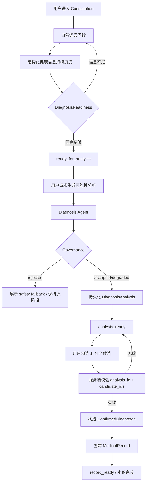

# 功能设计文档：AI Consultation → Diagnosis → Medical Record（MVP）

> **HISTORICAL / SUPERSEDED — 2026-08-15**  
> Superseded by [`feature_spec_longitudinal_body_health.md`](../../feature_spec_longitudinal_body_health.md) and [ADR 0004](../../adr/0004-adopt-longitudinal-body-state-model.md).  
> Original 更新时间：2026-08-14  
> 说明：本文保留旧 `Consultation -> MedicalRecord` 产品模型的设计历史，不再作为当前正式业务主线。

## 1. 功能定位

BodySense 当前 MVP 的核心闭环是：

```text
Consultation
  → CollectedHealthContext
  → DiagnosisReadiness
  → DiagnosisAnalysis
  → 用户确认 1..N 个 DiagnosisCandidate
  → ConfirmedDiagnoses
  → MedicalRecord
```

本功能的目标不是让 AI 直接给出医疗诊断，而是基于用户档案、问诊信息、体态分析和受控知识库，生成**结构化的可能性分析**，让用户确认与自身情况相符的一个或多个候选项，并将本次咨询结果固化为可追溯的 `MedicalRecord`。

本轮不继续实现 Rehabilitation / Treatment / Training。后续康复方案若恢复开发，应以 `MedicalRecord` 作为输入，而不是直接依赖会话中的临时 diagnosis JSON。

---

## 2. 本轮范围

### 2.1 In Scope

1. 保留并稳定现有 Consultation 对话、SSE、interrupt/resume、runtime event、thread projection 链路。
2. 明确定义 Consultation 产出的结构化健康上下文。
3. 定义统一的 Diagnosis readiness 业务规则。
4. 将 Diagnosis 生成收敛为独立的 Diagnosis Agent 能力。
5. DiagnosisAnalysis 生成 1..N 个候选项。
6. 用户可以从候选项中确认 1..N 个结果。
7. 服务端必须验证所选 candidate 确实属于当前有效 DiagnosisAnalysis。
8. 确认后生成持久化 `MedicalRecord`。
9. React / Go / Python 对 Diagnosis contract 使用一致的领域语义。
10. 保留 governance、red flag、citation 等现有安全与可追溯能力。

### 2.2 Out of Scope

1. Rehabilitation / TreatmentPlan 生成。
2. TrainingPlan、训练打卡、阶段性复评。
3. 自动网络搜索动作 GIF、自动爬取媒体、自动补知识库。
4. 医疗级确诊或替代专业医生诊疗。
5. 为旧 diagnosis / treatment 数据设计长期兼容层。
6. 本轮重写 Consultation streaming runtime 或 SSE v1 协议。
7. 本轮大拆 `consultation_thread.py`；其结构优化放到 Diagnosis vertical slice 稳定之后。

---

## 3. 用户主路径



### 3.1 信息不足时

系统继续 Consultation，不允许客户端通过直接调用 Diagnosis API 绕过 readiness。

### 3.2 Diagnosis 被治理层拒绝时

- HTTP 可以返回正常业务响应；
- 必须明确标记 `governance.verdict = rejected`；
- 不持久化为有效 DiagnosisAnalysis；
- 不推进到 `analysis_ready`；
- UI 展示 `safety_fallback` 或对应安全提示；
- Server durable state 保持为唯一真相。

### 3.3 用户确认时

用户不是编辑或回传完整 diagnosis JSON，而是提交：

```text
analysis_id
selected_candidate_ids[1..N]
```

服务端根据已持久化的 DiagnosisAnalysis 重建并验证 `ConfirmedDiagnoses`。

---

## 4. 领域对象

### 4.1 CollectedHealthContext

Consultation 阶段沉淀的结构化上下文。

建议逻辑结构：

```ts
interface CollectedHealthContext {
  symptoms: SymptomInfo[];
  health_features: HealthFeatures;
  posture_analysis?: PostureAnalysisSummary;
  conversation_summary?: string;
}
```

其来源可以包括：

- 用户消息；
- `extract_symptom_info` 等结构化抽取能力；
- `ask_user` 的 question / answer；
- 已完成的三视角 posture analysis；
- 用户手动确认或修改的 health features。

该对象表达“已经收集到了什么”，不表达最终 Diagnosis。

### 4.2 DiagnosisReadiness

这是**确定性的业务 policy**，不由 LLM 自由决定。

```ts
interface DiagnosisReadiness {
  ready: boolean;
  missing_requirements: string[];
  reason: string;
}
```

最低原则：

- 至少存在可用于判断的有效健康信息；
- 关键安全信息缺失时应继续询问；
- red flag 场景不得通过简单 readiness 规则直接进入普通 Diagnosis 输出；
- readiness 规则必须有单一 authoritative owner：**Go application policy**。Python 可以提供抽取结果或 advisory signal，Web 只展示 readiness；真正允许 Diagnosis generation 的判断由 Go 基于 durable consultation state 重新计算并执行。

### 4.3 DiagnosisCandidate

```ts
interface DiagnosisCandidate {
  candidate_id: string;
  name: string;
  confidence: '高' | '中' | '低';
  severity: '轻度' | '中度' | '重度';
  basis: string;
  typical_symptoms?: string;
  differential?: string;
}
```

约束：

1. `candidate_id` 由 application layer 分配，不要求 LLM 自行生成稳定 ID。
2. Candidate 一旦属于一个持久化 DiagnosisAnalysis，就视为该 Analysis 的不可变快照。
3. 前端不得修改 Candidate 内容后再提交为“确认结果”。

### 4.4 DiagnosisAnalysis

```ts
interface DiagnosisAnalysis {
  analysis_id: string;
  candidates: DiagnosisCandidate[];
  citations?: Citation[];
  red_flags?: RedFlagResult;
  governance: GovernanceResult;
  created_at: string;
}
```

`DiagnosisAnalysis` 表达 AI 在某一时间点、基于某一组上下文得出的结构化可能性分析。

它不是用户确认结果，也不能在 confirmation 时被覆盖。

### 4.5 ConfirmedDiagnoses

```ts
interface ConfirmedDiagnoses {
  analysis_id: string;
  selected_candidate_ids: string[]; // minItems = 1
  selected_candidates_snapshot: DiagnosisCandidate[];
  confirmed_at: string;
}
```

业务规则：

- 至少选择 1 个；
- 可以选择多个；
- 每个 candidate ID 必须属于同一个当前有效 DiagnosisAnalysis；
- 不接受客户端凭空提交候选内容；
- 旧 analysis 被新 analysis 替代后，旧 candidate 不应继续用于新 confirmation。

### 4.6 MedicalRecord

`MedicalRecord` 是当前 MVP 的最终 durable business artifact。

```ts
interface MedicalRecord {
  record_id: string;
  user_id: string;
  consultation_id: string;
  diagnosis_analysis_id: string;
  consultation_summary?: string;
  collected_health_context: CollectedHealthContext;
  diagnosis_analysis: DiagnosisAnalysis;
  confirmed_diagnoses: ConfirmedDiagnoses;
  safety_snapshot?: {
    red_flags?: RedFlagResult;
    governance?: GovernanceResult;
  };
  citations?: Citation[];
  created_at: string;
}
```

MedicalRecord 采用 snapshot 语义：

- 后续 Profile 修改不回写历史记录；
- 后续知识库变化不改变历史引用；
- 当前 MVP 中一个 Consultation 只生成一个最终 MedicalRecord，生成后保持不可变；
- 若未来支持“重新分析并再次确认”，应显式扩展为新的 Analysis / Record 版本，而不是悄悄修改旧记录；
- 后续 Rehabilitation 若实现，应从 MedicalRecord 读取确认后的业务上下文。

---

## 5. 状态机

### 5.1 目标状态

```text
collecting
  ↓
ready_for_analysis
  ↓
analysis_ready
  ↓
record_ready
  ↓
completed（可选，若未来需要显式结束会话）
```

### 5.2 状态语义

| Phase | 含义 |
|---|---|
| `collecting` | 仍在问诊和补充健康信息 |
| `ready_for_analysis` | readiness policy 判定当前信息允许生成 DiagnosisAnalysis |
| `analysis_ready` | 有一个治理通过且有效的 DiagnosisAnalysis，等待用户确认 1..N candidates |
| `record_ready` | ConfirmedDiagnoses 已生成，并已固化 MedicalRecord |
| `completed` | 可选的会话终态，不作为本轮强制要求 |

### 5.3 状态转移规则

状态机不再只用“rank 越来越大”表达业务。

允许的核心 transition：

```text
collecting -> ready_for_analysis
ready_for_analysis -> collecting          # 用户补充信息导致 readiness 失效时允许
ready_for_analysis -> analysis_ready
analysis_ready -> ready_for_analysis      # 新关键证据使旧 Analysis 失效时允许
analysis_ready -> record_ready
record_ready -> completed                 # 可选
```

因此当前 `ShouldAdvancePhase(nextRank >= currentRank)` 只能视为旧实现，不是目标业务状态机。

---

## 6. Diagnosis Agent 边界

### 6.1 Agent 负责什么

Diagnosis Agent 负责：

1. 基于受控 DiagnosisContext 生成结构化 candidates；
2. 按需调用只读知识检索 / posture context 等工具；
3. 输出满足 Pydantic schema 的结构化结果；
4. 在生成过程中保留 citations / evidence；
5. 将不确定性表达在 confidence / differential 中。

### 6.2 Agent 不负责什么

Diagnosis Agent 不负责：

- 用户 ownership；
- phase 持久化；
- confirmation authorization；
- candidate ID 的业务身份分配；
- MedicalRecord transaction；
- Go runtime event durability；
- React UI 状态；
- LangGraph checkpoint ownership。

### 6.3 PydanticAI 目标形态

Python 侧目标是使用 PydanticAI 的 Agent abstraction：

```text
Agent
├─ typed deps: DiagnosisDependencies / DiagnosisContext
├─ instructions
├─ function tools
└─ structured output: DiagnosisAgentOutput
```

建议：

- `deps_type` 承载运行时依赖；
- tool 通过 `RunContext` 读取依赖；
- `output_type` 使用 Pydantic model；
- HTTP adapter contract 在第一阶段迁移时保持不变；
- 先替换裸 `AIService.generate -> json.loads -> model_validate`，再逐步迁移工具。

PydanticAI 是 Diagnosis 的 Agent execution layer，不替代 LangGraph 的 consultation workflow / HITL / checkpoint 职责。

---

## 7. LangGraph / Consultation Runtime 边界

本轮保护现有：

```text
POST /api/v1/consultation-runs
Run / Turn / Message identity
requestId idempotency
StreamEvent v1
runtime_events
thread projection
ask_user interrupt / resume
LangGraph checkpointer + thread_id
```

LangGraph 继续适合表达：

- 多轮 Consultation；
- workflow routing；
- interrupt / resume；
- long-lived thread state；
- 后续需要显式 workflow node 的流程。

本轮不要求将 DiagnosisAnalysis 改成 consultation graph 内的一个大节点；Diagnosis 先作为明确 HTTP / application boundary 独立迁移。

---

## 8. React 交互设计

### 8.1 DiagnosisPanel

当前单选：

```text
selectedDiagnosis: Diagnosis | null
```

目标改为多选：

```text
selectedCandidateIds: Set<string>
```

候选卡片使用 checkbox semantics，而不是 radio semantics。

### 8.2 用户操作

1. 信息未达到 readiness：不显示可执行的“生成分析”，或按钮明确 disabled 并解释缺失项。
2. `ready_for_analysis`：显示“生成可能性分析”。
3. `analysis_ready`：展示 1..N candidates。
4. 用户勾选一个或多个候选。
5. 按钮文案建议：`确认所选判断并生成病历单`。
6. 成功后展示 MedicalRecord 摘要，而不是 TreatmentPlan。

### 8.3 Governance rejected

前端不得在任何 2xx response 上无条件执行：

```text
phase = analysis_ready
```

必须先区分：

```text
accepted/degraded
vs
rejected
```

Rejected 时：

- 展示 safety fallback；
- 不展示可确认 candidates；
- 不本地推进 phase；
- 以 server / projection 刷新后的 durable state 为准。

---

## 9. API 目标合同

### 9.1 生成 DiagnosisAnalysis

保留路由形态：

```http
POST /api/v1/consultations/:id/diagnosis
```

目标 accepted response：

```json
{
  "analysis_id": "uuid",
  "candidates": [
    {
      "candidate_id": "candidate-uuid",
      "name": "头前伸倾向",
      "confidence": "中",
      "severity": "轻度",
      "basis": "...",
      "typical_symptoms": "...",
      "differential": "..."
    }
  ],
  "citations": [],
  "governance": {
    "kind": "diagnosis",
    "verdict": "accepted",
    "reasons": [],
    "issues": []
  }
}
```

Rejected response 保留现有治理语义：

```json
{
  "governance": {
    "kind": "diagnosis",
    "verdict": "rejected",
    "reasons": [],
    "issues": []
  },
  "safety_fallback": "..."
}
```

### 9.2 确认 Diagnosis

保留现有 route 可以减少不必要的 URL churn：

```http
PUT /api/v1/consultations/:id/confirm
```

目标 request：

```json
{
  "analysisId": "uuid",
  "selectedCandidateIds": ["candidate-a", "candidate-c"]
}
```

服务端必须验证：

```text
session.phase == analysis_ready
analysisId == 当前有效 analysis
selectedCandidateIds.length >= 1
所有 candidate ID 均属于该 analysis
```

目标 response 可以返回：

```json
{
  "confirmed_diagnoses": { ... },
  "medical_record": { ... },
  "phase": "record_ready"
}
```

### 9.3 MedicalRecord 读取

建议提供显式读取：

```http
GET /api/v1/consultations/:id/medical-record
```

同时 thread projection 应暴露 `diagnosis_readiness`、当前 `diagnosis_analysis` 与 `medical_record` read model，使 React 刷新后不依赖本地推导恢复关键业务状态。

---

## 10. 数据持久化目标

### 10.1 consultation_sessions

目标保留：

```text
conversation_id
phase
extracted_info
health_features
active_diagnosis_analysis_id (new)
created_at / updated_at / ended_at
```

旧字段：

```text
diagnosis
treatment_plan
```

在新 vertical slice 完成后退役。

### 10.2 diagnosis_analyses

建议新表：

```text
diagnosis_analyses
├─ id UUID PK
├─ consultation_id UUID FK
├─ candidates JSONB
├─ citations JSONB
├─ red_flags JSONB
├─ governance JSONB
├─ context_metadata JSONB
└─ created_at
```

第一版不要求把每个 candidate 单独规范化成 relational table；其生命周期天然属于 DiagnosisAnalysis aggregate。

### 10.3 medical_records

建议新表：

```text
medical_records
├─ id UUID PK
├─ user_id UUID
├─ consultation_id UUID FK UNIQUE   # MVP: one final record per consultation
├─ diagnosis_analysis_id UUID FK
├─ consultation_snapshot JSONB
├─ confirmed_diagnoses JSONB
├─ safety_snapshot JSONB
├─ citations JSONB
└─ created_at
```

`MedicalRecord` 是未来 Rehabilitation 的稳定输入边界。

---

## 11. Protected Contracts

### 11.1 必须保护

- `POST /api/v1/consultation-runs` 主流程；
- request ID idempotency；
- Conversation / Run / Turn / Message identity；
- StreamEvent v1 envelope；
- durable `runtime_events`；
- thread projection / replay；
- interrupt / resume；
- governance accepted / degraded / rejected 语义；
- Go 作为用户身份、业务持久化、public runtime event 的 durable owner；
- Python Diagnosis HTTP adapter 在 PydanticAI 第一阶段迁移时的 characterization contract。

### 11.2 明确迁移 / 退役

- `ConsultationSession.diagnosis` 同时表示 Analysis 和 ConfirmedDiagnosis；
- `ConfirmDiagnosisRequest.diagnosis` 接受完整任意 JSON；
- 单个 `confirmedDiagnosis`；
- DiagnosisPanel 单选；
- “确认诊断并生成改善方案”绑定动作；
- `treatment_plan` 作为 Consultation 本轮终点；
- Journey 仅根据 `diagnosis != nil` 判断已完成 Diagnosis；
- 仅使用 phase rank 阻止回退的状态机实现。

---

## 12. 安全与一致性规则

1. 客户端永远不能通过回传完整 candidate 内容来伪造确认。
2. Diagnosis generation 必须通过 server readiness gate。
3. Governance rejected 不得产生可确认的业务 artifact。
4. Red flag 规则优先级高于普通 Diagnosis 推理。
5. MedicalRecord creation 与 ConfirmedDiagnoses 应在同一个 application transaction 中完成，避免“已确认但无记录”。
6. UI optimistic state 不能成为 phase truth；最终以 Go durable state / projection 为准。
7. 重新分析后旧 Analysis 仍可审计，但不能默认继续作为当前 confirmation target。
8. 所有结构化输出在 Python Agent 边界与 Go application boundary 都应做 schema / invariant validation。

---

## 13. 验收标准

- [ ] Consultation 原有消息流、SSE、interrupt/resume、刷新回放不回归。
- [ ] 信息不足时不能调用成功 Diagnosis generation。
- [ ] DiagnosisAgent 使用 typed structured output，而不是裸 JSON parsing 作为主路径。
- [ ] DiagnosisAnalysis 与 ConfirmedDiagnoses 不再共用同一个可覆盖 JSON 字段。
- [ ] 每个 candidate 有稳定 `candidate_id`。
- [ ] React 支持选择 1..N candidates。
- [ ] 空选择被拒绝。
- [ ] 任意伪造 candidate ID 被服务端拒绝。
- [ ] Governance rejected 不持久化有效 Analysis，不推进 `analysis_ready`。
- [ ] 确认成功后生成 MedicalRecord。
- [ ] MedicalRecord 保存 Consultation / Analysis / Confirmation / Safety 的快照。
- [ ] 当前 MVP 不再要求生成 TreatmentPlan 才算业务完成。
- [ ] Health Journey 能区分 Analysis、ConfirmedDiagnoses、MedicalRecord 的不同完成度。

---

## 14. 后续演进

本轮稳定后，再进入以下工作：

1. 将 Diagnosis 侧的 knowledge/posture lookup 收敛为 PydanticAI Tools。
2. 将 `consultation_thread.py` 拆成更小的 LangGraph nodes，并让 routing 真正由 graph edge / Command 驱动。
3. 进一步统一 CollectedHealthContext / DiagnosisContext / Agent Dependencies 的边界。
4. 扩展 eval harness，覆盖 Diagnosis structured output、multi-select confirmation、governance、MedicalRecord snapshot。
5. 若恢复 Rehabilitation：新增 `MedicalRecord -> RehabilitationPlan` 独立功能线，不重新耦合回 ConsultationSession 临时状态。
