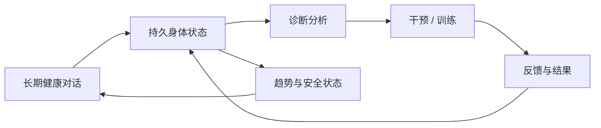

# 体悟 BodySense

> **AI 原生长期身体健康工作区** —— 把持续对话、长期身体状态、循证诊断、干预方案与训练反馈连接成一个可追踪闭环。

<p align="left">
  <strong>语言：</strong> <a href="../../README.md">英文</a> · 简体中文
</p>

<p align="left">
  <a href="https://body.bakersean.top"><strong>在线产品</strong></a> ·
  <a href="https://bakersean168.github.io/BodySense/"><strong>项目介绍</strong></a> ·
  <a href="../feature_spec_longitudinal_body_health.md"><strong>产品规格</strong></a> ·
  <a href="../architecture/deployment-architecture.md"><strong>系统架构</strong></a>
</p>

BodySense 不是一次性生成报告的 AI 问诊演示。它围绕一个长期存在的健康工作区设计：用户可以持续描述身体变化、补充观察、纠正事实、查看分析如何演进，并把干预与训练结果重新写回后续判断。

> [!IMPORTANT]
> BodySense 是个人健康信息与体态分析辅助项目，不是医疗器械，也不能替代医生、物理治疗师或其他专业人员的诊断与治疗。

## 产品闭环



核心体验由五部分组成：

- **长期对话** —— 用户不需要为每一个身体问题反复创建新的问诊记录。
- **实时身体状态** —— 结构化事实、观察、变化、AI 假设与安全状态持续演进，并允许用户直接纠正。
- **循证诊断** —— 诊断绑定精确的身体状态版本、时间上下文、观察和检索证据，而不是只依赖聊天记录。
- **版本化干预方案** —— 当前方案拥有明确版本与复审生命周期，不会因为一条新消息被静默覆盖。
- **闭环反馈** —— 训练执行、依从性、症状变化和自测结果重新进入长期状态与后续复审。

## 工程价值

BodySense 重点解决的不是“如何调用一个模型”，而是 **AI 输出如何成为可持久、可追踪、可复审的产品状态**。

| 工程问题 | BodySense 的处理方式 |
| --- | --- |
| 长时间 AI 交互 | Run / Turn / checkpoint + 持久事件日志 |
| 人在回路 | 结构化 `ask_user` interrupt / resume |
| AI 与业务状态 | Go 持有持久业务真值，AI 运行时只产生经过校验的提案与事件 |
| 检索 | 基于 pgvector 的证据检索与来源追踪 |
| 模型边界 | 独立 LiteLLM 网关，应用代码不直接持有物理供应商路由 |
| 诊断治理 | 不可变配置身份、回放评估与硬安全门禁 |
| 生产交付 | 一致的不可变发布产物与 revision 校验发布 |

## 系统架构

```text
React Web
   │  HTTP + SSE
   ▼
Go API / 领域真值
   │
   ├── PostgreSQL + pgvector
   ├── Redis
   └── Python AI Service
          │
          ├── FastAPI
          ├── LangGraph 持久运行时
          ├── PydanticAI 类型化 Agent
          └── LiteLLM 模型网关
```

仓库采用 Nx + pnpm monorepo：

```text
apps/
├── web/          React 19 + TypeScript + Vite
├── api/          Go + Gin + GORM
└── ai-service/   Python + FastAPI + LangGraph + PydanticAI

docker/           本地 / 生产编排
scripts/          校验与发布工具
docs/             产品规格、ADR、架构与计划
tools/            项目专用工程工具
```

当前运行时与部署边界见 [`docs/architecture/deployment-architecture.md`](../architecture/deployment-architecture.md)。

## 技术栈

- **前端：** React 19、TypeScript 6、Vite 8、Tailwind CSS 4、shadcn/ui
- **后端：** Go 1.26、Gin、GORM
- **AI：** Python 3.13、FastAPI、LangGraph、PydanticAI
- **数据：** PostgreSQL + pgvector、Redis
- **模型网关：** LiteLLM
- **工作区：** Nx 23、pnpm 11
- **质量体系：** Vitest、Go test、Pytest、Playwright、Ruff/Pyright、ESLint
- **交付：** GitHub Actions、Docker/Compose、Alibaba Cloud ACR + ECS

## 快速开始

### 环境要求

- Node.js 24+
- pnpm 11+
- Go 1.26+
- Python 3.13+
- Docker 与 Compose

### 本地运行

```bash
git clone https://github.com/BakerSean168/BodySense.git
cd BodySense
pnpm install
pnpm dev
```

`pnpm dev` 是 direct-dev 的标准交互入口：它会幂等确认 Docker 基础设施健康，读取存在的 `.env.dev.local`，然后在宿主机前台启动 Web / API / AI，并保留热更新能力。

基础设施刻意比应用进程更长寿：

```bash
pnpm dev:infra:status  # PostgreSQL 18 + pgvector、Redis、LiteLLM
pnpm dev:infra:up      # 创建/启动并等待健康
pnpm dev:infra:logs    # 查看基础设施日志
pnpm dev:infra:down    # 显式拆除；持久化数据卷保留
```

默认 direct-dev 端口为 Web `20100`、API `20101`、AI `20102`、PostgreSQL `20110`、Redis `20111`、LiteLLM `20112`。基础设施容器采用 `restart: unless-stopped`，因此 Docker 或宿主机正常重启后会自动恢复，但 Web / API / AI 不会被强制常驻。

机器相关覆盖项和模型供应商凭据放到 Git 忽略的 `.env.dev.local`。`scripts/dev-env.sh` 已提供非敏感开发默认值，不再要求把 `.env.example` 复制成 `.env`。

如果不需要完整技术栈，可以单独启动某个运行面：

```bash
pnpm dev:web
pnpm dev:api
pnpm dev:ai
```

## 验证

仓库尽量让本地验证与 CI 使用同一套质量契约。

```bash
pnpm lint
pnpm typecheck
pnpm test
pnpm e2e
pnpm verify:release
```

`pnpm verify:release` 是仓库级综合发布门禁。CI 还会验证已发布数据库迁移历史和长期健康浏览器流程，全部通过后版本才具备生产发布资格。

## 生产环境

当前生产应用：**[body.bakersean.top](https://body.bakersean.top)**。

生产应用与 GitHub Pages 项目介绍页有意保持职责分离：

- **GitHub Pages** 负责解释项目价值与工程故事。
- **Alibaba Cloud ECS** 运行真实产品。
- **Alibaba Cloud ACR** 保存生产 OCI 产物。
- **GitHub Actions** 负责 CI、版本发布与不可变镜像发布。

当前部署契约见 [`docs/architecture/deployment-architecture.md`](../architecture/deployment-architecture.md)。

## 文档

如果希望先理解产品而不是直接阅读代码，可以从这里开始：

- [`长期身体健康工作区`](../feature_spec_longitudinal_body_health.md) —— 当前产品模型与用户体验。
- [`部署架构`](../architecture/deployment-architecture.md) —— 当前生产拓扑与发布流程。
- [`AGENT.md`](../../AGENT.md) —— 仓库约定与 AI 辅助工程工作流。
- [`docs/`](../) —— 架构、ADR、产品规格、评估与实施历史。

## 仓库状态与许可

BodySense 是一个 **公开源码仓库**，但当前 **没有附带开源许可证**。仅公开可见并不代表授予复制、修改或再分发代码的许可；除非未来明确加入许可证，否则版权仍由仓库所有者保留。
